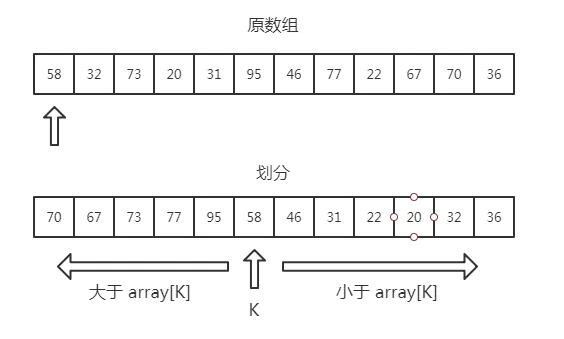

# Algorithm14--TopK问题

从一堆数据中找前K大/前K小的问题

## 参考网址

https://www.jianshu.com/p/a4a1984fc4ff

## 方法一：排序

既然是要前 K 大的数，那么最直接的当然就是排序了，通过如快排等效率较高的排序算法，可以在平均 O（nlogn）的时间复杂度找到结果。

这种方式在数据量不大的时候简单可行，但固然不是最优的方法。

## 方法二：快排

* 快排的 partition 划分思想可以用于计算某个位置的数值等问题，例如用来计算中位数；显然，也适用于计算 TopK 问题



* 每次经过划分，如果中间值等于 K ，那么其左边的数就是 Top K 的数据；
* 当然，如果不等于，只要递归处理左边或者右边的数即可
* 该方法的时间复杂度是 O(n) ，简单分析就是第一次划分时遍历数组需要花费 n，而往后每一次都折半（当然不是准确地折半），粗略地计算就是 n + n/2 + n/4 +... < 2n，因此显然时间复杂度是 O(n)
* 对比第一个方法显然快了不少，随着数据量的增大，两个方法的时间差距会越来越大
* 虽然时间复杂度是 O(n) ，但是缺点也很明显，最主要的就是内存问题，在海量数据的情况下，我们很有可能没办法一次性将数据全部加载入内存，这个时候这个方法就无法完成使命了
* 还有一点就是这种思路需要我们修改输入的数组，这也是值得考虑的一点

## 方法三：分布式思想处理海量数据

* 面对海量数据，我们就可以放分布式的方向去思考了
* 我们可以将数据分散在多台机器中，然后每台机器并行计算各自的 TopK 数据，最后汇总，再计算得到最终的 TopK 数据
* 这种数据分片的分布式思想在面试中非常值得一提，在实际项目中也十分常见

## 方法四：堆排序

* 维护一个大小为 K 的小顶堆，依次将数据放入堆中，当堆的大小满了的时候，只需要将堆顶元素与下一个数比较：如果大于堆顶元素，则将当前的堆顶元素抛弃，并将该元素插入堆中。遍历完全部数据，Top K 的元素也自然都在堆里面了。

* 对于海量数据，我们不需要一次性将全部数据取出来，可以一次只取一部分，因为我们只需要将数据一个个拿来与堆顶比较。

* 另外还有一个优势就是对于动态数组，我们可以一直都维护一个 K 大小的小顶堆，当有数据被添加到集合中时，我们就直接拿它与堆顶的元素对比。这样，无论任何时候需要查询当前的前 K 大数据，我们都可以里立刻返回给他。

* 整个操作中，遍历数组需要 O(n) 的时间复杂度，一次堆化操作需要 O(logK)，加起来就是 O(nlogK) 的复杂度，换个角度来看，如果 K 远小于 n 的话， O(nlogK) 其实就接近于 O(n) 了，甚至会更快，因此也是十分高效的。

* 堆排序：

  https://www.jianshu.com/p/15a29c0ace73

  ```python
  """
  升序排序：大顶堆
  降序排序：小顶堆
  """
  from collections import deque
  
  
  def heap_adjust(L, start, end):
      temp = L[start]
      i, j = start, start * 2
      while j <= end:
          if j < end and L[j] < L[j+1]:
              j += 1
          if temp < L[j]:
              L[i] = L[j]
              i, j = j, 2*j
          else:
              break
      L[i] = temp
  
  def heap_sorting(nums):
      # 时间复杂度：平均：o(nlogn)，最好：o(nlogn)，最坏：o(nlogn)
      # 空间复杂度：o(n)
      # 稳定性：不稳定
      L = deque(nums)
      L.appendleft(0)
      length = len(L) - 1
      first_sort_count = length // 2
      # 构造初始大顶堆
      for i in range(first_sort_count, 0, -1):
          heap_adjust(L, i, length)
      # 循环n-1次进行排序
      for i in range(length - 1):
          L[1], L[length - i] = L[length - i], L[1]
          heap_adjust(L, 1, length - i - 1)
  
      return [L[i] for i in range(1, len(L))]
  ```

## 力扣347：前K个高频元素

```python
"""
347.前K个最高频元素
给你一个整数数组 nums 和一个整数 k ，请你返回其中出现频率前 k 高的元素。你可以按 任意顺序 返回答案。
进阶：你所设计算法的时间复杂度 必须 优于 O(n log n) ，其中 n 是数组大小。
解题思路：堆排序，快排
堆排序：
    首先遍历整个数组，https://blog.csdn.net/mcanye/article/details/80881124，并形成一个「出现次数数组」。
    找出原数组的前 k 个高频元素，就相当于找出「出现次数数组」的前 k 大的值。
    最简单的做法是给「出现次数数组」排序。
    但由于可能有 O(N) 个不同的出现次数（其中 N 为原数组长度），故总的算法复杂度会达到 O(NlogN)，不满足题目的要求。
    在这里，我们可以利用堆的思想：建立一个小顶堆，然后遍历「出现次数数组」：
        如果堆的元素个数小于 k，就可以直接插入堆中。
        如果堆的元素个数等于 k，则检查堆顶与当前出现次数的大小。
            如果堆顶更大，说明至少有 k 个数字的出现次数比当前值大，故舍弃当前值；
            否则，就弹出堆顶，并将当前值插入堆中。
    遍历完成后，堆中的元素就代表了「出现次数数组」中前 k 大的值。
基于快速排序：
    我们可以使用基于快速排序的方法，求出「出现次数数组」的前 k 大的值。
    在对数组 arr[l…r] 做快速排序的过程中，我们首先将数组划分为两个部分 arr[i…q−1] 与 arr[q+1…j]，
    并使得 arr[i…q−1] 中的每一个值都不超过 arr[q]，且 arr[q+1…j] 中的每一个值都大于 arr[q]。
    于是，我们根据 k 与左侧子数组 arr[i…q−1] 的长度（为 q-iq−i）的大小关系：
        如果 k≤q−i，则数组 arr[l…r] 前 k 大的值，就等于子数组 arr[i…q−1] 前 k 大的值。
        否则，数组 arr[l…r] 前 k 大的值，就等于左侧子数组全部元素，加上右侧子数组 arr[q+1…j] 中前 k−(q−i) 大的值。
    原版的快速排序算法的平均时间复杂度为 O(NlogN)。
    我们的算法中，每次只需在其中的一个分支递归即可，因此算法的平均时间复杂度降为 O(N)。
"""
from collections import deque
import heapq


class ComparaAble(object):
    def __init__(self, n, count):
        self.n = n
        self.count = count

    def __eq__(self, other):
        return self.count == other.count

    def __le__(self, other):
        return self.count <= other.count

    def __lt__(self, other):
        return self.count < other.count

    def __gt__(self, other):
        return self.count > other.count

    def __ge__(self, other):
        return self.count >= other.count

    def __ne__(self, other):
        return self.count != other.count

class Solution(object):
    def heap_adjust(self, L, start, end):
        temp = L[start]
        i, j = start, start*2
        while j <= end:
            if j < end and L[j][1] > L[j+1][1]:
                j += 1
            if temp[1] > L[j][1]:
                L[i] = L[j]
                i, j = j, j*2
            else:
                break
        L[i] = temp

    def heap_sorting(self, L):
        length = len(L) - 1
        start_sort_index = length // 2
        for i in range(start_sort_index, 0, -1):
            self.heap_adjust(L, i, length)

    def topKFrequent(self, nums, k):
        """
        :type nums: List[int]
        :type k: int
        :rtype: List[int]
        使用deque构造小顶堆，并手动进行维护，基于堆排序算法思想
        时间击败90.59%，内存击败56.86%
        """
        occurrences = dict()
        for n in nums:
            if n in occurrences:
                occurrences[n] += 1
            else:
                occurrences[n] = 1
        print(occurrences)
        length = len(occurrences)
        if length <= k:
            return list(occurrences.keys())
        L = deque([(0, 0)])
        i = 0
        for key, value in occurrences.items():
            print(key, value)
            if i < k:
                L.append((key, value))
            elif i == k:
                self.heap_sorting(L)
                if value > L[1][1]:
                    L[1] = (key, value)
                    self.heap_adjust(L, 1, k)
            else:
                if value > L[1][1]:
                    L[1] = (key, value)
                    self.heap_adjust(L, 1, k)
            i += 1
            print(L)

        result = list()
        for i in range(1, k+1):
            n, count = L[i]
            result.append(n)
        return result

    def topKFrequent1(self, nums, k):
        """
        :type nums: List[int]
        :type k: int
        :rtype: List[int]
        使用优先队列，同样是堆排序思想，但是不用手动维护了
        时间击败90.59%，内存击败84.60%
        """
        occurrences = dict()
        for n in nums:
            if n in occurrences:
                occurrences[n] += 1
            else:
                occurrences[n] = 1
        length = len(occurrences)
        if length <= k:
            return list(occurrences.keys())
        L = list()
        for key, value in occurrences.items():
            size = len(L)
            if size < k:
                heapq.heappush(L, ComparaAble(key, value))
            else:
                if L[0].count < value:
                    heapq.heapreplace(L, ComparaAble(key, value))
        result = list()
        for l in L:
            result.append(l.n)
        return result

    def topKFrequent2(self, nums, k):
        """
        :type nums: List[int]
        :type k: int
        :rtype: List[int]
        快速排序思想
        时间击败42.68%，内存击败31.27%
        """
        occurrences = dict()
        for n in nums:
            if n in occurrences:
                occurrences[n] += 1
            else:
                occurrences[n] = 1
        length = len(occurrences)
        if length <= k:
            return list(occurrences.keys())
        li = list()
        for key, value in occurrences.items():
            li.append((key, value))
        result = list()
        self.quick_sorting(li, 0, len(li)-1, result, k)
        return result

    def quick_sorting(self, alist, start, end, result, k):
        from random import randint
        rand_index = randint(start, end)
        alist[rand_index], alist[start] = alist[start], alist[rand_index]
        value = alist[start]
        i, index = start+1, start
        while i <= end:
            if alist[i][1] >= value[1]:
                alist[i], alist[index+1] = alist[index+1], alist[i]
                index += 1
            i += 1
        alist[index], alist[start] = alist[start], alist[index]
        if index - start >= k:
            self.quick_sorting(alist, start, index-1, result, k)
        else:
            for i in range(start, index+1):
                result.append(alist[i][0])
            if index - start + 1 < k:
                self.quick_sorting(alist, index + 1, len(alist) - 1, result, k - (index - start + 1))


if __name__ == '__main__':
    nums = [1,1,1,2,2,3]
    k = 2
    solution = Solution()
    result = solution.topKFrequent2(nums, k)
    print(result)
```

## 力扣703：数据流中的第K大元素

```python
"""
703.数据流中的第K大元素
设计一个找到数据流中第 k 大元素的类（class）。
注意是排序后的第 k 大元素，不是第 k 个不同的元素。
请实现 KthLargest 类：
KthLargest(int k, int[] nums) 使用整数 k 和整数流 nums 初始化对象。
int add(int val) 将 val 插入数据流 nums 后，返回当前数据流中第 k 大的元素。
解题思路：优先队列
我们可以使用一个大小为 k 的优先队列来存储前 k 大的元素，其中优先队列的队头为队列中最小的元素，也就是第 k 大的元素。
在单次插入的操作中，我们首先将元素 val 加入到优先队列中。
如果此时优先队列的大小大于 k，我们需要将优先队列的队头元素弹出，以保证优先队列的大小为 k。
"""
import heapq
class KthLargest(object):
    # 时间击败30.00%，内存击败58.18%
    def __init__(self, k, nums):
        """
        :type k: int
        :type nums: List[int]
        """
        self.heap = list()
        self.k = k
        i = 0
        while i < len(nums):
            heapq.heappush(self.heap, nums[i])
            if i >= self.k:
                heapq.heappop(self.heap)
            i += 1

    def add(self, val):
        """
        :type val: int
        :rtype: int
        """
        heapq.heappush(self.heap, val)
        n = len(self.heap)
        if n > self.k:
            heapq.heappop(self.heap)
        return self.heap[0]


# Your KthLargest object will be instantiated and called as such:
obj = KthLargest(3, [4, 5, 8, 2])
param_1 = obj.add(3)
print(param_1)
```

