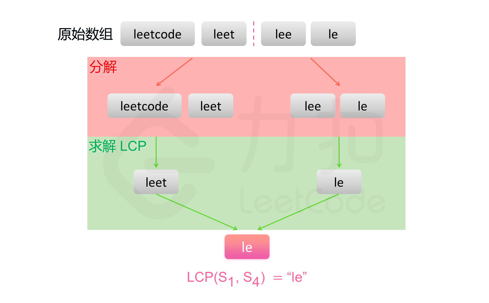

# Algorithm2--最长公共前缀

## 题目介绍

编写一个函数来查找字符串数组中的最长公共前缀。

如果不存在公共前缀，返回空字符串 `""`。

### 测试用例

```
输入：strs = ["flower","flow","flight"]
输出："fl"

输入：strs = ["dog","racecar","car"]
输出：""
解释：输入不存在公共前缀。
```

## 横向扫描

### 思路

* 用 LCP(S1…Sn) 表示字符串S1…Sn的最长公共前缀。

* 可以得到以下结论：LCP(S1...Sn)=LCP(LCP(LCP(S1,S2),S3),...Sn)

* 基于该结论，可以得到一种查找字符串数组中的最长公共前缀的简单方法。
  * 依次遍历字符串数组中的每个字符串，对于每个遍历到的字符串，更新最长公共前缀
  * 当遍历完所有的字符串以后，即可得到字符串数组中的最长公共前缀。
  * 如果在尚未遍历完所有的字符串时，最长公共前缀已经是空串，则最长公共前缀一定是空串，因此不需要继续遍历剩下的字符串，直接返回空串即可。


### 代码

```java
public class LongestCommonPrefix14 {
	public String longestCommonPrefix(String[] strs) {
		// 横向扫描
		// 依次遍历字符串数组中的每个字符串，对于每个遍历到的字符串，更新最长公共前缀
		// 当遍历完所有的字符串以后，即可得到字符串数组中的最长公共前缀
		// 时间击败84.39%，内存击败59.58%
		if (strs.length==0 || strs==null)
			return "";
		String result = strs[0];
		int len = strs.length;
		for (int i=1; i<len; i++) {
			result = this.longestCommonPrefix(result, strs[i]);
			if (result.length()==0)
				break;
		}
		return result;
    }
	public String longestCommonPrefix(String str1, String str2) {
		int len = Math.min(str1.length(), str2.length());
		int i=0;
		while (i<len && str1.charAt(i) == str2.charAt(i)) {
			++i;
		}
		return str1.substring(0, i);
	}
}
```

## 纵向扫描

### 思路

* 纵向扫描时，从前往后遍历所有字符串的每一列，比较相同列上的字符是否相同
* 如果相同则继续对下一列进行比较
* 如果不相同则当前列不再属于公共前缀，当前列之前的部分为最长公共前缀


### 代码

```java
public class LongestCommonPrefix14 {
	public String longestCommonPrefix1(String[] strs) {
		/*
		 * 纵向扫描
		 * 向扫描时，从前往后遍历所有字符串的每一列，比较相同列上的字符是否相同
		 * 如果相同则继续对下一列进行比较
		 * 如果不相同则当前列不再属于公共前缀，当前列之前的部分为最长公共前缀。
		 * 时间击败84.32%，内存击败78.14%*/ 
		if (strs==null || strs.length==0)
			return "";
		int str0len = strs[0].length();
		for (int i=0; i<str0len; ++i) {
			char c = strs[0].charAt(i);
			for (int j=1; j<strs.length; ++j) {
				if (i==strs[j].length() || strs[j].charAt(i)!=c)
					return strs[0].substring(0, i);
			}
		}
		return strs[0];
	}
}
```

## 分治法

* 用 LCP(S1…Sn) 表示字符串S1…Sn的最长公共前缀

* 注意到 LCP 的计算满足结合律，有以下结论:

  LCP(S1...Sn)=LCP(LCP(LCP(S1,S2),S3),...Sn)

* 基于上述结论，可以使用分治法得到字符串数组中的最长公共前缀。

  对于问题 LCP(Si...Sj)，可以分解成两个子问题 LCP(Si...Smid) 与 LCP(Smid+1...Sj)，其中mid=(i+j)/2。

  对两个子问题分别求解，然后对两个子问题的解计算最长公共前缀，即为原问题的解。



### 代码

```java
class Solution {
    public String longestCommonPrefix(String[] strs) {
        if (strs==null || strs.length==0)
			return "";
		else {
			return longestCommonPrefix(strs, 0, strs.length-1);
		}
    }
    public String longestCommonPrefix(String[] strs, int start, int end) {
		if (start==end)
			return strs[start];
		else {
			int mid = (end - start)/2 + start;
			String lcpleft = longestCommonPrefix(strs, start, mid);
			String lcpright = longestCommonPrefix(strs, mid+1, end);
			return longestCommonPrefix(lcpleft, lcpright);
		}
	}
    public String longestCommonPrefix(String str1, String str2) {
		int len = Math.min(str1.length(), str2.length());
		int i=0;
		while (i<len && str1.charAt(i) == str2.charAt(i)) {
			++i;
		}
		return str1.substring(0, i);
	}
}
```


