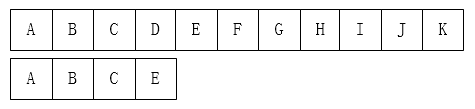
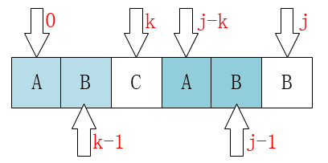
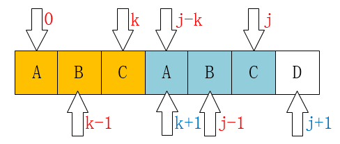

# 数据结构笔记1--KMP算法

## 参考网址

https://www.cnblogs.com/yjiyjige/p/3263858.html

## 介绍

+ KMP是三位大牛：D.E.Knuth、J.H.Morris和V.R.Pratt同时发现的。其中第一位就是《计算机程序设计艺术》的作者
+ KMP算法要解决的问题就是在字符串（也叫主串）中的模式（pattern）定位问题。
+ 说简单点就是我们平时常说的关键字搜索。
+ 模式串就是关键字（接下来称它为P），如果它在一个主串（接下来称为T）中出现，就返回它的具体位置，否则返回-1（常用手段）



## 暴力破解法

### 思路

1. 主串指针i=0(i<length(T))，关键字指针j=0(j<length(P))

2. 从左到右一个个匹配

   + 如果有某个字符不匹配

     i += 1 ; j = 0;

   + 如果全部匹配

     返回i

3. 重复步骤2

### 代码

```8java
/**

 * 暴力破解法

 * @param ts 主串

 * @param ps 模式串

 * @return 如果找到，返回在主串中第一个字符出现的下标，否则为-1

 */

public static int bf(String ts, String ps) {

    char[] t = ts.toCharArray();
    char[] p = ps.toCharArray();
    int i = 0; // 主串的位置
    int j = 0; // 模式串的位置
    while (i < t.length && j < p.length) {
       if (t[i] == p[j]) { // 当两个字符相同，就比较下一个
           i++;
           j++;
       }
       else {
           i = i - j + 1; // 一旦不匹配，i后退
           j = 0; // j归0
       }
    }
    if (j == p.length) {
       return i - j;
    }
    else {
       return -1;
    }
}8
```

## KMP算法

### 思路

+ **利用已经部分匹配这个有效信息，保持i指针不回溯，通过修改j指针，让模式串尽量地移动到有效的位置。**

+ 整个KMP的重点就在于**当某一个字符与主串不匹配时，我们应该知道j指针要移动到哪？**

  + 例1：j应该移动到第一位

    

    

  + 例2：j应该移动到第二位

    

    

+ 存在着这样的性质：**P最前面的k个字符和j之前的最后k个字符是一样的**。

+ 用数学公式来表示是：P[0:k-1] == P[j-k:j-1]

  

+ 因此j应该直接移动到k

  当T[i] != P[j]时

  有T[i-j:i-1] == P[0:j-1]

  由P[0:k-1] == P[j-k:j-1]

  必然：T[i-k:i-1] == P[0:k-1]

+ 求k

  因为在P的每一个位置都可能发生不匹配，也就是说我们要计算每一个位置j对应的k，所以用一个数组next来保存，**next[j] = k，表示当T[i] != P[j]时，j指针的下一个位置。**

  + 当j为0时，如果T[i] != P[j]

    

    **j已经在最左边了，不可能再移动了，这时候要应该是i指针后移**

    next[0] = -1  （初始化）

  + 当j为1时，如果T[i] != P[j]

    

    **j指针一定是后移到0位置的**。因为它前面也就只有这一个位置了

  + 其余情况，如果T[i] != P[j]

    + 当P[k] == P[j]时，有next[j+1] == next[j] + 1

      

      

      因为在P[j]之前已经有P[0:k-1] == P[j-k:j-1]。（next[j]==k）

      这时候现有P[k] == P[j]，我们是不是可以得到P[0:k-1] + P[k] == p[j-k:j-1] + P[j]。

      即：P[0:k] == P[j-k:j]，即next[j+1] == k + 1 == next[j] + 1。

    + 如果P[k] != P[j]，k = next[k]

      

      

      像上边的例子，我们已经不可能找到[ A，B，A，B ]这个最长的后缀串了，但我们还是可能找到[ A，B ]、[ B ]这样的前缀串的。所以这个过程像不像在定位[ A，B，A，C ]这个串，当C和主串不一样了（也就是k位置不一样了），那当然是把指针移动到next[k]啦。

### 代码

```java
public static int[] getNext(String ps) {
    char[] p = ps.toCharArray();
    int[] next = new int[p.length];
    next[0] = -1;
    int j = 0;
    int k = -1;
    while (j < p.length - 1) {
       if (k == -1 || p[j] == p[k]) {
           next[++j] = ++k;
       } else {
           k = next[k];
       }
    }
    return next;
}
public static int KMP(String ts, String ps) {
    char[] t = ts.toCharArray();
    char[] p = ps.toCharArray();
    int i = 0; // 主串的位置
    int j = 0; // 模式串的位置
    int[] next = getNext(ps);
    while (i < t.length && j < p.length) {
       if (j == -1 || t[i] == p[j]) { // 当j为-1时，要移动的是i，当然j也要归0
           i++;
           j++;

       } else {
           // i不需要回溯了
           // i = i - j + 1;
           j = next[j]; // j回到指定位置
       }
    }
    if (j == p.length) {
       return i - j;
    } else {
       return -1;
    }
}
```

