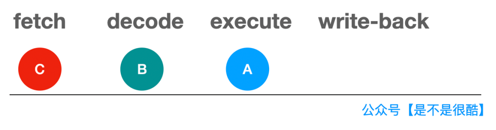
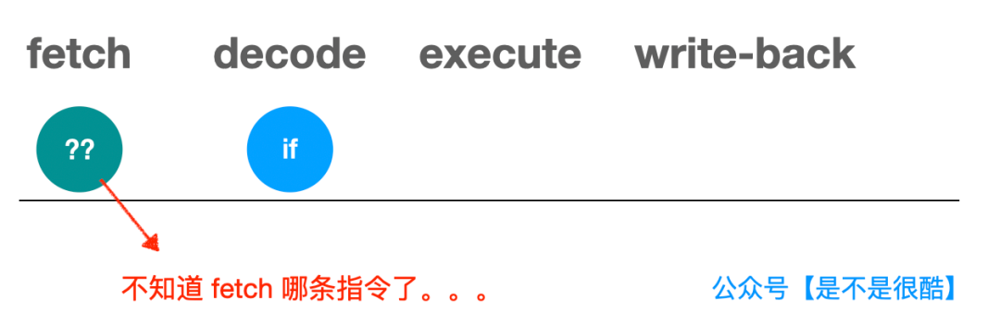
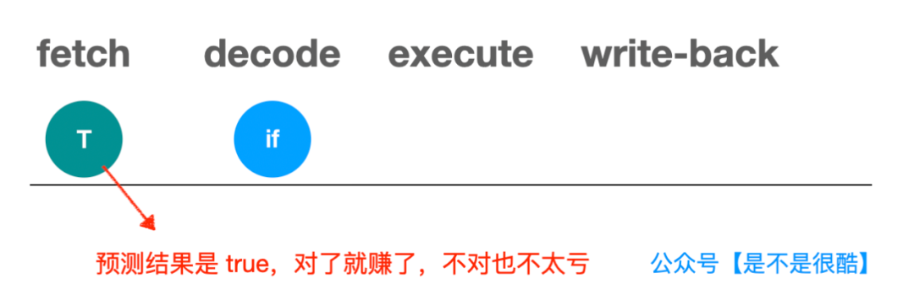
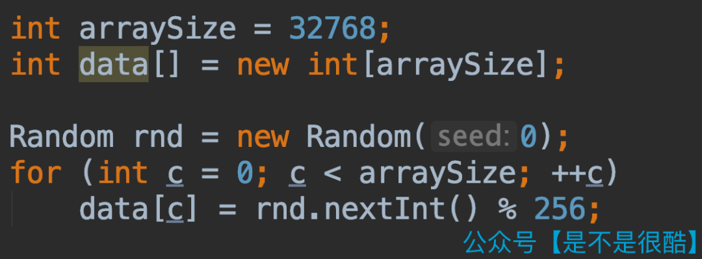
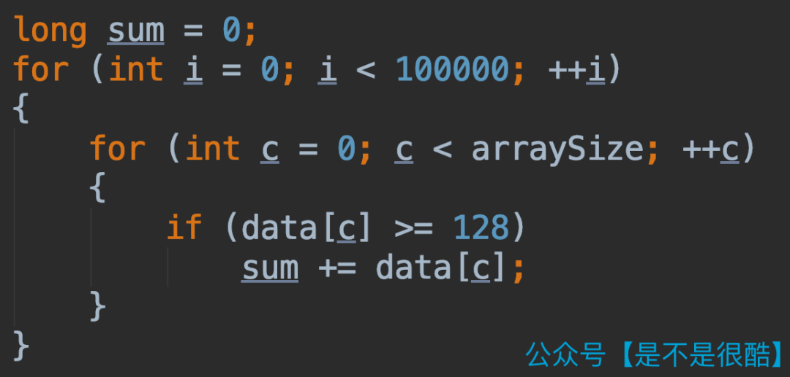
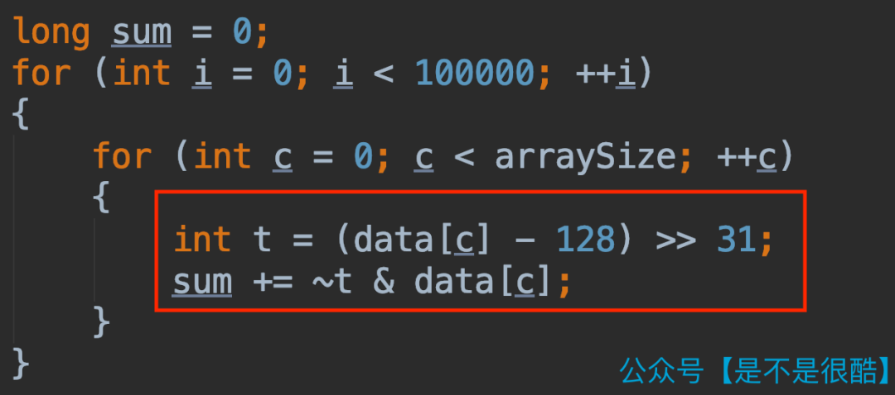

# CPU笔记1--分支预测

## 指令执行方式：流水线

### 常见的四阶段流水线模型

指令在CPU内部执行，需要4步：

* fetch（获取指令）
* decode（解码指令）
* execute（执行指令）
* write-back（回写数据）



当 A 指令 decode 完成，进入 execute 阶段，就可以开始对 B 指令进行 decode 了，同时，B 指令的下一条 C 指令，就可以开始 fetch 了

## IF指令对CPU指令执行性能的影响

如果A指令是一条if指令，那么必须等待A指令运行完，才能够根据IF表达式中的结果（真或假）知道下一条指令执行什么。



而实际情况，可能不是简单的一条指令的问题。因为 if 表达式的计算，可能涉及多个操作。

比如上面代码中，就算是 if(data[c] >= 128) 这个简单的逻辑，我们也需要先解析出 c 的值，再拿出 data，再从 data 中拿出 c 这个索引对应的元素，再去比较这个元素是不是大于等于 128。

可以想象，后面的指令就停在这里了。需要等这一系列 if 判断相关的指令都执行完，计算出最终结果，才能决定下面把哪条指令放入流水线。

这显然会对性能产生影响。

于是，现代 CPU 对于这种情况，都设计了一个机制，叫做分支预测（Branch Prediction）。

## 分支预测

### 原理

分支预测就是针对这种 if 指令，不等它执行完毕，先预测一下执行的结果可能是 true 还是 false，然后将对应条件的指令放进流水线。



如果等 if 语句执行完毕，发现最初预测错了，那么我们把这些错误的指令计算结果扔掉就好了，转而重新把正确的指令放到流水线中执行。

这种情况，虽然也会损失一些性能，但可以接受。因为反正如果不做预测，时间也会空耗，对应就是 CPU 的时钟周期空转。

但一旦预测对了，那就是一个巨大的性能提升。因为后续指令已经进入流水线，执行起来了。我们直接继续这个过程就好。

### 实现

不同的体系架构，包括同一体系架构 CPU 的不同版本，会有不同的实现策略。

但是，整体上，一个重要的策略，是参考某条 if 指令执行过程中判断为true 或者 false 的历史记录。

这应用了在计算机领域经常使用的一个原理：局部性原理。

#### 局部性原理

* **时间局部性**：如果一个信息正在访问，那么近期很有可能会再次访问

* **空间局部性****：如果一个信息正在访问，那么近期访问的其他信息，大概率在空间地址上，和这个信息的空间地址邻近

这样的局部性原理同样被应用在了 CPU 对 if 的条件分支预测上。一个if 现在被判为 true，下次，会更高概率的判为 true。

当然，实际的预测逻辑会更复杂，但是，局部性原理是一个重要的参考。

## 验证实验

### 随机数组：



### 随机数组&使用if



整体耗时8.5秒左右

### 对数组进行排序&使用if

整体耗时2.8秒左右

### 随机数组&不使用if



整体耗时1.7秒左右

### 实验环境

* JAVA 或C++

  ```java
  package branchprediction.study;
  import java.util.Arrays;
  import java.util.Random;
  
  public class BranchPrediction {
  	public static void BranchPrediction() {
  		int arraySize = 32768;
  		int data[] = new int[arraySize];
  		Random rnd = new Random(0);
  		for (int c=0; c<arraySize; ++c)
  			data[c] = rnd.nextInt() % 256;
  		
  		long start = System.nanoTime();
  		long sum = 0;
  		for (int i=0; i<100000; ++i) {
  			for (int c=0; c<arraySize; ++c) {
  				if (data[c] >= 128)
  					sum += data[c];
  			}
  		}
  		System.out.println((System.nanoTime() - start) / 1000000000.0);
  		System.out.println("sum = " + sum);
  		
  		start = System.nanoTime();
  		sum = 0;
  		for (int i=0; i<100000; ++i) {
  			for (int c=0; c<arraySize; ++c) {
  				int t = (data[c] - 128) >> 31;
  				sum += ~t & data[c];
  			}
  		}
  		System.out.println((System.nanoTime() - start) / 1000000000.0);
  		System.out.println("sum = " + sum);
  		
  		start = System.nanoTime();
  		sum = 0;
  		Arrays.sort(data);
  		for (int i=0; i<100000; ++i) {
  			for (int c=0; c<arraySize; ++c) {
  				if (data[c] >= 128)
  					sum += data[c];
  			}
  		}
  		System.out.println((System.nanoTime() - start) / 1000000000.0);
  		System.out.println("sum = " + sum);
  	}
  }
  ```

  ```java
  5.6957287
  sum = 155184200000
  1.7979752
  sum = 155184200000
  1.1419698
  sum = 155184200000
  ```

* Python

  亲测没效果，或者说基本没效果

  排序前后有微小提升

  避免使用if的方法反而时间较久

  ```python
  import functools
  import time
  import random
  
  def metric(fn):
      @functools.wraps(fn)
      def wrapper(*args, **kwargs):
          start_time = time.time()
          r = fn(*args, **kwargs)
          end_time = time.time()
          t = end_time - start_time
          print('%s executed in %s ms.' % (fn.__name__, str(t)))
          return r
      return wrapper
  
  def getrandomlist(arraysize):
      data = list()
  
      for i in range(0, arraysize):
          data.append(random.randint(0, 255))
      return data
  
  @metric
  def fun1(data):
      sum = 0
      length = len(data)
      for _ in range(0, 10000):
          for i in range(0, length):
              if data[i] >= 128:
                  sum += data[i]
      return sum
  
  @metric
  def fun2(data):
      sum = 0
      length = len(data)
      for _ in range(0, 10000):
          for i in range(0, length):
              t = (data[i] - 128) >> 31
              sum += ~t & data[i]
      return sum
  
  
  if __name__ == "__main__":
      arraysize = 32768
      data1 = getrandomlist(arraysize)
      print("不排序if比较方案")
      sum1 = fun1(data1)
      print(sum1)
      print("排序if比较方案")
      data2 = sorted(data1)
      sum2 = fun1(data2)
      print(sum2)
      print("不排序避免if方案")
      sum3 = fun2(data1)
      print(sum3)
  ```

  ```python
  不排序if比较方案
  fun1 executed in 22.617655515670776 ms.
  31195030000
  排序if比较方案
  fun1 executed in 21.75508689880371 ms.
  31195030000
  不排序避免if方案
  fun2 executed in 63.612165689468384 ms.
  31195030000
  ```

  

