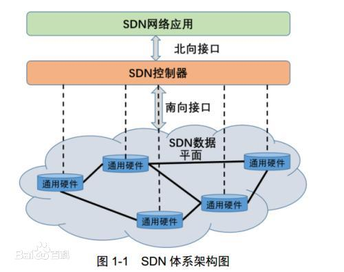

# ComputeNetwork3--SDN

### 简介

SDN(Software Defined Network)，软件定义网络

核心技术：OpenFlow通过将网络设备的控制面与数据面分离开来，从而实现了网络流量的灵活控制，使网络作为管道变得更加智能

### 设计思想

利用分层的思想，SDN将数据与控制相分离。

在控制层，包括具有逻辑中心化和可编程的控制器，可掌握全局网络信息，方便运营商和科研人员管理配置网络和部署新协议等。

在数据层，包括哑的交换机（与传统的二层交换机不同，专指用于转发数据的设备），仅提供简单的数据转发功能，可以快速处理匹配的数据包，适应流量日益增长的需求。

两层之间采用开放的统一接口（如OpenFlow等）进行交互。

控制器通过标准接口向交换机下发统一标准规则，交换机仅需按照这些规则执行相应的动作即可。

软件定义网络的思想是通过控制与转发分离，将网络中交换设备的控制逻辑集中到一个计算设备上，为提升网络管理配置能力带来新的思路。

SDN的本质特点是控制平面和数据平面的分离以及开放可编程性。通过分离控制平面和数据平面以及开放的通信协议，SDN打破了传统网络设备的封闭性。

此外，南北向和东西向的开放接口及可编程性，也使得网络管理变得更加简单、动态和灵活

### 体系结构

SDN的整体架构由下到上（由南到北）分为数据平面、控制平面和应用平面，具体如图1-1所示。

其中，数据平面由交换机等网络通用硬件组成，各个网络设备之间通过不同规则形成的SDN数据通路连接；

控制平面包含了逻辑上为中心的SDN控制器，它掌握着全局网络信息，负责各种转发规则的控制；

应用平面包含着各种基于SDN的网络应用，用户无需关心底层细节就可以编程、部署新应用。

控制平面与数据平面之间通过SDN控制数据平面接口（control-data-plane interface，简称CDPI）进行通信，它具有统一的通信标准，主要负责将控制器中的转发规则下发至转发设备，最主要应用的是**OpenFlow协议**。

控制平面与应用平面之间通过SDN北向接口（northbound interface，简称NBI）进行通信，而NBI并非统一标准，它允许用户根据自身需求定制开发各种网络管理应用。

SDN中的接口具有开放性，以控制器为逻辑中心，南向接口负责与数据平面进行通信，北向接口负责与应用平面进行通信，东西向接口负责多控制器之间的通信。

最主流的南向接口CDPI采用的是OpenFlow协议。OpenFlow最基本的特点是基于流（Flow）的概念来匹配转发规则，每一个交换机都维护一个流表（Flow Table），依据流表中的转发规则进行转发，而流表的建立、维护和下发都是由控制器完成的。

针对北向接口，应用程序通过北向接口编程来调用所需的各种网络资源，实现对网络的快速配置和部署。

东西向接口使控制器具有可扩展性，为负载均衡和性能提升提供了技术保障。

