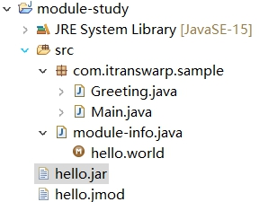
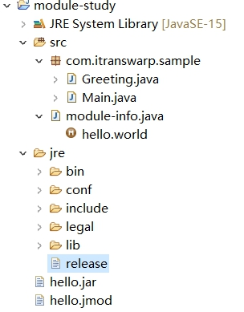

# Java笔记13--面向对象编程1-基础

## 面向对象和面向过程

### 面向过程

面向过程编程，是把模型分解成一步一步的过程。

### 面向对象

面向对象编程(Object-Oriented Programming，简称OOP)，是一种通过对象的方式，把现实世界映射到计算机模型的一种编程方法。

## 类和实例

### 类

class是一种对象模版，它定义了如何创建实例，因此，class本身就是一种数据类型

* 定义类

  ```java
  class Person {
      public String name;
      public int age;
  }
  ```

  一个`class`可以包含多个字段（`field`），字段用来描述一个类的特征。上面的`Person`类，我们定义了两个字段，一个是`String`类型的字段，命名为`name`，一个是`int`类型的字段，命名为`age`。

  因此，通过`class`，把一组数据汇集到一个对象上，实现了数据封装。

### 实例

而instance是对象实例，instance是根据class创建的实例，可以创建多个instance，每个instance类型相同，但各自属性可能不相同

* 创建实例

  ```java
  Person ming = new Person();
  ```

  上述代码创建了一个Person类型的实例，并通过变量`ming`指向它。

  注意区分`Person ming`是定义`Person`类型的变量`ming`，而`new Person()`是创建`Person`实例。

* 访问实例变量 : 变量.字段

  ```java
  ming.name = "Xiao Ming"; // 对字段name赋值
  ming.age = 12; // 对字段age赋值
  System.out.println(ming.name); // 访问字段name
  
  Person hong = new Person();
  hong.name = "Xiao Hong";
  hong.age = 15;
  ```

  上述两个变量分别指向两个不同的实例，它们在内存中的结构如下：

  ```ascii
              ┌──────────────────┐
  ming ──────>│Person instance   │
              ├──────────────────┤
              │name = "Xiao Ming"│
              │age = 12          │
              └──────────────────┘
              ┌──────────────────┐
  hong ──────>│Person instance   │
              ├──────────────────┤
              │name = "Xiao Hong"│
              │age = 15          │
              └──────────────────┘
  ```

## 方法

一个类通过定义方法，就可以给外部代码暴露一些操作的接口，同时，内部自己保证逻辑一致性。

调用方法的语法是`实例变量.方法名(参数);`。

一个方法调用就是一个语句，所以不要忘了在末尾加`;`

### 定义方法

```java
修饰符 方法返回类型 方法名(方法参数列表) {
    若干方法语句;
    return 方法返回值;
}
```

方法返回值通过`return`语句实现，如果没有返回值，返回类型设置为`void`，可以省略`return`。

### private方法

private方法不允许外部调用，允许类内部调用

```java
public class Main {
    public static void main(String[] args) {
        Person ming = new Person();
        ming.setBirth(2008);
        System.out.println(ming.getAge());
    }
}

class Person {
    private String name;
    private int birth;

    public void setBirth(int birth) {
        this.birth = birth;
    }

    public int getAge() {
        return calcAge(2019); // 调用private方法
    }

    // private方法:
    private int calcAge(int currentYear) {
        return currentYear - this.birth;
    }
}
```

这个`Person`类只定义了`birth`字段，没有定义`age`字段，获取`age`时，通过方法`getAge()`返回的是一个实时计算的值，并非存储在某个字段的值。

这说明方法可以封装一个类的对外接口，调用方不需要知道也不关心`Person`实例在内部到底有没有`age`字段。

### this变量

* 在方法内部，可以使用一个隐含的变量`this`，它始终指向当前实例。

* 因此，通过`this.field`就可以访问当前实例的字段。

* 如果没有命名冲突，可以省略`this`。

  ```java
  class Person {
      private String name;
  
      public String getName() {
          return name; // 相当于this.name
      }
  }
  ```

* 但是，如果有局部变量和字段重名，那么局部变量优先级更高，就必须加上`this`

  ```java
  class Person {
      private String name;
  
      public void setName(String name) {
          this.name = name; // 前面的this不可少，少了就变成局部变量name了
      }
  }
  ```

### 方法参数

* 方法可以包含0个或任意个参数。
* 方法参数用于接收传递给方法的变量值。
* 调用方法时，必须严格按照参数的定义一一传递。

### 可变参数

* 可变参数用`类型...`定义，可变参数相当于数组类型

  ```java
  class Group {
      private String[] names;
  
      public void setNames(String... names) {
          this.names = names;
      }
  }
  ```

  上面的`setNames()`就定义了一个可变参数。

  调用时，可以这么写：

  ```java
  Group g = new Group();
  g.setNames("Xiao Ming", "Xiao Hong", "Xiao Jun"); // 传入3个String
  g.setNames("Xiao Ming", "Xiao Hong"); // 传入2个String
  g.setNames("Xiao Ming"); // 传入1个String
  g.setNames(); // 传入0个String
  ```

  完全可以把可变参数改写为`String[]`类型：

  ```java
  class Group {
      private String[] names;
  
      public void setNames(String[] names) {
          this.names = names;
      }
  }
  ```

  但是，调用方需要自己先构造`String[]`，比较麻烦：

  ```java
  Group g = new Group();
  g.setNames(new String[] {"Xiao Ming", "Xiao Hong", "Xiao Jun"}); // 传入1个String[]
  ```

  另一个问题是，调用方可以传入`null`：

  ```java
  Group g = new Group();
  g.setNames(null);
  ```

  而可变参数可以保证无法传入`null`，因为传入0个参数时，接收到的实际值是一个空数组而不是`null`。

### 参数绑定

+ 调用方把参数传递给实例方法时，调用时传递的值会按参数位置一一绑定。

+ 基本类型参数的传递，是调用方值的复制。双方各自的后续修改，互不影响。

  ```java
  public class Main {
      public static void main(String[] args) {
          Person p = new Person();
          int n = 15; // n的值为15
          p.setAge(n); // 传入n的值
          System.out.println(p.getAge()); // 15
          n = 20; // n的值改为20
          System.out.println(p.getAge()); // 15
      }
  }
  
  class Person {
      private int age;
  
      public int getAge() {
          return this.age;
      }
  
      public void setAge(int age) {
          this.age = age;
      }
  }
  ```

+ 引用类型参数的传递，调用方的变量，和接收方的参数变量，指向的是同一个对象。

  双方任意一方对这个对象的修改，都会影响对方（因为指向同一个对象嘛）。

  ```java
  public class Main {
      public static void main(String[] args) {
          Person p = new Person();
          String[] fullname = new String[] { "Homer", "Simpson" };
          p.setName(fullname); // 传入fullname数组
          System.out.println(p.getName()); // "Homer Simpson"
          fullname[0] = "Bart"; // fullname数组的第一个元素修改为"Bart"
          System.out.println(p.getName()); // "Bart Simpson"
      }
  }
  
  class Person {
      private String[] name;
  
      public String getName() {
          return this.name[0] + " " + this.name[1];
      }
  
      public void setName(String[] name) {
          this.name = name;
      }
  }
  ```

  ```java
  public class Main {
      public static void main(String[] args) {
          Person p = new Person();
          String bob = "Bob";
          p.setName(bob); // 传入bob变量
          System.out.println(p.getName()); // "Bob"
          bob = "Alice"; // bob改名为Alice
          System.out.println(p.getName()); // "Bob"
      }
  }
  
  class Person {
      private String name;
  
      public String getName() {
          return this.name;
      }
  
      public void setName(String name) {
          this.name = name;
      }
  }
  ```
  
  当 bob = "Alice"时，会在内存中新开辟一个空间，bob的指向该变了。但是name属性还是指向原来的内存空间 还是Bob

## 构造方法

* 创建实例的时候，实际上是通过构造方法来初始化实例的。

* 示例

  ```java
  public class Main {
      public static void main(String[] args) {
          Person p = new Person("Xiao Ming", 15);
          System.out.println(p.getName());
          System.out.println(p.getAge());
      }
  }
  
  class Person {
      private String name;
      private int age;
  
      public Person(String name, int age) {
          this.name = name;
          this.age = age;
      }
      
      public String getName() {
          return this.name;
      }
  
      public int getAge() {
          return this.age;
      }
  }
  ```

* 构造方法的名称就是类名。

* 构造方法的参数没有限制，在方法内部，也可以编写任意语句。

* 但是，和普通方法相比，构造方法没有返回值**（也没有`void`）**，调用构造方法，必须用`new`操作符。

### 默认构造方法

如果一个类没有定义构造方法，编译器会自动为我们生成一个默认构造方法，它没有参数，也没有执行语句，类似这样：

```java
class Person {
    public Person() {
    }
}
```

要特别注意的是，**如果我们自定义了一个构造方法，那么，编译器就不再自动创建默认构造方法**

如果既要能使用带参数的构造方法，又想保留不带参数的构造方法，那么只能把两个构造方法都定义出来：

```java
public class Main {
    public static void main(String[] args) {
        Person p1 = new Person("Xiao Ming", 15); // 既可以调用带参数的构造方法
        Person p2 = new Person(); // 也可以调用无参数构造方法
    }
}

class Person {
    private String name;
    private int age;

    public Person() {
    }

    public Person(String name, int age) {
        this.name = name;
        this.age = age;
    }
    
    public String getName() {
        return this.name;
    }

    public int getAge() {
        return this.age;
    }
}
```

没有在构造方法中初始化字段时，引用类型的字段默认是`null`，数值类型的字段用默认值，`int`类型默认值是`0`，布尔类型默认值是`false`

```java
class Person {
    private String name; // 默认初始化为null
    private int age; // 默认初始化为0

    public Person() {
    }
}
```

也可以对字段直接进行初始化：

```java
class Person {
    private String name = "Unamed";
    private int age = 10;
}
```

**在Java中，创建对象实例的时候，按照如下顺序进行初始化**：

* 先初始化字段，例如，`int age = 10;`表示字段初始化为`10`，`double salary;`表示字段默认初始化为`0`，`String name;`表示引用类型字段默认初始化为`null`；
* 执行构造方法的代码进行初始化。

```java
class Person {
    private String name = "Unamed";
    private int age = 10;

    public Person(String name, int age) {
        this.name = name;
        this.age = age;
    }
}
```

构造方法的代码由于后运行，所以，`new Person("Xiao Ming", 12)`的字段值最终由构造方法的代码确定。

### 多构造方法

可以定义多个构造方法，在通过`new`操作符调用的时候，编译器通过构造方法的参数数量、位置和类型自动区分：

```java
class Person {
    private String name;
    private int age;

    public Person(String name, int age) {
        this.name = name;
        this.age = age;
    }

    public Person(String name) {
        this.name = name;
        this.age = 12;
    }

    public Person() {
    }
}
```

如果调用`new Person("Xiao Ming", 20);`，会自动匹配到构造方法`public Person(String, int)`。

如果调用`new Person("Xiao Ming");`，会自动匹配到构造方法`public Person(String)`。

如果调用`new Person();`，会自动匹配到构造方法`public Person()`。

**一个构造方法可以调用其他构造方法，这样做的目的是便于代码复用。**调用其他构造方法的语法是`this(…)`：

```java
class Person {
    private String name;
    private int age;

    public Person(String name, int age) {
        this.name = name;
        this.age = age;
    }

    public Person(String name) {
        this(name, 18); // 调用另一个构造方法Person(String, int)
    }

    public Person() {
        this("Unnamed"); // 调用另一个构造方法Person(String)
    }
}
```

## 方法重载

在一个类中，我们可以定义多个方法。

如果有一系列方法，它们的功能都是类似的，只有参数有所不同，那么，可以把这一组方法名做成*同名*方法。

这种**方法名相同，但各自的参数不同，称为方法重载（`Overload`）**。

注意：**方法重载的返回值类型通常都是相同的。**

方法重载的目的是，功能类似的方法使用同一名字，更容易记住，因此，调用起来更简单。

* 示例：在`Hello`类中，定义多个`hello()`方法：

  ```java
  class Hello {
      public void hello() {
          System.out.println("Hello, world!");
      }
  
      public void hello(String name) {
          System.out.println("Hello, " + name + "!");
      }
  
      public void hello(String name, int age) {
          if (age < 18) {
              System.out.println("Hi, " + name + "!");
          } else {
              System.out.println("Hello, " + name + "!");
          }
      }
  }
  ```

* 示例：`String`类提供了多个重载方法`indexOf()`，可以查找子串：

  - `int indexOf(int ch)`：根据字符的Unicode码查找；
  - `int indexOf(String str)`：根据字符串查找；
  - `int indexOf(int ch, int fromIndex)`：根据字符查找，但指定起始位置；
  - `int indexOf(String str, int fromIndex)`根据字符串查找，但指定起始位置。

  ```java
  public class Main {
      public static void main(String[] args) {
          String s = "Test string";
          int n1 = s.indexOf('t');
          int n2 = s.indexOf("st");
          int n3 = s.indexOf("st", 4);
          System.out.println(n1);
          System.out.println(n2);
          System.out.println(n3);
      }
  }
  ```

  ```java
  3
  2
  5
  ```

## 继承

+ 继承是面向对象编程中非常强大的一种机制，它首先可以复用代码。

  当我们让`Student`从`Person`继承时，`Student`就获得了`Person`的所有功能，我们只需要为`Student`编写新增的功能。

### Java使用extends关键字实现继承

```java
class Person {
    private String name;
    private int age;

    public String getName() {...}
    public void setName(String name) {...}
    public int getAge() {...}
    public void setAge(int age) {...}
}

class Student extends Person {
    // 不要重复name和age字段/方法,
    // 只需要定义新增score字段/方法:
    private int score;

    public int getScore() { … }
    public void setScore(int score) { … }
}
```

在OOP的术语中，我们把`Person`称为超类（super class），父类（parent class），基类（base class）；把`Student`称为子类（subclass），扩展类（extended class）。

+ **子类自动获得了父类的所有字段，严禁定义与父类重名的字段！**

+ 在Java中，没有明确写`extends`的类，编译器会自动加上`extends Object`。

  所以，任何类，除了`Object`，都会继承自某个类。

* **Java只允许一个class继承自一个类**，因此，一个类有且仅有一个父类。

  只有`Object`特殊，它没有父类。

### 继承树

如果我们定义一个继承自`Person`的`Student`和`Teacher`

```ascii
       ┌───────────┐
       │  Object   │
       └───────────┘
             ▲
             │
       ┌───────────┐
       │  Person   │
       └───────────┘
          ▲     ▲
          │     │
          │     │
┌───────────┐ ┌───────────┐
│  Student  │ │  Teacher  │
└───────────┘ └───────────┘
```

### protected

* 继承有个特点，就是子类无法访问父类的`private`字段或者`private`方法。

  这使得继承的作用被削弱了。

  为了让子类可以访问父类的字段，我们需要把`private`改为`protected`。

  用`protected`修饰的字段可以被子类访问

* `protected`关键字可以把字段和方法的访问权限控制在继承树内部，

  一个`protected`字段和方法可以被其子类，以及子类的子类所访问，

```java
class Person {
    protected String name;
    protected int age;
}

class Student extends Person {
    public String hello() {
        return "Hello, " + name; // OK!
    }
}
```

### super

* `super`关键字表示父类（超类）。

* 子类引用父类的字段时，可以用`super.fieldName`。

  ```java
  class Student extends Person {
      public String hello() {
          return "Hello, " + super.name;
      }
  }
  ```

  实际上，这里使用`super.name`，或者`this.name`，或者`name`，效果都是一样的。编译器会自动定位到父类的`name`字段。

* 在某些情况下，必须使用super

  * 示例1

    ```java
    public class Main {
        public static void main(String[] args) {
            Student s = new Student("Xiao Ming", 12, 89);
        }
    }
    
    class Person {
        protected String name;
        protected int age;
    
        public Person(String name, int age) {
            this.name = name;
            this.age = age;
        }
    }
    
    class Student extends Person {
        protected int score;
    
        public Student(String name, int age, int score) {
            this.score = score;
        }
    }
    ```

    运行上面的代码，会得到一个编译错误，大意是在`Student`的构造方法中，无法调用`Person`的构造方法。

    **这是因为在Java中，任何`class`的构造方法，第一行语句必须是调用父类的构造方法。如果没有明确地调用父类的构造方法，编译器会帮我们自动加一句`super();`**，所以，`Student`类的构造方法实际上是这样：

    ```java
    class Student extends Person {
        protected int score;
    
        public Student(String name, int age, int score) {
            super(); // 自动调用父类的构造方法
            this.score = score;
        }
    }
    ```

    但是，`Person`类并没有无参数的构造方法，因此，编译失败。

    解决方法是调用`Person`类存在的某个构造方法。例如：

    ```java
    class Student extends Person {
        protected int score;
    
        public Student(String name, int age, int score) {
            super(name, age); // 调用父类的构造方法Person(String, int)
            this.score = score;
        }
    }
    ```

    这样就可以正常编译了！

    因此我们得出结论：**如果父类没有默认的构造方法，子类就必须显式调用`super()`并给出参数以便让编译器定位到父类的一个合适的构造方法。**

    这里还顺带引出了另一个问题：即**子类*不会继承*任何父类的构造方法**。**子类默认的构造方法是编译器自动生成的，不是继承的。**

### 阻止继承

* 正常情况下，只要某个class没有`final`修饰符，那么任何类都可以从该class继承。

* 从Java 15开始，允许使用`sealed`修饰class，并通过`permits`明确写出能够从该class继承的子类名称。

* 示例

  定义一个`Shape`类：

  ```java
  public sealed class Shape permits Rect, Circle, Triangle {
      ...
  }
  ```

  上述`Shape`类就是一个`sealed`类，它只允许指定的3个类继承它。

* 这种`sealed`类主要用于一些框架，防止继承被滥用。

* `sealed`类在Java 15中目前是预览状态，要启用它，必须使用参数`--enable-preview`和`--source 15`。

### 向上转型

如果`Student`是从`Person`继承下来的，那么，一个引用类型为`Person`的变量，能否指向`Student`类型的实例？

* 可以

* 这是因为`Student`继承自`Person`，因此，它拥有`Person`的全部功能

* `Person`类型的变量，如果指向`Student`类型的实例，对它进行操作，是没有问题的！

* 这种把一个子类类型安全地变为父类类型的赋值，被称为向上转型（upcasting）。

* 向上转型实际上是把一个子类型安全地变为更加抽象的父类型：

  ```java
  Student s = new Student();
  Person p = s; // upcasting, ok
  Object o1 = p; // upcasting, ok
  Object o2 = s; // upcasting, ok
  ```

  注意到继承树是`Student > Person > Object`，所以，可以把`Student`类型转型为`Person`，或者更高层次的`Object`。

### 向下转型

* 和向上转型相反，如果把一个父类类型强制转型为子类类型，就是向下转型（downcasting）。

  ```java
  Person p1 = new Student(); // upcasting, ok
  Person p2 = new Person();
  Student s1 = (Student) p1; // ok
  Student s2 = (Student) p2; // runtime error! ClassCastException!
  ```

  `Person`类型`p1`实际指向`Student`实例，`Person`类型变量`p2`实际指向`Person`实例。

  在向下转型的时候，把`p1`转型为`Student`会成功，因为`p1`确实指向`Student`实例，把`p2`转型为`Student`会失败，因为`p2`的实际类型是`Person`，**不能把父类变为子类，因为子类功能比父类多，多的功能无法凭空变出来。**

* 向下转型很可能会失败。失败的时候，Java虚拟机会报`ClassCastException`。

* 为了避免向下转型出错，Java提供了`instanceof`操作符，可以先判断一个实例究竟是不是某种类型：

  ```java
  Person p = new Person();
  System.out.println(p instanceof Person); // true
  System.out.println(p instanceof Student); // false
  
  Student s = new Student();
  System.out.println(s instanceof Person); // true
  System.out.println(s instanceof Student); // true
  
  Student n = null;
  System.out.println(n instanceof Student); // false
  ```

  `instanceof`实际上判断一个变量所指向的实例是否是指定类型，或者这个类型的子类。

  **如果一个引用变量为`null`，那么对任何`instanceof`的判断都为`false`。**

  利用`instanceof`，在向下转型前可以先判断：

  ```java
  Person p = new Student();
  if (p instanceof Student) {
      // 只有判断成功才会向下转型:
      Student s = (Student) p; // 一定会成功
  }
  ```

* 从Java 14开始，判断`instanceof`后，可以直接转型为指定变量，避免再次强制转型。

  例如，对于以下代码：

  ```java
  Object obj = "hello";
  if (obj instanceof String) {
      String s = (String) obj;
      System.out.println(s.toUpperCase());
  }
  ```

  可以改写如下：

  ```java
  public class Main {
      public static void main(String[] args) {
          Object obj = "hello";
          if (obj instanceof String s) {
              // 可以直接使用变量s:
              System.out.println(s.toUpperCase());
          }
      }
  }
  ```

  这种使用`instanceof`的写法更加简洁。

### 区分继承和组合

在使用继承时，我们要注意逻辑一致性。

考察下面的`Book`类：

```java
class Book {
    protected String name;
    public String getName() {...}
    public void setName(String name) {...}
}
```

这个`Book`类也有`name`字段，那么，我们能不能让`Student`继承自`Book`呢？

```java
class Student extends Book {
    protected int score;
}
```

显然，从逻辑上讲，这是不合理的，`Student`不应该从`Book`继承，而应该从`Person`继承。

究其原因，是因为`Student`是`Person`的一种，它们是is关系，而`Student`并不是`Book`。实际上`Student`和`Book`的关系是has关系。

具有has关系不应该使用继承，而是使用组合，即`Student`可以持有一个`Book`实例：

```java
class Student extends Person {
    protected Book book;
    protected int score;
}
```

因此，继承是is关系，组合是has关系。

## 多态

### 覆写

* 在继承关系中，子类如果定义了一个与父类方法签名**完全相同**的方法，被称为覆写（Override）。

* 示例

  例如，在`Person`类中，我们定义了`run()`方法：

  ```java
  class Person {
      public void run() {
          System.out.println("Person.run");
      }
  }
  ```

  在子类`Student`中，覆写这个`run()`方法：

  ```java
  class Student extends Person {
      @Override
      public void run() {
          System.out.println("Student.run");
      }
  }
  ```

* Override和Overload区别

  如果方法签名不同，就是Overload，Overload方法是一个新方法；

  如果方法签名相同，并且返回值也相同，就是`Override`。

  ```java
  class Person {
      public void run() { … }
  }
  
  class Student extends Person {
      // 不是Override，因为参数不同:
      public void run(String s) { … }
      // 不是Override，因为返回值不同:
      public int run() { … }
  }
  ```

* 方法名相同，方法参数相同，但方法返回值不同，也是不同的方法。

  在Java程序中，出现这种情况，编译器会报错。

* 加上`@Override`可以让编译器帮助检查是否进行了正确的覆写。

  希望进行覆写，但是不小心写错了方法签名，编译器会报错。

  但是**`@Override`不是必需的**。

+ 子类覆写父类的方法时的调用问题

  ```java
  public class Main {
      public static void main(String[] args) {
          Person p = new Student();
          p.run(); // 应该打印Person.run还是Student.run?
      }
  }
  
  class Person {
      public void run() {
          System.out.println("Person.run");
      }
  }
  
  class Student extends Person {
      @Override
      public void run() {
          System.out.println("Student.run");
      }
  }
  ```

  一个实际类型为`Student`，引用类型为`Person`的变量，调用其`run()`方法，调用的是`Student`的`run()`方法？

  **Java的实例方法调用是基于运行时的实际类型的动态调用，而非变量的声明类型。**

  **这个非常重要的特性在面向对象编程中称之为多态**。它的英文拼写非常复杂：Polymorphic。

### 多态

* 多态是指，针对某个类型的方法调用，其真正执行的方法取决于运行时期实际类型的方法。

  对于这样的调用：

  ```java
  Person p = new Student();
  p.run(); // 无法确定运行时究竟调用哪个run()方法
  ```

  真正执行的方法可能是`Student`的`run()`方法，但也可能是`Person`的`run()`方法

  假设我们编写这样一个方法：

  ```java
  public void runTwice(Person p) {
      p.run();
      p.run();
  }
  ```

  它传入的参数类型是`Person`，我们是无法知道传入的参数实际类型究竟是`Person`，还是`Student`，还是`Person`的其他子类，因此，也无法确定调用的是不是`Person`类定义的`run()`方法。

* **多态的特性就是，运行期才能动态决定调用的子类方法**。

* 对某个类型调用某个方法，执行的实际方法可能是某个子类的覆写方法。

  这种不确定性的方法调用，究竟有什么作用？

  ```java
  public class Main {
      public static void main(String[] args) {
          // 给一个有普通收入、工资收入和享受国务院特殊津贴的小伙伴算税:
          Income[] incomes = new Income[] {
              new Income(3000),
              new Salary(7500),
              new StateCouncilSpecialAllowance(15000)
          };
          System.out.println(totalTax(incomes));
      }
  	// 编写一个报税的财务软件，对于一个人的所有收入进行报税
      public static double totalTax(Income... incomes) {
          double total = 0;
          for (Income income: incomes) {
              total = total + income.getTax();
          }
          return total;
      }
  }
  // 假设我们定义一种收入，需要给它报税，那么先定义一个Income类：
  class Income {
      protected double income;
  
      public Income(double income) {
          this.income = income;
      }
  
      public double getTax() {
          return income * 0.1; // 税率10%
      }
  }
  // 对于工资收入，可以减去一个基数，那么我们可以从Income派生出
  // SalaryIncome，并覆写getTax()：
  class Salary extends Income {
      public Salary(double income) {
          super(income);
      }
  
      @Override
      public double getTax() {
          if (income <= 5000) {
              return 0;
          }
          return (income - 5000) * 0.2;
      }
  }
  // 如果你享受国务院特殊津贴，那么按照规定，可以全部免税：
  class StateCouncilSpecialAllowance extends Income {
      public StateCouncilSpecialAllowance(double income) {
          super(income);
      }
  
      @Override
      public double getTax() {
          return 0;
      }
  }
  ```

  观察`totalTax()`方法：利用多态，`totalTax()`方法只需要和`Income`打交道，它完全不需要知道`Salary`和`StateCouncilSpecialAllowance`的存在，就可以正确计算出总的税。

  如果我们要新增一种稿费收入，只需要从`Income`派生，然后正确覆写`getTax()`方法就可以。把新的类型传入`totalTax()`，不需要修改任何代码。

  可见，**多态具有一个非常强大的功能，就是允许添加更多类型的子类实现功能扩展，却不需要修改基于父类的代码**。

### 覆写Object方法

* 所有的`class`最终都继承自`Object`，而`Object`定义了几个重要的方法：

  * `toString()`：把instance输出为`String`；
  * `equals()`：判断两个instance是否逻辑相等；
  * `hashCode()`：计算一个instance的哈希值。

* 在必要的情况下，我们可以覆写`Object`的这几个方法。

  ```java
  class Person {
      ...
      // 显示更有意义的字符串:
      @Override
      public String toString() {
          return "Person:name=" + name;
      }
  
      // 比较是否相等:
      @Override
      public boolean equals(Object o) {
          // 当且仅当o为Person类型:
          if (o instanceof Person) {
              Person p = (Person) o;
              // 并且name字段相同时，返回true:
              return this.name.equals(p.name);
          }
          return false;
      }
  
      // 计算hash:
      @Override
      public int hashCode() {
          return this.name.hashCode();
      }
  }
  ```

### 调用super

在子类的覆写方法中，如果要调用父类的被覆写的方法，可以通过`super`来调用。

```java
class Person {
    protected String name;
    public String hello() {
        return "Hello, " + name;
    }
}

class Student extends Person {
    @Override
    public String hello() {
        // 调用父类的hello()方法:
        return super.hello() + "!";
    }
}
```

### final

继承可以允许子类覆写父类的方法。

* 如果一个父类不允许子类对它的某个方法进行覆写，可以把该方法标记为`final`，即，用`final`修饰的方法不能被`Override`：

  ```java
  class Person {
      protected String name;
      public final String hello() {
          return "Hello, " + name;
      }
  }
  
  class Student extends Person {
      // compile error: 不允许覆写
      @Override
      public String hello() {
      }
  }
  ```

* 如果一个类不希望任何其他类继承自它，那么可以把这个类本身标记为`final`，即，用`final`修饰的类不能被继承：

  ```java
  final class Person {
      protected String name;
  }
  
  // compile error: 不允许继承自Person
  class Student extends Person {
  }
  ```

* 对于一个类的实例字段，同样可以用`final`修饰。用`final`修饰的字段在初始化后不能被修改。

  ```java
  class Person {
      public final String name = "Unamed";
  }
  ```

  对`final`字段重新赋值会报错：

  ```java
  Person p = new Person();
  p.name = "New Name"; // compile error!
  ```

  **可以在构造方法中初始化final字段**：

  ```java
  class Person {
      public final String name;
      public Person(String name) {
          this.name = name;
      }
  }
  ```

  这种方法更为常用，因为可以保证实例一旦创建，其`final`字段就不可修改。

### final使用注意点

* final关键字可以修饰类，方法，变量（成员变量内，局部变量，静态变量）

* 被final修饰的类是一个最终类，不可以被继承

* 被final修饰的方法是一个最终方法，不可以被覆盖，但是可以被继承。

* 被final修饰的变量只能是一个常量，只能赋值一次。

* 内部类被定义在类中的局部位置上时，只能访问局部被final修饰的局部变量。

## 抽象类

由于多态的存在，每个子类都可以覆写父类的方法

```java
class Person {
    public void run() { … }
}

class Student extends Person {
    @Override
    public void run() { … }
}

class Teacher extends Person {
    @Override
    public void run() { … }
}
```

从`Person`类派生的`Student`和`Teacher`都可以覆写`run()`方法。

如果父类`Person`的`run()`方法没有实际意义，**能否去掉父类方法的执行语句**？

```java
class Person {
    public void run(); // Compile Error!
}
```

答案是不行，会导致编译错误，因为定义方法的时候，必须实现方法的语句。

**能不能去掉父类的`run()`方法？**

答案还是不行，因为去掉父类的`run()`方法，就失去了多态的特性。例如，`runTwice()`就无法编译：

```java
public void runTwice(Person p) {
    p.run(); // Person没有run()方法，会导致编译错误
    p.run();
}
```

* 如果父类的方法本身不需要实现任何功能，仅仅是为了定义方法签名，目的是让子类去覆写它，那么，可以把父类的方法声明为抽象方法：

  ```java
  class Person {
      public abstract void run();
  }
  ```

  把一个方法声明为`abstract`，表示它是一个抽象方法，本身没有实现任何方法语句。因为这个抽象方法本身是无法执行的，所以，`Person`类也无法被实例化。编译器会告诉我们，**无法编译`Person`类，因为它包含抽象方法**。

  必须把`Person`类本身也声明为`abstract`，才能正确编译它：

  ```java
  abstract class Person {
      public abstract void run();
  }
  ```

* 如果一个`class`定义了方法，但没有具体执行代码，这个方法就是抽象方法，抽象方法用`abstract`修饰。

* **因为无法执行抽象方法，因此这个类也必须申明为抽象类（abstract class）。**

* **无法实例化一个抽象类**

  ```java
  Person p = new Person(); // 编译错误
  ```

* 抽象类的使用意义

  因为抽象类本身被设计成只能用于被继承，因此，**抽象类可以强迫子类实现其定义的抽象方法**，否则编译会报错。因此，**抽象方法实际上相当于定义了“规范”。**

  例如，`Person`类定义了抽象方法`run()`，那么，在实现子类`Student`的时候，就必须覆写`run()`方法：

  ```java
  public class Main {
      public static void main(String[] args) {
          Person p = new Student();
          p.run();
      }
  }
  
  abstract class Person {
      public abstract void run();
  }
  
  class Student extends Person {
      @Override
      public void run() {
          System.out.println("Student.run");
      }
  }
  ```

### 面向抽象编程

当我们定义了抽象类`Person`，以及具体的`Student`、`Teacher`子类的时候，我们可以通过抽象类`Person`类型去引用具体的子类的实例：

```java
Person s = new Student();
Person t = new Teacher();
```

这种引用抽象类的好处在于，我们对其进行方法调用，并不关心`Person`类型变量的具体子类型：

```java
// 不关心Person变量的具体子类型:
s.run();
t.run();
```

同样的代码，如果引用的是一个新的子类，我们仍然不关心具体类型：

```java
// 同样不关心新的子类是如何实现run()方法的：
Person e = new Employee();
e.run();
```

* **这种尽量引用高层类型，避免引用实际子类型的方式，称之为面向抽象编程。**

* **面向抽象编程的本质就是：**
  - 上层代码只定义规范（例如：`abstract class Person`）；
  - 不需要子类就可以实现业务逻辑（正常编译）；
  - 具体的业务逻辑由不同的子类实现，调用者并不关心。

### abstract使用注意点

* 抽象方法只能定义在抽象类中，抽象方法和抽象类必须由abstract修饰
* abstract关键字只能描述类和方法，不能描述变量
* 抽象方法只定义方法声明，不定义方法实现
* 抽象类不可以被实例化（创建对象），只有通过子类继承抽象类并覆盖抽象类中的所有抽象方法后，该子类才可以被实例化，否则该子类还是一个抽象类
* 抽象类中有构造函数用于给子类对象进行初始化，同时抽象类中可以含有非抽象方法
* abstract关键字不可以与final，private,static关键字共存
  * 因为被final修饰的方法不可以被重写，意味着子类不可以重写该方法，如果abstract和final共同修饰父类中的方法，子类要实现抽象方法（abstract的作用），而final又不让该方法重写，这相互矛盾。
  * 如果private和abstract共同修饰父类中的方法，private修饰则该方法不可以被子类访问，但是abstract修饰需要子类去实现，两者产生矛盾。
  * 如果static和abstract共同修饰父类中的方法，static表示是静态的方法，随着类的加载而加载，则该方法不需要在子类中去实现，这与abstract关键字矛盾。

## 接口

* 在抽象类中，抽象方法本质上是定义接口规范：即规定高层类的接口，从而保证所有子类都有相同的接口实现，这样，多态就能发挥出威力。

* 如果一个抽象类没有字段，所有方法全部都是抽象方法：

  ```java
  abstract class Person {
      public abstract void run();
      public abstract String getName();
  }
  ```

  就可以把该抽象类改写为接口：`interface`。

* 在Java中，使用`interface`可以声明一个接口：

  ```java
  interface Person {
      void run();
      String getName();
  }
  ```

* 所谓`interface`，就是比抽象类还要抽象的纯抽象接口，因为它连字段都不能有。

* 因为**接口定义的所有方法默认都是`public abstract`的**，所以这两个修饰符不需要写出来（写不写效果都一样）。

* 当一个具体的`class`去实现一个`interface`时，需要使用`implements`关键字。

  ```java
  class Student implements Person {
      private String name;
  
      public Student(String name) {
          this.name = name;
      }
  
      @Override
      public void run() {
          System.out.println(this.name + " run");
      }
  
      @Override
      public String getName() {
          return this.name;
      }
  }
  ```

* 在Java中，**一个类只能继承自另一个类，不能从多个类继承**。

* 但是，**一个类可以实现多个`interface`**，例如：

  ```java
  class Student implements Person, Hello { // 实现了两个interface
      ...
  }
  ```

### 术语

* Java的接口特指`interface`的定义，表示一个接口类型和一组方法签名
* 而编程接口泛指接口规范，如方法签名，数据格式，网络协议等。

抽象类和接口的对比如下：

|            | abstract class       | interface                   |
| ---------- | -------------------- | --------------------------- |
| 继承       | 只能extends一个class | 可以implements多个interface |
| 字段       | 可以定义实例字段     | 不能定义实例字段            |
| 抽象方法   | 可以定义抽象方法     | 可以定义抽象方法            |
| 非抽象方法 | 可以定义非抽象方法   | 可以定义default方法         |

### 接口继承

* 一个`interface`可以继承自另一个`interface`。

* `interface`继承自`interface`使用`extends`，它相当于扩展了接口的方法。

  ```java
  interface Hello {
      void hello();
  }
  
  interface Person extends Hello {
      void run();
      String getName();
  }
  ```

  此时，`Person`接口继承自`Hello`接口，因此，`Person`接口现在实际上有3个抽象方法签名，其中一个来自继承的`Hello`接口。

### 继承关系

* 合理设计`interface`和`abstract class`的继承关系，可以充分复用代码。

* 一般来说，公共逻辑适合放在`abstract class`中，具体逻辑放到各个子类，而接口层次代表抽象程度。

* 可以参考Java的集合类定义的一组接口、抽象类以及具体子类的继承关系：

  ```ascii
  ┌───────────────┐
  │   Iterable    │
  └───────────────┘
          ▲                ┌───────────────────┐
          │                │      Object       │
  ┌───────────────┐        └───────────────────┘
  │  Collection   │                  ▲
  └───────────────┘                  │
          ▲     ▲          ┌───────────────────┐
          │     └──────────│AbstractCollection │
  ┌───────────────┐        └───────────────────┘
  │     List      │                  ▲
  └───────────────┘                  │
                ▲          ┌───────────────────┐
                └──────────│   AbstractList    │
                           └───────────────────┘
                                  ▲     ▲
                                  │     │
                                  │     │
                       ┌────────────┐ ┌────────────┐
                       │ ArrayList  │ │ LinkedList │
                       └────────────┘ └────────────┘
  ```

* 在使用的时候，实例化的对象永远只能是某个具体的子类，但总是通过接口去引用它，因为接口比抽象类更抽象：

  ```java
  List list = new ArrayList(); // 用List接口引用具体子类的实例
  Collection coll = list; // 向上转型为Collection接口
  Iterable it = coll; // 向上转型为Iterable接口
  ```

### default方法

* 在接口中，可以定义`default`方法。

  例如，把`Person`接口的`run()`方法改为`default`方法：

  ```java
  public class Main {
      public static void main(String[] args) {
          Person p = new Student("Xiao Ming");
          p.run();
      }
  }
  
  interface Person {
      String getName();
      default void run() {
          System.out.println(getName() + " run");
      }
  }
  
  class Student implements Person {
      private String name;
  
      public Student(String name) {
          this.name = name;
      }
  
      public String getName() {
          return this.name;
      }
  }
  ```

* 实现类可以不必覆写`default`方法。

* `default`方法的目的是，当我们需要给接口新增一个方法时，会涉及到修改全部子类。如果新增的是`default`方法，那么子类就不必全部修改，只需要在需要覆写的地方去覆写新增方法。

* `default`方法和抽象类的普通方法是有所不同的。

  因为**`interface`没有字段，`default`方法无法访问字段，而抽象类的普通方法可以访问实例字段。**

## 静态字段和静态方法

### 静态字段

* 在一个`class`中定义的字段，我们称之为实例字段。

* 实例字段的特点是，每个实例都有独立的字段，各个实例的同名字段互不影响。

* 还有一种字段，是用`static`修饰的字段，称为静态字段：`static field`。

* 实例字段在每个实例中都有自己的一个独立“空间”，但是**静态字段只有一个共享“空间”**，所有实例都会共享该字段。

  ```java
  class Person {
      public String name;
      public int age;
      // 定义静态字段number:
      public static int number;
  }
  ```

* 实例

  ```java
  public class Main {
      public static void main(String[] args) {
          Person ming = new Person("Xiao Ming", 12);
          Person hong = new Person("Xiao Hong", 15);
          ming.number = 88;
          System.out.println(hong.number);
          hong.number = 99;
          System.out.println(ming.number);
      }
  }
  
  class Person {
      public String name;
      public int age;
  
      public static int number;
  
      public Person(String name, int age) {
          this.name = name;
          this.age = age;
      }
  }
  ```

  ```
  88
  99
  ```

* **对于静态字段，无论修改哪个实例的静态字段，效果都是一样的：所有实例的静态字段都被修改了**，原因是**静态字段并不属于实例**：

  ```ascii
          ┌──────────────────┐
  ming ──>│Person instance   │
          ├──────────────────┤
          │name = "Xiao Ming"│
          │age = 12          │
          │number ───────────┼──┐    ┌─────────────┐
          └──────────────────┘  │    │Person class │
                                │    ├─────────────┤
                                ├───>│number = 99  │
          ┌──────────────────┐  │    └─────────────┘
  hong ──>│Person instance   │  │
          ├──────────────────┤  │
          │name = "Xiao Hong"│  │
          │age = 15          │  │
          │number ───────────┼──┘
          └──────────────────┘
  ```

  虽然实例可以访问静态字段，但是它们指向的其实都是`Person class`的静态字段。所以，**所有实例共享一个静态字段**。

* 因此，**不推荐用`实例变量.静态字段`去访问静态字段**，因为在Java程序中，实例对象并没有静态字段。

* 在代码中，**实例对象能访问静态字段只是因为编译器可以根据实例类型自动转换为`类名.静态字段`来访问静态对象**。

* **推荐用类名来访问静态字段**。

  可以把静态字段理解为描述`class`本身的字段（非实例字段）。

  对于上面的代码，更好的写法是：

  ```java
  Person.number = 99;
  System.out.println(Person.number);
  ```

### 静态方法

* 用`static`修饰的方法称为静态方法。

* 调用实例方法必须通过一个实例变量，而**调用静态方法则不需要实例变量，通过类名就可以调用**。

* 静态方法类似其它编程语言的函数。

  ```java
  public class Main {
      public static void main(String[] args) {
          Person.setNumber(99);
          System.out.println(Person.number);
      }
  }
  
  class Person {
      public static int number;
  
      public static void setNumber(int value) {
          number = value;
      }
  }
  ```

* 因为**静态方法属于`class`而不属于实例**，因此，==**静态方法内部，无法访问`this`变量，也无法访问实例字段，它只能访问静态字段**==。
* 通过实例变量也可以调用静态方法，但这只是编译器自动帮我们把实例改写成类名而已。
* 通常情况下，通过实例变量访问静态字段和静态方法，会得到一个编译警告。
* 静态方法经常用于工具类。例如：
  * Arrays.sort()
  * Math.random()
* 静态方法也经常用于辅助方法。注意到Java程序的入口`main()`也是静态方法。

### 接口的静态方法

* 因为`interface`是一个纯抽象类，所以它不能定义实例字段。

* 但是，`interface`是可以有静态字段的，并且静态字段必须为`final`类型：

  ```java
  public interface Person {
      public static final int MALE = 1;
      public static final int FEMALE = 2;
  }
  ```

  实际上，因为**`interface`的字段只能是`public static final`类型**，所以我们可以把这些修饰符都去掉，上述代码可以简写为：

  ```java
  public interface Person {
      // 编译器会自动加上public statc final:
      int MALE = 1;
      int FEMALE = 2;
  }
  ```

  编译器会自动把该字段变为`public static final`类型。

### static使用注意点

* static用于修饰成员变量和成员函数，想要实现对象中的共性数据的对象共享，可以将这个数据进行静态修饰，被静态修饰的成员可以直接被类名调用，静态随着类的加载而加载，而且优先于对象存在。

* 静态方法只能访问静态成员（静态方法和静态变量），不可以访问非静态成员

  这是因为静态方法加载时，优先于对象存在，所以没有办法访问对象中的成员。

* 静态方法中不能使用this和super关键字

  因为this代表本类对象，super代表父类对象，而静态时，有可能没有对象存在，所以this和super无法使用

## 包

* 在Java中，我们使用`package`来解决名字冲突。

* Java定义了一种名字空间，称之为包：`package`。

* 一个类总是属于某个包，类名（比如`Person`）只是一个简写，真正的完整类名是`包名.类名`。

  例如：JDK的`Arrays`类存放在包`java.util`下面，因此，完整类名是`java.util.Arrays`。

* 包可以是多层结构，用`.`隔开。

* 要特别注意：**包没有父子关系**。

  java.util和java.util.zip是不同的包，两者没有任何继承关系。

* 在定义`class`的时候，我们需要在第一行声明这个`class`属于哪个包。

  ```java
  package ming; // 申明包名ming
  
  public class Person {
  }
  ```

  没有定义包名的`class`，它使用的是默认包，非常容易引起名字冲突，因此，**不推荐不写包名的做法**。

* 我们还需要按照包结构把Java文件组织起来。

  假设以`package_sample`作为根目录，`src`作为源码目录，那么所有文件结构就是：

  ```ascii
  package_sample
  └─ src
      ├─ hong
      │  └─ Person.java
      │─ ming
      │  └─ Person.java
      └─ mr
         └─ jun
            └─ Arrays.java
  ```

  即所有Java文件对应的目录层次要和包的层次一致。

* 编译后的`.class`文件也需要按照包结构存放。

  如果使用IDE，把编译后的`.class`文件放到`bin`目录下，那么，编译的文件结构就是：

  ```ascii
  package_sample
  └─ bin
     ├─ hong
     │  └─ Person.class
     │─ ming
     │  └─ Person.class
     └─ mr
        └─ jun
           └─ Arrays.class
  ```

  编译的命令相对比较复杂，我们需要在`src`目录下执行`javac`命令：

  ```bash
  $ javac -d ../bin ming/Person.java hong/Person.java mr/jun/Arrays.java
  ```

  在IDE中，会自动根据包结构编译所有Java源码，所以不必担心使用命令行编译的复杂命令。

### 包作用域

* 位于同一个包的类，可以访问包作用域的字段和方法。

* **不用`public`、`protected`、`private`修饰的字段和方法就是包作用域。**

  例如，`Person`类定义在`hello`包下面：

  ```java
  package hello;
  
  public class Person {
      // 包作用域:
      void hello() {
          System.out.println("Hello!");
      }
  }
  ```

  `Main`类也定义在`hello`包下面：

  ```java
  package hello;
  
  public class Main {
      public static void main(String[] args) {
          Person p = new Person();
          p.hello(); // 可以调用，因为Main和Person在同一个包
      }
  }
  ```

### import

* 在一个`class`中，我们总会引用其他的`class`。

  例如，小明的`ming.Person`类，如果要引用小军的`mr.jun.Arrays`类，他有三种写法：

  * 第一种，直接写出完整类名

    ```java
    // Person.java
    package ming;
    
    public class Person {
        public void run() {
            mr.jun.Arrays arrays = new mr.jun.Arrays();
        }
    }
    ```

  * 第二种，用`import`语句，导入小军的`Arrays`，然后写简单类名

    ```java
    // Person.java
    package ming;
    
    // 导入完整类名:
    import mr.jun.Arrays;
    
    public class Person {
        public void run() {
            Arrays arrays = new Arrays();
        }
    }
    ```

  * 第三种，在写`import`的时候，使用`*`，表示把这个包下面的所有`class`都导入进来（但不包括子包的`class`）

    ```java
    // Person.java
    package ming;
    
    // 导入mr.jun包的所有class:
    import mr.jun.*;
    
    public class Person {
        public void run() {
            Arrays arrays = new Arrays();
        }
    }
    ```

    我们一般不推荐这种写法，因为在导入了多个包后，很难看出`Arrays`类属于哪个包。

* 还有一种**`import static`**的语法，它可以导入可以导入一个类的静态字段和静态方法：

  ```java
  package main;
  
  // 导入System类的所有静态字段和静态方法:
  import static java.lang.System.*;
  
  public class Main {
      public static void main(String[] args) {
          // 相当于调用System.out.println(…)
          out.println("Hello, world!");
      }
  }
  ```

  `import static`很少使用。

* Java编译器最终编译出的`.class`文件只使用*完整类名*，因此，在代码中，当编译器遇到一个`class`名称时：
  - 如果是完整类名，就直接根据完整类名查找这个`class`；
  - 如果是简单类名，按下面的顺序依次查找：
    - 查找当前`package`是否存在这个`class`；
    - 查找`import`的包是否包含这个`class`；
    - 查找`java.lang`包是否包含这个`class`。
  - 如果按照上面的规则还无法确定类名，则编译报错。
  
* 实例

  ```java
  // Main.java
  package test;
  
  import java.text.Format;
  
  public class Main {
      public static void main(String[] args) {
          java.util.List list; // ok，使用完整类名 -> java.util.List
          Format format = null; // ok，使用import的类 -> java.text.Format
          String s = "hi"; // ok，使用java.lang包的String -> java.lang.String
          System.out.println(s); // ok，使用java.lang包的System -> java.lang.System
          MessageFormat mf = null; // 编译错误：无法找到MessageFormat: MessageFormat cannot be resolved to a type
      }
  }
  ```

* 编写class的时候，编译器会自动帮我们做两个import动作：

  - 默认自动`import`当前`package`的其他`class`；
  - 默认自动`import java.lang.*`。

  注意：自动导入的是java.lang包，但类似java.lang.reflect这些包仍需要手动导入。

* **JDK的核心类使用`java.lang`包，编译器会自动导入**
* **JDK的其它常用类定义在`java.util.*`，`java.math.*`，`java.text.*`，……；**
* 如果有两个`class`名称相同，例如，`mr.jun.Arrays`和`java.util.Arrays`，那么只能`import`其中一个，另一个必须写完整类名。

### 使用注意

* 为了避免名字冲突，我们需要确定唯一的包名。推荐的做法是使用倒置的域名来确保唯一性。

  例如：
  * org.apache
  * org.apache.commons.log
  * com.liaoxuefeng.sample

  子包就可以根据功能自行命名。

* 要注意不要和`java.lang`包的类重名，即自己的类不要使用这些名字：
  * String
  * System
  * Runtime
  * ...

* 要注意也不要和JDK常用类重名：
  * java.util.List
  * java.text.Format
  * java.math.BigInteger
  * ...

## 作用域

### 访问修饰符

* 在Java中，我们经常看到`public`、`protected`、`private`这些修饰符。
* 在Java中，这些修饰符可以用来限定访问作用域。
* 详看《Java笔记4--Java修饰符》

### package

* 包作用域是指一个类允许访问同一个`package`的没有`public`、`private`修饰的`class`，以及没有`public`、`protected`、`private`修饰的字段和方法。

  ```java
  package abc;
  // package权限的类:
  class Hello {
      // package权限的方法:
      void hi() {
      }
  }
  ```

  只要在同一个包，就可以访问`package`权限的`class`、`field`和`method`：

  ```java
  package abc;
  
  class Main {
      void foo() {
          // 可以访问package权限的类:
          Hello h = new Hello();
          // 可以调用package权限的方法:
          h.hi();
      }
  }
  ```

  注意，包名必须完全一致，包没有父子关系，`com.apache`和`com.apache.abc`是不同的包。

* 包作用域就是默认作用域（default）

### 局部变量

* 在方法内部定义的变量称为局部变量，局部变量作用域从变量声明处开始到对应的块结束。

* 方法参数也是局部变量。

* 实例

  ```java
  package abc;
  
  public class Hello {
      void hi(String name) { // ①
          String s = name.toLowerCase(); // ②
          int len = s.length(); // ③
          if (len < 10) { // ④
              int p = 10 - len; // ⑤
              for (int i=0; i<10; i++) { // ⑥
                  System.out.println(); // ⑦
              } // ⑧
          } // ⑨
      } // ⑩
  }
  ```

  我们观察上面的`hi()`方法代码：

  - 方法参数name是局部变量，它的作用域是整个方法，即①～⑩；
  - 变量s的作用域是定义处到方法结束，即②～⑩；
  - 变量len的作用域是定义处到方法结束，即③～⑩；
  - 变量p的作用域是定义处到if块结束，即⑤～⑨；
  - 变量i的作用域是for循环，即⑥～⑧。

* 使用局部变量时，应该尽可能把局部变量的作用域缩小，尽可能延后声明局部变量。

### final

* 非访问修饰符：final

* 用`final`修饰`class`可以阻止被继承：

  ```java
  package abc;
  
  // 无法被继承:
  public final class Hello {
      private int n = 0;
      protected void hi(int t) {
          long i = t;
      }
  }
  ```

* 用`final`修饰`method`可以阻止被子类覆写：

  ```java
  package abc;
  
  public class Hello {
      // 无法被覆写:
      protected final void hi() {
      }
  }
  ```

* 用`final`修饰`field`可以阻止被重新赋值：

  ```java
  package abc;
  
  public class Hello {
      private final int n = 0;
      protected void hi() {
          this.n = 1; // error!
      }
  }
  ```

* 用`final`修饰局部变量可以阻止被重新赋值：

  ```java
  package abc;
  
  public class Hello {
      protected void hi(final int t) {
          t = 1; // error!
      }
  }
  ```

### 注意

* 如果不确定是否需要`public`，就不声明为`public`，即尽可能少地暴露对外的字段和方法。
* 把方法定义为`package`权限有助于测试，因为测试类和被测试类只要位于同一个`package`，测试代码就可以访问被测试类的`package`权限方法。
* **一个`.java`文件只能包含一个`public`类，但可以包含多个非`public`类**。
* **如果有`public`类，文件名必须和`public`类的名字相同**。

## 内部类

有一种类，它被定义在另一个类的内部，所以称为内部类（Nested Class）。

Java的内部类分为好几种，通常情况用得不多

### Inner Class

* 如果一个类定义在另一个类的内部，这个类就是Inner Class

  ```java
  class Outer {
      class Inner {
          // 定义了一个Inner Class
      }
  }
  ```

* 上述定义的`Outer`是一个普通类，而`Inner`是一个Inner Class，它与普通类有个最大的不同，就是**Inner Class的实例不能单独存在，必须依附于一个Outer Class的实例**。

  ```java
  public class Main {
      public static void main(String[] args) {
          Outer outer = new Outer("Nested"); // 实例化一个Outer
          Outer.Inner inner = outer.new Inner(); // 实例化一个Inner
          inner.hello();
      }
  }
  
  class Outer {
      private String name;
  
      Outer(String name) {
          this.name = name;
      }
  
      class Inner {
          void hello() {
              System.out.println("Hello, " + Outer.this.name);
          }
      }
  }
  ```

  ```java
  Hello, Nested
  ```

  * 要实例化一个`Inner`，我们必须首先创建一个`Outer`的实例，然后，调用`Outer`实例的`new`来创建`Inner`实例

    这是因为**Inner Class除了有一个`this`指向它自己，还隐含地持有一个Outer Class实例，可以用`Outer.this`访问这个实例**。所以，实例化一个Inner Class不能脱离Outer实例。

  * **Inner Class和普通Class相比，除了能引用Outer实例外，还有一个额外的“特权”，就是可以修改Outer Class的`private`字段**，因为Inner Class的作用域在Outer Class内部，所以能访问Outer Class的`private`字段和方法。

* 观察Java编译器编译后的`.class`文件可以发现，**`Outer`类被编译为`Outer.class`，而`Inner`类被编译为`Outer$Inner.class`。**

### Annoymous Class

* 还有一种定义Inner Class的方法，它不需要在Outer Class中明确地定义这个Class，而是在方法内部，通过匿名类（Anonymous Class）来定义。

  ```java
  public class Main {
      public static void main(String[] args) {
          Outer outer = new Outer("Nested");
          outer.asyncHello();
      }
  }
  
  class Outer {
      private String name;
  
      Outer(String name) {
          this.name = name;
      }
  
      void asyncHello() {
          Runnable r = new Runnable() {
              @Override
              public void run() {
                  System.out.println("Hello, " + Outer.this.name);
              }
          };
          new Thread(r).start();
      }
  }
  ```

  ```java
  Hello, Nested
  ```

  * 观察`asyncHello()`方法，我们在方法内部实例化了一个`Runnable`。

  * `Runnable`本身是接口，接口是不能实例化的，所以这里实际上是定义了一个实现了`Runnable`接口的匿名类，并且通过`new`实例化该匿名类，然后转型为`Runnable`。

  * 在定义匿名类的时候就必须实例化它，定义匿名类的写法如下：

    ```java
    Runnable r = new Runnable() {
        // 实现必要的抽象方法...
    };
    ```

* **匿名类和Inner Class一样，可以访问Outer Class的`private`字段和方法。**

* **之所以我们要定义匿名类，是因为在这里我们通常不关心类名，比直接定义Inner Class可以少写很多代码。**

* 观察Java编译器编译后的`.class`文件可以发现，**`Outer`类被编译为`Outer.class`，而匿名类被编译为`Outer$1.class`。如果有多个匿名类，Java编译器会将每个匿名类依次命名为`Outer$1`、`Outer$2`、`Outer$3`……**

* 除了接口外，匿名类也完全可以继承自普通类。

  ```java
  import java.util.HashMap;
  
  public class Main {
      public static void main(String[] args) {
          HashMap<String, String> map1 = new HashMap<>();
          HashMap<String, String> map2 = new HashMap<>() {}; // 匿名类!
          HashMap<String, String> map3 = new HashMap<>() {
              {
                  put("A", "1");
                  put("B", "2");
              }
          };
          System.out.println(map3.get("A"));
      }
  }
  ```

  `map1`是一个普通的`HashMap`实例，但`map2`是一个匿名类实例，只是该匿名类继承自`HashMap`。

  `map3`也是一个继承自`HashMap`的匿名类实例，并且添加了`static`代码块来初始化数据。

  观察编译输出可发现`Main$1.class`和`Main$2.class`两个匿名类文件。

### Static Nested Class

* 最后一种内部类和Inner Class类似，但是使用`static`修饰，称为静态内部类（Static Nested Class）

  ```java
  public class Main {
      public static void main(String[] args) {
          Outer.StaticNested sn = new Outer.StaticNested();
          sn.hello();
      }
  }
  
  class Outer {
      private static String NAME = "OUTER";
  
      private String name;
  
      Outer(String name) {
          this.name = name;
      }
  
      static class StaticNested {
          void hello() {
              System.out.println("Hello, " + Outer.NAME);
          }
      }
  }
  ```

* 用`static`修饰的内部类和Inner Class有很大的不同，它不再依附于`Outer`的实例，而是一个**完全独立的类**，因此**无法引用`Outer.this`**，但它**可以访问`Outer`的`private`静态字段和静态方法**。

  如果把`StaticNested`移到`Outer`之外，就失去了访问`private`的权限。

### 小结

* Java的内部类可分为Inner Class、Anonymous Class和Static Nested Class三种：
  * Inner Class和Anonymous Class本质上是相同的，都必须依附于Outer Class的实例，即隐含地持有`Outer.this`实例，并拥有Outer Class的`private`访问权限；
  * Static Nested Class是独立类，但拥有Outer Class的`private`访问权限。

## classpath和jar

### classpath

* `classpath`是JVM用到的一个环境变量，它用来指示JVM如何搜索`class`。

* 因为Java是编译型语言，源码文件是`.java`，而编译后的`.class`文件才是真正可以被JVM执行的字节码。

* 因此，JVM需要知道，如果要加载一个`abc.xyz.Hello`的类，应该去哪搜索对应的`Hello.class`文件。

* 所以，`classpath`就是一组目录的集合，它设置的搜索路径与操作系统相关。

  * 在Windows系统上，用`;`分隔，带空格的目录用`""`括起来，可能长这样：

    ```java
    C:\work\project1\bin;C:\shared;"D:\My Documents\project1\bin"
    ```

  * 在Linux系统上，用`:`分隔，可能长这样：

    ```java
    /usr/shared:/usr/local/bin:/home/liaoxuefeng/bin
    ```

* 现在我们假设`classpath`是`.;C:\work\project1\bin;C:\shared`，当JVM在加载`abc.xyz.Hello`这个类时，会依次查找：

  - <当前目录>\abc\xyz\Hello.class
  - C:\work\project1\bin\abc\xyz\Hello.class
  - C:\shared\abc\xyz\Hello.class

  如果JVM在某个路径下找到了对应的`class`文件，就不再往后继续搜索。如果所有路径下都没有找到，就报错。

* `classpath`的设定方法有两种：

  * 在系统环境变量中设置`classpath`环境变量，不推荐；

    会污染整个系统环境。

  * 在启动JVM时设置`classpath`变量，推荐。

    实际上就是给`java`命令传入`-classpath`或`-cp`参数：

    ```bash
    $ java -classpath .;C:\work\project1\bin;C:\shared abc.xyz.Hello
    ```

    或者使用`-cp`的简写：

    ```bash
    $ java -cp .;C:\work\project1\bin;C:\shared abc.xyz.Hello
    ```

* 没有设置系统环境变量，也没有传入`-cp`参数，那么**JVM默认的`classpath`为`.`，即当前目录**：

  ```bash
  $ java abc.xyz.Hello
  ```

  上述命令告诉JVM只在当前目录搜索`Hello.class`。

* **在IDE中运行Java程序，IDE自动传入的`-cp`参数是当前工程的`bin`目录和引入的jar包。**

* 通常，我们在自己编写的`class`中，会引用Java核心库的`class`，例如，`String`、`ArrayList`等。这些`class`应该上哪去找？

  * 有很多“如何设置classpath”的文章会告诉你把JVM自带的`rt.jar`放入`classpath`，但事实上，根本不需要告诉JVM如何去Java核心库查找`class`，JVM怎么可能笨到连自己的核心库在哪都不知道？
  * **不要把任何Java核心库添加到classpath中！JVM根本不依赖classpath加载核心库！**
  * 更好的做法是，不要设置`classpath`！默认的当前目录`.`对于绝大多数情况都够用了。

* 假设我们有一个编译后的`Hello.class`，它的包名是`com.example`，当前目录是`C:\work`，那么，目录结构必须如下：

  ```ascii
  C:\work
  └─ com
     └─ example
        └─ Hello.class
  ```

  运行这个`Hello.class`必须在当前目录下使用如下命令：

  ```bash
  $ C:\work> java -cp . com.example.Hello
  ```

  JVM根据classpath设置的`.`在当前目录下查找`com.example.Hello`，即实际搜索文件必须位于`com/example/Hello.class`。如果指定的`.class`文件不存在，或者目录结构和包名对不上，均会报错。

### jar

* jar包可以把`package`组织的目录层级，以及各个目录下的所有文件（包括`.class`文件和其他文件）都打成一个jar文件，这样一来，无论是备份，还是发给客户，就简单多了。

  如果有很多`.class`文件，散落在各层目录中，肯定不便于管理。如果能把目录打一个包，变成一个文件，就方便多了。

* jar包实际上就是一个zip格式的压缩文件，而**jar包相当于目录**。

* 如果我们要执行一个jar包的`class`，就可以把jar包放到`classpath`中：

  ```bash
  $ java -cp ./hello.jar abc.xyz.Hello
  ```

  这样JVM会自动在`hello.jar`文件里去搜索某个类。

* 创建jar包

  * 因为jar包就是zip包，所以，直接在资源管理器中，找到正确的目录，点击右键，在弹出的快捷菜单中选择“发送到”，“压缩(zipped)文件夹”，就制作了一个zip文件。
  * 然后，把后缀从`.zip`改为`.jar`，一个jar包就创建成功。
  * jar包里的第一层目录，不能是`bin`，而应该是`hong`、`ming`、`mr`。

* 示例

  * 假设编译输出的目录结构是这样：

    ```ascii
    package_sample
    └─ bin
       ├─ hong
       │  └─ Person.class
       │  ming
       │  └─ Person.class
       └─ mr
          └─ jun
             └─ Arrays.class
    ```

  * 正确的jar包

    

  * 错误的jar包

    

    打包打得有问题，JVM仍然无法从jar包中查找正确的`class`，原因是`hong.Person`必须按`hong/Person.class`存放，而不是`bin/hong/Person.class`。

* jar包还可以包含一个特殊的**`/META-INF/MANIFEST.MF`文件**，`MANIFEST.MF`是纯文本，可以指定`Main-Class`和其它信息。

  JVM会自动读取这个`MANIFEST.MF`文件，如果存在`Main-Class`，我们就不必在命令行指定启动的类名，而是用更方便的命令：

  ```bash
  $ java -jar hello.jar
  ```

* jar包还可以包含其它jar包，这个时候，就需要在`MANIFEST.MF`文件里配置`classpath`了。
* 在大型项目中，不可能手动编写`MANIFEST.MF`文件，再手动创建zip包。
* Java社区提供了大量的开源构建工具，例如[Maven](https://www.liaoxuefeng.com/wiki/1252599548343744/1255945359327200)，可以非常方便地创建jar包。

## 模块

* 从Java 9开始，JDK又引入了模块（Module）

  * `.class`文件是JVM看到的最小可执行文件，而一个大型程序需要编写很多Class，并生成一堆`.class`文件，很不便于管理，所以，`jar`文件就是`class`文件的容器。

  * 在Java 9之前，一个大型Java程序会生成自己的jar文件，同时引用依赖的第三方jar文件

  * 而**JVM自带的Java标准库，实际上也是以jar文件形式存放的，这个文件叫`rt.jar`**，一共有60多M。

  * 如果是自己开发的程序，除了一个自己的`app.jar`以外，还需要一堆第三方的jar包，运行一个Java程序，一般来说，命令行写这样：

    ```bash
    $ java -cp app.jar:a.jar:b.jar:c.jar com.liaoxuefeng.sample.Main
    ```

    注意：JVM自带的标准库rt.jar不要写到classpath中，写了反而会干扰JVM的正常运行。

  * 如果漏写了某个运行时需要用到的jar，那么在运行期极有可能抛出`ClassNotFoundException`。
  * 所以，**jar只是用于存放class的容器，它并不关心class之间的依赖。**

* 从Java 9开始引入的模块，主要是为了解决“依赖”这个问题。

  * 如果`a.jar`必须依赖另一个`b.jar`才能运行，那我们应该给`a.jar`加点说明啥的，让程序在编译和运行的时候能自动定位到`b.jar`，这种自带“依赖关系”的class容器就是模块。

  * 为了表明Java模块化的决心，从Java 9开始，原有的Java标准库已经由一个单一巨大的`rt.jar`分拆成了几十个模块，这些模块以**`.jmod`扩展名**标识，可以在`$JAVA_HOME/jmods`（C:\Program Files\Java\jdk-15.0.2\jmods）目录下找到它们：
    - java.base.jmod
    - java.compiler.jmod
    - java.datatransfer.jmod
    - java.desktop.jmod

  * 这些`.jmod`文件每一个都是一个模块，模块名就是文件名。

    例如：模块`java.base`对应的文件就是`java.base.jmod`。

  * 模块之间的依赖关系已经被写入到模块内的**`module-info.class`**文件了。

* 所有的模块都直接或间接地依赖`java.base`模块，**只有`java.base`模块不依赖任何模块，它可以被看作是“根模块”**，好比所有的类都是从`Object`直接或间接继承而来。

* 把一堆class封装为jar仅仅是一个打包的过程，而把一堆class封装为模块则不但需要打包，还需要写入依赖关系，并且还可以包含二进制代码（通常是JNI扩展）。

* 此外，模块支持多版本，即在同一个模块中可以为不同的JVM提供不同的版本。

### 编写模块

* 首先，创建模块和原有的创建Java项目是完全一样的

* 示例：以`oop-module`工程为例，它的目录结构如下：

  ```ascii
  oop-module
  ├── bin
  ├── build.sh
  └── src
      ├── com
      │   └── itranswarp
      │       └── sample
      │           ├── Greeting.java
      │           └── Main.java
      └── module-info.java
  ```

  其中，`bin`目录存放编译后的class文件，`src`目录存放源码，按包名的目录结构存放

  仅仅在`src`目录下多了一个`module-info.java`这个文件，这就是模块的描述文件:

  ```java
  module hello.world {
  	requires java.base; // 可不写，任何模块都会自动引入java.base
  	requires java.xml;
  }
  ```

  * `module`是关键字
  * `hello.world`是模块的名称，它的命名规范与包一致。
  * 花括号的`requires xxx;`表示这个模块需要引用的其他模块名。
  * 除了**`java.base`可以被自动引入外**，这里我们引入了一个`java.xml`的模块。

* 当我们使用模块声明了依赖关系后，才能使用引入的模块。

  例如，`Main.java`代码如下：

  ```java
  package com.itranswarp.sample;
  
  // 必须引入java.xml模块后才能使用其中的类:
  import javax.xml.XMLConstants;
  
  public class Main {
  	public static void main(String[] args) {
  		Greeting g = new Greeting();
  		System.out.println(g.hello(XMLConstants.XML_NS_PREFIX));
  	}
  }
  ```

  如果把`requires java.xml;`从`module-info.java`中去掉，编译将报错。

  可见，模块的重要作用就是声明依赖关系。

* 用JDK提供的命令行工具来编译并创建模块

  * 首先，我们把工作目录切换到`oop-module`，在当前目录下编译所有的`.java`文件，并存放到`bin`目录下，命令如下：

    ```java
    $ javac -d bin src/module-info.java src/com/itranswarp/sample/*.java
    ```

  * 如果编译成功，现在项目结构如下：

    ```java
    oop-module
    ├── bin
    │   ├── com
    │   │   └── itranswarp
    │   │       └── sample
    │   │           ├── Greeting.class
    │   │           └── Main.class
    │   └── module-info.class
    └── src
        ├── com
        │   └── itranswarp
        │       └── sample
        │           ├── Greeting.java
        │           └── Main.java
        └── module-info.java
    ```

    注意到`src`目录下的`module-info.java`被编译到`bin`目录下的`module-info.class`。

  * 下一步，我们需要把bin目录下的所有class文件先打包成jar，在打包的时候，注意传入`--main-class`参数，让这个jar包能自己定位`main`方法所在的类：

    ```bash
    $ jar --create --file hello.jar --main-class com.itranswarp.sample.Main -C bin .
    ```

  * 最后，把jar包转换成模块（.jmod）:
  
    ```
    jmod create --class-path hello.jar hello.jmod
    ```
  
    
  
  * 可以直接运行：
  
    ```bash
    java --module-path hello.jar --module hello.world
    ```

### 运行模块

* 要运行一个jar，我们使用`java -jar xxx.jar`命令。

* 要运行一个模块，我们只需要指定模块名。

  ```bash
  $ java --module-path hello.jmod --module hello.world
  Error occurred during initialization of boot layer
  java.lang.module.FindException: JMOD format not supported at execution time: hello.jmod
  ```

  结果是一个错误：原因是`.jmod`不能被放入`--module-path`中。换成`.jar`就没问题了：

  ```bash
  $ java --module-path hello.jar --module hello.world
  Hello, xml!
  ```

* 那我们辛辛苦苦创建的`hello.jmod`有什么用？

  答案是我们可以用它来打包JRE。

### 打包JRE

* 前面讲了，为了支持模块化，Java 9首先带头把自己的一个巨大无比的`rt.jar`拆成了几十个`.jmod`模块

  原因就是，运行Java程序的时候，实际上我们用到的JDK模块，并没有那么多。

  不需要的模块，完全可以删除。

* 过去发布一个Java应用程序，要运行它，必须下载一个完整的JRE，再运行jar包。

  而完整的JRE块头很大，有100多M。

* 怎么给JRE瘦身呢？

  现在，JRE自身的标准库已经分拆成了模块，只需要带上程序用到的模块，其他的模块就可以被裁剪掉。

* 怎么裁剪JRE呢？

  并不是说把系统安装的JRE给删掉部分模块，而是“复制”一份JRE，但只带上用到的模块。

  为此，JDK提供了`jlink`命令来干这件事。命令如下：

  ```bash
  $ jlink --module-path hello.jmod --add-modules java.base,java.xml,hello.world --output jre/
  ```

  * 我们在`--module-path`参数指定了我们自己的模块`hello.jmod`，
  * 然后，在`--add-modules`参数中指定了我们用到的3个模块`java.base`、`java.xml`和`hello.world`，用`,`分隔。
  * 最后，在`--output`参数指定输出目录。

* 现在，在当前目录下，我们可以找到`jre`目录，这是一个完整的并且带有我们自己`hello.jmod`模块的JRE。

  

* 运行JRE

  * 直接运行这个JRE：

    ```bash
    $ jre/bin/java --module hello.world
    Hello, xml!
    ```

    **运行报错：**'jre' 不是内部或外部命令，，也不是可运行的程序

  * 正确应该是：切换到jre目录，运行JRE

    ```bash
    E:\Java\eclipse-workspace\module-study\jre\bin>java --module hello.world
    ```

* 要分发我们自己的Java应用程序，只需要把这个`jre`目录打个包给对方发过去，对方直接运行上述命令即可，既不用下载安装JDK，也不用知道如何配置我们自己的模块，极大地方便了分发和部署。

### 访问权限

* 前面我们讲过，Java的class访问权限分为public、protected、private和默认的包访问权限。

* 引入模块后，这些访问权限的规则就要稍微做些调整。

* 确切地说，class的这些访问权限只在一个模块内有效，模块和模块之间，例如，a模块要访问b模块的某个class，必要条件是b模块明确地导出了可以访问的包。

* 举个例子：我们编写的模块`hello.world`用到了模块`java.xml`的一个类`javax.xml.XMLConstants`，我们之所以能直接使用这个类，是因为模块`java.xml`的`module-info.java`中声明了若干导出：

  ```java
  module java.xml {
      exports java.xml;
      exports javax.xml.catalog;
      exports javax.xml.datatype;
      ...
  }
  ```

* 只有它声明的导出的包，外部代码才被允许访问。

* 换句话说，如果外部代码想要访问我们的`hello.world`模块中的`com.itranswarp.sample.Greeting`类，我们必须将其导出：

  ```java
  module hello.world {
      exports com.itranswarp.sample;
  
      requires java.base;
  	requires java.xml;
  }
  ```

* 因此，模块进一步隔离了代码的访问权限。

