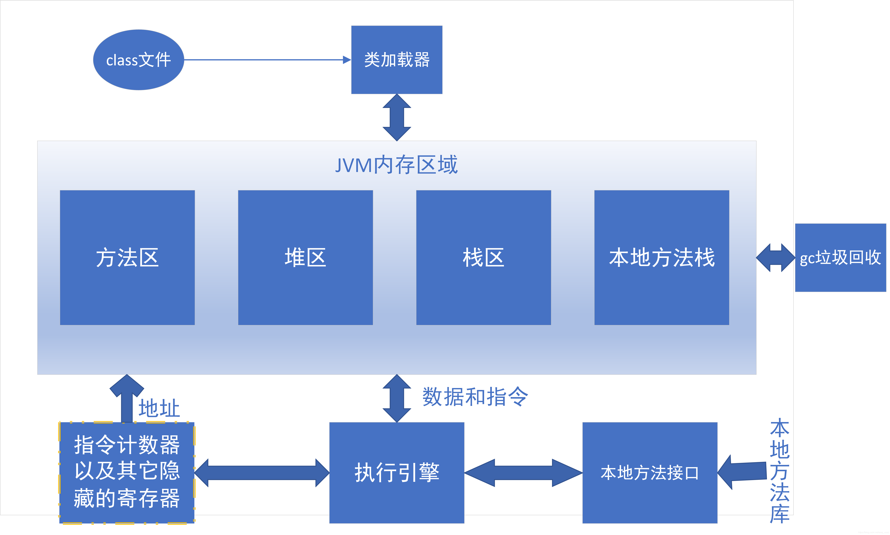

# Java笔记15--JVM

## JVM概念

* JVM, Java Virtual Machine，意为Java虚拟机
* Java规范
  * JVM主要定义二进制class文件和JVM指令集等
  * JVM语言规范主要体现在以下几点
    - Class文件类型
    - 运行时数据
    - 帧栈
    - 虚拟机的启动
    - 虚拟机的指令集
  * 此外，JVM需要对Java Library 提供以下支持（因为这些东西没有办法通过java语言本身来实现）
    - 反射 java.lang.reflect
    - ClassLoader
    - 初始化class和interface
    - 安全相关 java.security
    - 多线程
    - 弱引用

## Java引用的四种状态

## JAVA中的内存划分

* JAVA在程序运行时，在内存中划分5片空间进行数据的存储。

  

  * 寄存器

    最快的存储区, 由编译器根据需求进行分配,我们在程序中无法控制.

  * 本地方法栈

    * Java官方对于本地方法的定义为methods written in a language other than the Java programming language

      就是**使用非Java语言实现的方法**，但是通常我们指的一般为C或者C++，因此这个栈也有着C栈这一称号。

    * 一个不支持本地方法执行的JVM没有必要实现这个数据区域。

    * 本地方法栈基本和JVM栈一样，其大小也是可以设置为固定值或者动态增加，因此也会对应抛出StackOverflowError和OutOfMemoryError错误。

  * 方法区

    * 又叫静态区

    * 它用于存储已经被虚拟机加载的类信息、常量、静态变量、静态方法、普通方法、即时编译器编译后的代码等数据。

    * **跟堆一样，被所有的线程共享**

      当有多个线程都用到一个类的时候，而这个类还未被加载，则应该只有一个线程去加载类，让其他线程等待；

    * 方法区的大小不必是固定的，jvm可以根据应用的需要动态调整。

      jvm也可以允许用户和程序指定方法区的初始大小，最小和最大限制；

    * 方法区同样存在垃圾收集，因为通过用户定义的类加载器可以动态扩展Java程序，这样可能会导致一些类，不再被使用，变为垃圾。这时候需要进行垃圾清理。

  * 栈（Stack）

    * **每个线程包含一个栈区**，栈中只保存方法中（不包括对象的成员变量）的**基础数据类型和 自定义对象的引用(不是对象)**，对象都存放在堆区中

      存放基本类型的变量数据 和 对象的引用

      但对象本身不存放在栈中，而是存放在堆（new 出来的对象）或者常量池中（字符串常量对象存放在常量池中）

    * **每个栈中的数据(原始类型和对象引用)都是私有的**，其他栈不能访问。

    * 栈分为3个部分：基本类型变量区、执行环境上下文、操作指令区(存放操作指令)。

    * 存储的都是局部变量

      方法先进栈，然后再定义变量，变量有自己的作用域，一旦离开作用域，变量就会被释放。

    * 栈内存的更新速度很快，因为局部变量的生命周期都很短。

  * 堆（heap）

    * 存储的全部是对象实例，每个对象都包含一个与之对应的class的信息(class信息存放在方法区)。
    * **jvm只有一个堆区(heap)被所有线程共享**，堆中不存放基本类型和对象引用，只存放对象本身，几乎所有的**对象实例和数组**都在堆中分配。
    * 存放所有new出来的对象，堆中存放的都是实体（对象）
      * 实体用于封装数据，而且是封装多个(实体的多个属性)
      * 如果一个数据消失，这个实体也没有消失，还可以用，所以堆是不会随时释放的
      * 堆里的实体虽然不会被释放，但是会被当成垃圾，Java有垃圾回收机制不定时的收取。
    * **被所有的线程共享**

