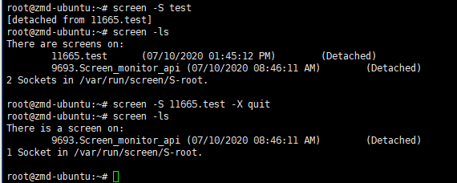

# LinuxTips11--screen服务

1. Screen服务简介

   Linux screen命令用于多重视窗管理程序。
   
   此处所谓的视窗，是指一个全屏幕的文字模式画面。
   
   通常只有在使用telnet登入主机或是使用老式的终端机时，才有可能用到screen程序。

2. 语法

   ```bash
   screen [-AmRvx -ls -wipe][-d <作业名称>][-h <行数>][-r <作业名称>][-s <shell>][-S <作业名称>]
   ```

   | 参数              | 说明                                                         |
   | ----------------- | ------------------------------------------------------------ |
   | -A                | 将所有的视窗都调整为目前终端机的大小                         |
   | -m                | 即使目前已在作业中的screen作业，仍强制建立新的screen作业     |
   | -R                | 先试图恢复离线的screen作业。若找不到离线的screen作业，就建立新的screen作业 |
   | -v                | 显示版本信息                                                 |
   | -x                | 恢复之前离线的screen作业                                     |
   | **-ls(或--list)** | **显示目前所有的screen作业**                                 |
   | -wipe             | 检查目前所有的screen作业，并删除已经无法使用的screen作业     |
   | **-d <作业名称>** | **将指定的screen离线**    **并不能kill掉该screen**           |
   | -h <行数>         | 指定视窗的缓冲区行数                                         |
   | **-r <作业名称>** | **恢复离线的screen作业**                                     |
   | -s \<shell>       | 指定建立新视窗时，所要执行的shell                            |
   | **-S <作业名称>** | **指定screen作业的名称**                                     |

3. 示例

   + 创建screen终端

     ```bash
     screen
     ```

     ```bash
     screen -S *screen_name*
     ```

   + 离开screen终端

     Ctrl+a+d

   + 重新连接离开的screen终端

     ```bash
     screen -r *screen_id*
     ```

     ```bash
     screen -r *screen_name*
     ```

4. kill一个screen

   + 方法一

     ```bash
     screen -S *screen_name* -X quit
     ```

     

   + 方法二
     + 进入要kill的终端
     + exit 

   

   

