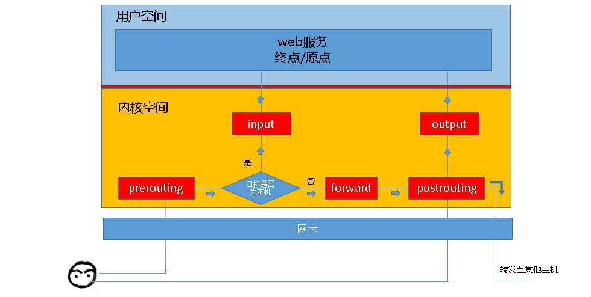
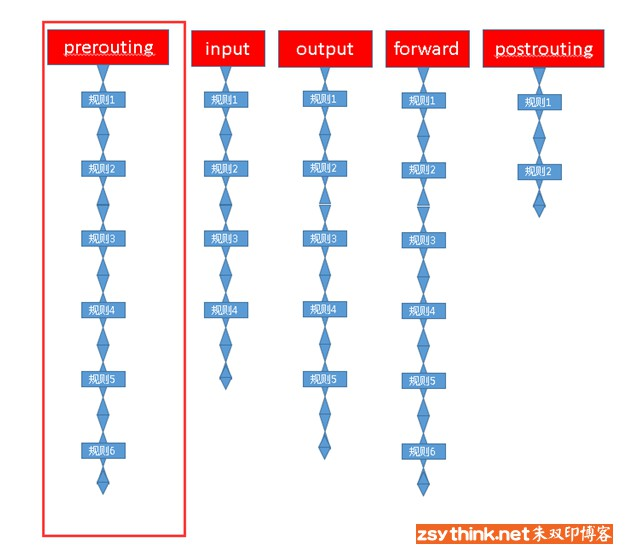
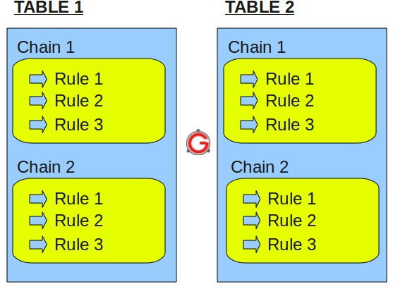
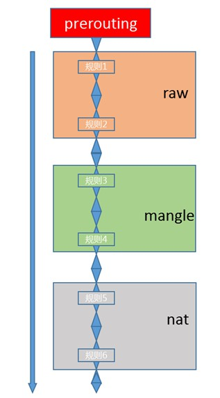
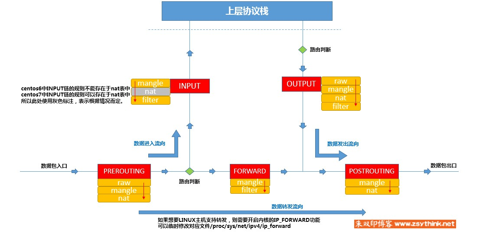

# LinuxTips45--Iptables1-基础

## 参考网址

https://www.zsythink.net/archives/1199

## 防火墙概念

+ 从逻辑上讲，防火墙可大体分为主机防火墙和网络防火墙
  + 主机防火墙：针对单个主机进行防护
  + 网络防火墙：往往处于网络入口或边缘，针对网络入口进行防护，服务于防火墙背后的本地局域网
  + 网络防火墙和主机防火墙并不冲突，网络防火墙主外（集体），主机防火墙主内（个人）
+ 从物理上讲，防火墙可分为硬件防火墙和软件防火墙
  + 硬件防火墙：在硬件级别实现部分防火墙功能，另一部分功能基于软件实现，性能高，成本高
  + 软件防火墙：应用软件处理逻辑运行于通用硬件平台之上的防火墙，性能低，成本低

## Iptables概念

+ iptables其实不是真正的防火墙，我们可以把它理解成一个客户端代理，用户通过iptables这个代理，将用户的安全设定执行到对应的"安全框架"中，这个"安全框架"才是真正的防火墙，这个框架的名字叫**netfilter**
+ **netfilter**才是防火墙真正的安全框架（framework），netfilter位于内核空间
+ iptables其实是一个命令行工具，位于用户空间，我们用这个工具操作真正的框架
+ netfilter/iptables（简称为iptables）组成Linux平台下的**包过滤防火墙**，与大多数的Linux软件一样，这个包过滤防火墙是免费的，它可以代替昂贵的商业防火墙解决方案，完成**封包过滤、封包重定向和网络地址转换（NAT）**等功能。
+ Netfilter是Linux操作系统核心层内部的一个**数据包处理模块**，它具有如下功能
  + 网络地址转换(Network Address Translate)
  + 数据包内容修改
  + 数据包过滤的防火墙功能
+ 所以说，虽然我们使用service iptables start启动iptables"服务"，但是其实准确的来说，iptables并没有一个守护进程，所以并不能算是真正意义上的服务，而应该算是**内核提供的功能**。

## Iptables基础

### 规则（policy）

+ iptables是按照规则来办事的，规则其实就是网络管理员预定义的条件，规则一般的定义为"如果**数据包头**符合这样的条件，就这样处理这个数据包"

+ 规则存储在内核空间的**信息包过滤表**中，这些规则分别指定了源地址、目的地址、传输协议（如TCP、UDP、ICMP）和服务类型（如HTTP、FTP和SMTP）等

+ 规则：根据指定的匹配条件来尝试匹配每个流经此处的报文，一旦匹配成功，则由规则后面指定的处理动作进行处理

+ 当数据包与规则匹配时，iptables就根据规则所定义的方法来处理这些数据包，如放行（accept）、拒绝（reject）和丢弃（drop）等

+ 配置防火墙的主要工作就是添加、修改和删除这些规则

+ 

+ 规则由匹配条件和处理动作组成

  + 匹配条件

    + 基本匹配条件

      源地址 Source IP 

      目标地址 Destination IP

    + 扩展匹配条件

      除了上述的条件可以用于匹配，还有很多其他的条件可以用于匹配，这些条件泛称为扩展条件，这些扩展条件其实也是netfilter中的一部分，只是以模块的形式存在，如果想要使用这些条件，则需要依赖对应的扩展模块。

      源端口 Source Port

      目标端口 Destination Port

  + 处理动作

    处理动作在iptables中被称为target，动作也可以分为基本动作和扩展动作

    常用动作

    **ACCEPT**：允许数据包通过。

    **DROP**：直接丢弃数据包，不给任何回应信息，这时候客户端会感觉自己的请求泥牛入海了，过了超时时间才会有反应。

    **REJECT**：拒绝数据包通过，必要时会给数据发送端一个响应的信息，客户端刚请求就会收到拒绝的信息。

    **SNAT**：源地址转换，解决内网用户用同一个公网地址上网的问题。

    **MASQUERADE**：是SNAT的一种特殊形式，适用于动态的、临时会变的ip上

    **DNAT**：目标地址转换。

    **REDIRECT**：在本机做端口映射

    **LOG**：在/var/log/messages文件中记录日志信息，然后将数据包传递给下一条规则，也就是说除了记录以外不对数据包做任何其他操作，仍然让下一条规则去匹配。

---

### 链（chain）

+  链是存放规则的容器
+ 
+ **五链**
  + Input
  + Output
  + Prerouting（路由前）
  + Forward
  + Postrouting（路由后）

### 表（table）

+ 表是用来存放链的容器

+ 我们把具有相同功能的规则的集合叫做"表"，所以说，不同功能的规则，我们可以放置在不同的表中进行管理，而iptables已经为我们定义了4种表，每种表对应了不同的功能，而我们定义的规则也都逃脱不了这4种功能的范围

+ iptables为我们提供了如下规则的分类，或者说，iptables为我们提供了如下"表" **四表**

  + filter表：负责过滤功能，防火墙；iptables的默认表

    内核模块：iptables_filter

  + nat表：network address translation，网络地址转换功能；

    内核模块：iptable_nat

  + mangle表：拆解报文，做出修改，并重新封装 的功能；

    内核模块：iptable_mangle

  + raw表：关闭nat表上启用的连接追踪机制；

    内核模块：iptable_raw

  我们自定义的所有规则，都是这四种分类中的规则，或者说，所有规则都存在于这4张"表"中

+ 

### 链表关系

+ filter表中的规则可以被INPUT, FORWARD, OUTPUT链使用
+ nat表中的规则可以被PREROUTING, OUTPUT, POSTROUTING链使用（centos7中还有INPUT，centos6中没有）
+ mangle表中的规则可以被PREROUTING, INPUT, FORWARD, OUTPUT, POSTROUTING链使用

+ raw表中的规则可以被PREROUTING, OUTPUT链使用

+ | 链          | 包含的表                 |
  | ----------- | ------------------------ |
  | INPUT       | filter, mangle           |
  | OUTPUT      | filter, nat, mangle, raw |
  | PREROUTING  | nat, mangle, raw         |
  | FORWARD     | filter, mangle           |
  | POSTROUTING | nat, mangle              |

### 链中规则优先级问题

+ 当四张表处于同一条链时，优先级如下

  raw --> mangle --> nat --> filter

+ 以PREROUGING为例

  

### 数据经过防火墙的流程

+ 所有发往本机的报文如果需要被过滤，都会经过INPUT链（PREROUTING链没有过滤功能）

