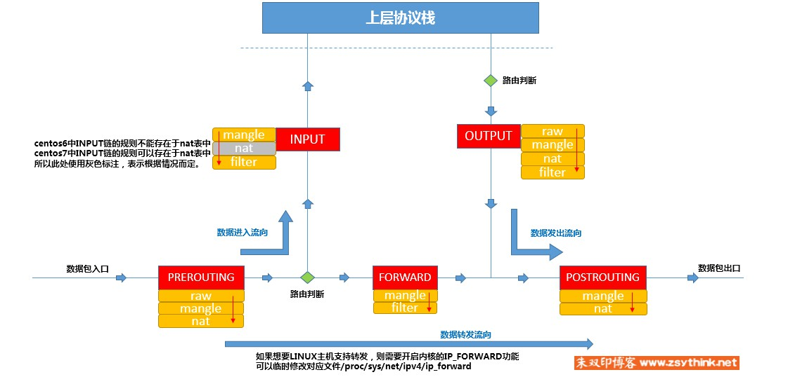

# LinuxTips48--Iptables4-匹配条件总结1

### 实验环境

+ 虚拟机CentOS -1：192.168.200.3 && 192.168.200.30（测试用机）
  + ifcfg-ens33 192.168.200.3
  + ifcfg-ens37 192.168.200.30
+ 虚拟机CentOS -2 ：192.168.200.4

---

### 匹配多个IP（基本匹配条件）

+ 用逗号分开

+ ```bash
  iptables -t filter -I INPUT -s 192.168.0.1,192.168.0.2 -j DROP
  ```

+ **"逗号"两侧均不能包含空格**，多个IP之间必须与逗号相连

---

### 匹配某个网段

+ ```bash
  iptables -t filter -I INPUT -s 10.6.0.0/16 -j DROP
  ```

---

### 对匹配条件取反

+ ```bash
  iptables -t filter -A INPUT ! -s 192.168.0.1 -j ACCEPT
  ```

  报文源地址IP只要不是192.168.0.1，都满足条件

+ 实操

  + 在CentOS -1 上设置iptables

    ```bash
    [root@promote sysconfig]# iptables -t filter -F INPUT
    [root@promote sysconfig]# iptables -t filter -xnvL INPUT
    Chain INPUT (policy ACCEPT 6 packets, 428 bytes)
        pkts      bytes target     prot opt in     out     source               destination         
    [root@promote sysconfig]# iptables -t filter -A INPUT ! -s 192.168.200.4 -j ACCEPT
    [root@promote sysconfig]# iptables -t filter -xnvL INPUT
    Chain INPUT (policy ACCEPT 0 packets, 0 bytes)
        pkts      bytes target     prot opt in     out     source               destination         
           7      520 ACCEPT     all  --  *      *      !192.168.200.4        0.0.0.0/0
    ```

  + 在CentOS -2(192.168.200.4) ping CentOS -1(192.168.200.3)

    ```bash
    [root@promote ~]# ping -c 4 192.168.200.3
    PING 192.168.200.3 (192.168.200.3) 56(84) bytes of data.
    64 bytes from 192.168.200.3: icmp_seq=1 ttl=64 time=0.483 ms
    64 bytes from 192.168.200.3: icmp_seq=2 ttl=64 time=0.759 ms
    64 bytes from 192.168.200.3: icmp_seq=3 ttl=64 time=0.380 ms
    64 bytes from 192.168.200.3: icmp_seq=4 ttl=64 time=0.378 ms
    
    --- 192.168.200.3 ping statistics ---
    4 packets transmitted, 4 received, 0% packet loss, time 3001ms
    rtt min/avg/max/mdev = 0.378/0.500/0.759/0.155 ms
    ```

    CentOS -2仍然能够ping通当前主机

    上例中，filter表的INPUT链中只有一条规则，这条规则要表达的意思就是：

    只要报文的源IP不是192.168.200.4，那么就接受此报文，但是，某些小伙伴可能会误会，把上例中的规则理解成如下含义，

    只要报文的源IP是192.168.200.4，那么就不接受此报文，这种理解与上述理解看似差别不大，其实完全不一样，这样理解是错误的，上述理解才是正确的。

    **换句话说就是，报文的源IP不是192.168.200.4时，会被接收，并不能代表，报文的源IP是192.168.200.4时，会被拒绝**

    上例中，因为并没有任何一条规则指明源IP是192.168.200.4时，该执行怎样的动作，所以，当来自192.168.200.4的报文经过INPUT链时，并不能匹配上例中的规则，于是，此报文就继续匹配后面的规则，可是，上例中只有一条规则，这条规则后面没有其他可以匹配的规则，于是，此报文就会去**匹配当前链的默认动作(默认策略)**，而上例中，INPUT链的默认动作为ACCEPT，所以，来自192.168.200.4的ping报文就被接收了，如果，**把上例中INPUT链的默认策略改为DROP，那么，192.168.200.4的报文将会被丢弃，146上的ping命令将得不到任何回应，但是如果将INPUT链的默认策略设置为DROP，当INPUT链中没有任何规则时，所有外来报文将会被丢弃，包括我们ssh远程连接**

---

### 匹配条件：目标IP地址（基本匹配条件）

##### 使用-d选项指定目标地址

+ 实操

  如果，想要拒绝CentOS -2发来的报文，但是只想拒绝192.168.200.4发向CentOS -1的192.168.200.30的报文，并不想拒绝发向CentOS -1的192.168.200.3的报文

  ```bash
  [root@promote ~]# iptables -t filter -F INPUT
  [root@promote ~]# iptables -t filter --line-number -xvnL INPUT
  Chain INPUT (policy ACCEPT 6 packets, 428 bytes)
  num      pkts      bytes target     prot opt in     out     source               destination         
  [root@promote ~]# iptables -t filter -I INPUT -s 192.168.200.4 -d 192.168.200.30 -j DROP
  [root@promote ~]# iptables -t filter --line-number -xvnL INPUT
  Chain INPUT (policy ACCEPT 6 packets, 480 bytes)
  num      pkts      bytes target     prot opt in     out     source               destination         
  1           0        0 DROP       all  --  *      *       192.168.200.4        192.168.200.30  
  ```

  + 在CentOS -2 进行ping通测试

    ```bash
    [root@promote ~]# ping -c 4 192.168.200.3
    PING 192.168.200.3 (192.168.200.3) 56(84) bytes of data.
    64 bytes from 192.168.200.3: icmp_seq=1 ttl=64 time=0.408 ms
    64 bytes from 192.168.200.3: icmp_seq=2 ttl=64 time=0.272 ms
    64 bytes from 192.168.200.3: icmp_seq=3 ttl=64 time=0.211 ms
    64 bytes from 192.168.200.3: icmp_seq=4 ttl=64 time=0.363 ms
    
    --- 192.168.200.3 ping statistics ---
    4 packets transmitted, 4 received, 0% packet loss, time 3001ms
    rtt min/avg/max/mdev = 0.211/0.313/0.408/0.078 ms
    [root@promote ~]# ping -c 4 192.168.200.30
    PING 192.168.200.30 (192.168.200.30) 56(84) bytes of data.
    
    --- 192.168.200.30 ping statistics ---
    4 packets transmitted, 0 received, 100% packet loss, time 3000ms
    ```

    192.168.200.3ping的通，192.168.200.30ping不通

  + 查看CentOS -1 iptables

    ```bash
    [root@promote ~]# iptables -t filter --line-number -xvnL INPUT
    Chain INPUT (policy ACCEPT 14 packets, 1096 bytes)
    num      pkts      bytes target     prot opt in     out     source               destination         
    1           4      336 DROP       all  --  *      *       192.168.200.4        192.168.200.30
    ```

    可以看到，已经有四个packet匹配到了第一条规则

+ -d选项也可以使用"叹号"进行取反，也能够同时指定多个IP地址，使用"逗号"隔开即可

+ **不管是-s选项还是-d选项，取反操作与同时指定多个IP的操作==不能==同时使用**

+ **需要明确的一点就是：当一条规则中有多个匹配条件时，这多个匹配条件之间，默认存在"与"的关系**

  即，当一条规则中存在多个匹配条件时，报文必须同时满足这些条件，才算做被规则匹配

---

### 匹配条件：协议类型（扩展匹配条件）

##### 使用-p(protocol)选项，指定需要匹配的报文的协议类型

##### -p选项支持tcp，udp，udplite，icmp，esp，ah，sctp，mh协议类型

##### centOS7中害支持icmpv6,mh

##### 当不使用-p指定协议类型时，默认表示所有类型的协议都会被匹配到，与使用-p all的效果相同

+ 实操

  如果想要拒绝来自CentOS -2 的TCP类型的请求

  ```bash
  [root@promote ~]# iptables -t filter -F INPUT
  [root@promote ~]# iptables -t filter --line-number -xvnL INPUT
  Chain INPUT (policy ACCEPT 6 packets, 428 bytes)
  num      pkts      bytes target     prot opt in     out     source               destination         
  [root@promote ~]# iptables -t filter -I INPUT -s 192.168.200.4 -d 192.168.200.30 -p tcp -j REJECT
  [root@promote ~]# iptables -t filter --line-number -xvnL INPUT
  Chain INPUT (policy ACCEPT 10 packets, 692 bytes)
  num      pkts      bytes target     prot opt in     out     source               destination         
  1           0        0 REJECT     tcp  --  *      *       192.168.200.4        192.168.200.30       reject-with icmp-port-unreachable
  ```

  + 在CentOS -2上使用ssh连接192.168.200.30进行测试

    **ssh协议的传输层协议属于tcp协议类型**

    ```bash
    [root@promote ~]# ssh root@192.168.200.30
    ssh: connect to host 192.168.200.30 port 22: Connection refused
    ```

  + 在CentOS -2 进行ping通测试

    ```bash
    [root@promote ~]# ping -c 4 192.168.200.30
    PING 192.168.200.30 (192.168.200.30) 56(84) bytes of data.
    64 bytes from 192.168.200.30: icmp_seq=1 ttl=64 time=0.260 ms
    64 bytes from 192.168.200.30: icmp_seq=2 ttl=64 time=0.401 ms
    64 bytes from 192.168.200.30: icmp_seq=3 ttl=64 time=0.292 ms
    64 bytes from 192.168.200.30: icmp_seq=4 ttl=64 time=2.36 ms
    
    --- 192.168.200.30 ping statistics ---
    4 packets transmitted, 4 received, 0% packet loss, time 3001ms
    rtt min/avg/max/mdev = 0.260/0.829/2.363/0.887 ms
    ```

    证明icmp协议并没有被规则匹配到，只有tcp类型的报文被匹配到了

  + 查看CentOS -1 iptables

    ```bash
    [root@promote ~]# iptables -t filter --line-number -xvnL INPUT
    Chain INPUT (policy ACCEPT 23 packets, 1628 bytes)
    num      pkts      bytes target     prot opt in     out     source               destination         
    1           1       60 REJECT     tcp  --  *      *       192.168.200.4        192.168.200.30       reject-with icmp-port-unreachable
    ```

    可以看到，已经有一个packet匹配到了第一条规则

---

### 匹配条件：网卡接口（扩展匹配条件）

##### 当本机有多个网卡时，可以使用 -i 选项去匹配报文是通过哪块网卡流入本机的

+ 使用-i选项指定网卡名称

+ 实操

  如果想要拒绝由网卡ifcfg-ens37流入的ping请求报文

  ```bash
  [root@promote ~]# iptables -t filter -F INPUT
  [root@promote ~]# iptables -t filter --line-number -xvnL INPUT
  Chain INPUT (policy ACCEPT 8 packets, 576 bytes)
  num      pkts      bytes target     prot opt in     out     source               destination         
  [root@promote ~]# iptables -t filter -I INPUT -i ens37 -p icmp -j DROP
  [root@promote ~]# iptables -t filter --line-number -xvnL INPUT
  Chain INPUT (policy ACCEPT 6 packets, 428 bytes)
  num      pkts      bytes target     prot opt in     out     source               destination         
  1           0        0 DROP       icmp --  ens37  *       0.0.0.0/0            0.0.0.0/0 
  ```

  -i选项是用于匹配报文流入的网卡的，也就是说，从本机发出的报文是不可能会使用到-i选项的，因为这些由本机发出的报文压根不是从网卡流入的，而是要通过网卡发出的，从这个角度考虑，-i选项的使用是有限制的

+ **-i选项只能用于下图中的PREROUTING链、INPUT链、FORWARD链**，这是-i选项的特殊性，因为它只是用于判断报文是从哪个网卡流入的，所以只能在上图中"数据流入流向"的链中与FORWARD链中存在，而上图中的"数据发出流向"经过的链中，是不可能使用-i选项的，比如上图中的OUTPUT链与POSTROUTING链，他们都不能使用-i选项

  
  

##### 当本机有多个网卡时，可以使用 -i 选项去匹配报文是通过哪块网卡流入本机的

+ **-o选项只能用于FORWARD链、OUTPUT链、POSTROUTING链**
+ **FORWARD链属于"中立国"，它能同时使用-i选项与-o选项**

---

### 匹配源端口与目标端口（扩展匹配条件）

+ **基本匹配条件直接使用，而如果想要使用扩展匹配条件，则需要依赖一些扩展模块**
+ 或者说，在使用扩展匹配条件之前，需要指定相应的扩展模块才行，即-m选项
+ 在使用扩展匹配条件时，当使用-p选项指定了报文的协议时，如果在没有使用-m指定对应的扩展模块名称的情况下，使用了扩展匹配条件，  iptables默认会调用与-p选项对应的协议名称相同的模块
+ 如果扩展匹配条件所依赖的扩展模块名正好与-p对应的协议名称相同，那么则可省略-m选项，否则则不能省略-m选项，必须使用-m选项指定对应的扩展模块名称

##### 使用--dport (destination-port) 可以匹配报文的目标端口

+ 使用--dport必须事先指定使用哪种协议，即必须先使用-p选项

+ 使用--dport必须事先指定使用哪种扩展模块，即必须先使用-m选项

  想要使用--dport这个扩展匹配条件，则必须依靠某个扩展模块完成

+ 实操

  如果CentOS -1 拒绝来自CentOS -2的ssh连接请求

  sshd服务的默认端口为22，使用ssh远程工具连接主机时，默认会连接服务端的22号端口

  ```bash
  [root@cxy-centos7-1 ~]# iptables -F INPUT
  [root@cxy-centos7-1 ~]# iptables --line-number -xvnL INPUT
  Chain INPUT (policy ACCEPT 204 packets, 14436 bytes)
  num      pkts      bytes target     prot opt in     out     source               destination         
  [root@cxy-centos7-1 ~]# iptables -I INPUT -s 192.168.200.4 -p tcp -m tcp --dport 22 -j REJECT
  [root@cxy-centos7-1 ~]# iptables --line-number -xvnL INPUT
  Chain INPUT (policy ACCEPT 7 packets, 504 bytes)
  num      pkts      bytes target     prot opt in     out     source               destination         
  1           0        0 REJECT     tcp  --  *      *       192.168.200.4        0.0.0.0/0            tcp dpt:22 reject-with icmp-port-unreachable
  ```

  + -p tcp与 -m tcp并不冲突，-p用于匹配报文的协议，-m 用于指定扩展模块的名称，正好，这个扩展模块也叫tcp

  + 可以省略-m tcp 。因为此例中，使用的扩展模块名和-p指定的协议名一致

  + 在CentOS -2上ssh远程了连接CentOS -1

    ```bash
    [root@cxy-centos7-2 ~]# ssh root@192.168.200.3
    ssh: connect to host 192.168.200.3 port 22: Connection refused
    ```

##### 使用--sport (source-port) 匹配报文的源端口

+ 实操

  ```bash
  [root@cxy-centos7-1 ~]# iptables -I INPUT -s 192.168.200.4 -p tcp --sport 22 -j ACCEPT
  [root@cxy-centos7-1 ~]# iptables --line-number -xvnL INPUT
  Chain INPUT (policy ACCEPT 6 packets, 428 bytes)
  num      pkts      bytes target     prot opt in     out     source               destination         
  1           0        0 ACCEPT     tcp  --  *      *       192.168.200.4        0.0.0.0/0            tcp spt:22
  2           1       60 REJECT     tcp  --  *      *       192.168.200.4        0.0.0.0/0            tcp dpt:22 reject-with icmp-port-unreachable
  ```

##### 扩展匹配条件取反

+ ```bash
  iptables -I INPUT -s 192.168.200.4 -p tcp -m tcp ! --dport 22 -j REJECT
  ```

  目的端口不是22的报文将会被匹配到

##### 匹配一个端口范围

+ ```bash
  iptables -I INPUT -s 192.168.200.4 -p tcp -m tcp --dport 22:25 -j REJECT
  ```

  匹配目标端口为22-25号之间的所有端口，即22,23,24,25号端口

+ ```bash
  iptables -I INPUT -s 192.168.200.4 -p tcp -m tcp --dport :22 -j REJECT
  ```

  匹配目标端口为0-25之间的所有端口

+ ```bash
  iptables -I INPUT -s 192.168.200.4 -p tcp -m tcp --dport 80: -j REJECT
  ```

  匹配目标端口为80号端口以及其以后的所有端口（直到65535）

##### 指定多个离散端口

+ 借助tcp扩展模块的--sport或者--dport都可以指定一个连续的端口范围

+ 借助**multiport**扩展模块的--sports或者--dports可以指定多个离散端口

  + 使用multiport模块的**--sports**扩展条件同时指定多个离散的源端口
  + 使用multiport模块的**--dports**扩展条件同时指定多个离散的目标端口

+ multiport扩展**只能用于tcp协议与udp协议**，即配合-p tcp或者-p udp使用

+ ```bash
  iptables -I INPUT -s 192.168.200.4 -p tcp -m multiport --dports 22,36,80 -j DROP
  ```

  禁止来自192.168.200.4的主机访问本机的22,36和80号端口

  + 此例中-m multiport是不能省略的

    + 如果你省略了-m multiport，就相当于在没有指定扩展模块的情况下，使用了扩展条件（"--dports"），那么上例中，iptables会默认调用"-m tcp"，但是，"--dports扩展条件"并不属于"tcp扩展模块",而是属于"multiport扩展模块"，所以，这时就会报错。

    + 综上所述，当使用--dports或者--sports这种扩展匹配条件时，必须使用-m指定模块的名称

+ 使用multiport模块的--sports与--dpors时，也可以指定连续的端口范围，并且能够在指定连续的端口范围的同时，指定离散的端口号

  ```bash
  iptables -I INPUT -s 192.168.200.4 -p tcp -m multiport --dports 22,80:88 -j REJECT
  ```

  拒绝来自192.168.299.4的tcp报文访问当前主机的22号端口以及80到88之间的所有端口号


