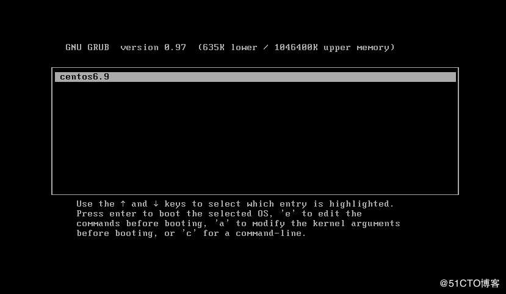
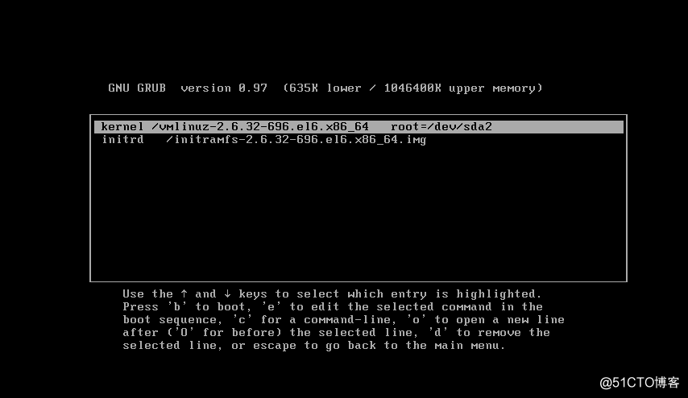
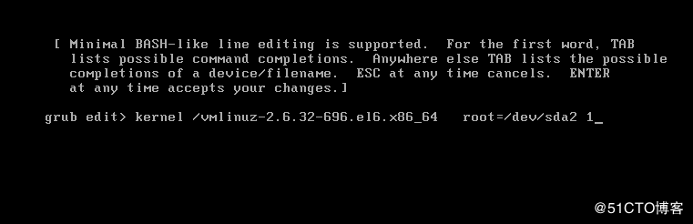
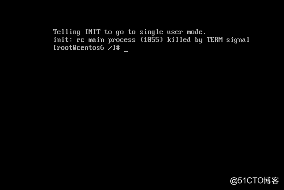
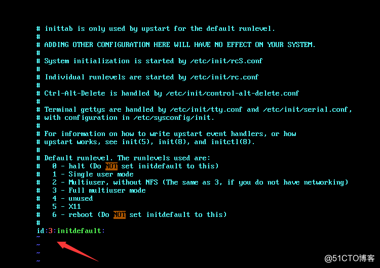

# LinuxTips67--init进程

### init进程

+ 进程的概念

  所谓进程就是系统中正在运行的程序，进程是操作系统的概念，每当我们执行一个程序时，对于操作系统来讲就是创建了一个进程，在这个过程中操作系统对进程资源的分配和释放，可以认为进程就是一个程序的一次执行过程。

+ Linux下的三个特殊进程

  + idle进程（PID=0）

    + **idle进程由系统自动创建，运行在内核态**
    + idle进程其pid=0，其前身是系统创建的第一个进程，也是唯一一个没有通过fork或者kernel_thread产生的进程。
    + 完成加载系统后，演变为进程调度、交换。

  + kthreadd（PID=2）

    + **kthreadd进程由idle通过kernel_thread创建，并始终运行在内核空间，负责所有内核进程的调度和管理。**

    + 它的任务就是管理和调度其他内核线程kernel_thread, 会循环执行一个kthread的函数，该函数的作用就是运行kthread_create_list全局链表中维护的kthread。

    + 当我们调用kernel_thread，创建的内核线程会被加入到此链表中，因此所有的内核线程都是直接或者间接的以kthreadd为父进程 。

  + init进程（PID=1）
    + **init进程由idle通过kernel_thread创建，在内核空间完成初始化后，加载init程序**
    + init进程由0进程创建，完成系统的初始化，是系统中所有其他用户进程的祖先进程。
    + Linux中的所有进程都是由init进程创建并运行的。
    + 首先Linux内核启动，然后在用户空间中启动init进程，再启动其他系统进程。在系统启动完成后，init将变成为守护进程监视系统其他进程。
    + 所以说init进程是Linux系统操作中不可缺少的程序之一，如果内核找不到init进程就会试着运行/bin/sh，如果运行失败，系统的启动也会失败。

---

### 运行级别

看：Linux笔记65--启动管理1-启动流程1-运行级别

---

### init运行级别的定义（以centos6为例）

+ init的运行级别配置是在/etc/init，而这些级别的定义是在/etc/rc.d目录内的如下：

  ```shell
  [root@centos6 rc.d]# ll
  total 60
  drwxr-xr-x. 2 root root  4096 Jan  9 02:30 init.d
  -rwxr-xr-x. 1 root root  2617 Mar 23  2017 rc
  drwxr-xr-x. 2 root root  4096 Jan  9 02:30 rc0.d
  drwxr-xr-x. 2 root root  4096 Jan  9 02:30 rc1.d
  drwxr-xr-x. 2 root root  4096 Jan  9 18:39 rc2.d
  drwxr-xr-x. 2 root root  4096 Jan  9 18:39 rc3.d
  drwxr-xr-x. 2 root root  4096 Jan  9 18:39 rc4.d
  drwxr-xr-x. 2 root root  4096 Jan  9 18:39 rc5.d
  drwxr-xr-x. 2 root root  4096 Jan  9 02:30 rc6.d
  -rwxr-xr-x. 1 root root   220 Mar 23  2017 rc.local
  -rwxr-xr-x. 1 root root 20199 Mar 23  2017 rc.sysinit
  ```

+ 这里的rc{0..6}.目录对应相应的级别里面放的都是要启动和关闭的进程我们进去看一下

  ```shell
  [root@centos6 rc3.d]# ls
  K01smartd          K69rpcsvcgssd      K95firstboot     S13irqbalance        S26udev-post
  K02oddjobd         K73winbind         K99rngd          S13rpcbind           S28autofs
  K05wdaemon         K74ntpd            S01sysstat       S15mdmonitor         S50bluetooth
  K10psacct          K75ntpdate         S02lvm2-monitor  S22messagebus        S55sshd
  K10saslauthd       K75quota_nld       S05rdma          S23NetworkManager    S80postfix
  K15htcacheclean    K76ypbind          S08ip6tables     S24nfslock           S82abrtd
  K15httpd           K84wpa_supplicant  S08iptables      S24rpcgssd           S83abrt-ccpp
  K30spice-vdagentd  K87restorecond     S10network       S25blk-availability  S90crond
  K50dnsmasq         K88sssd            S11auditd        S25cups              S95atd
  K50kdump           K89netconsole      S11portreserve   S25netfs             S99certmonger
  K60nfs             K89rdisc           S12rsyslog       S26acpid             S99local
  K61nfs-rdma        K92pppoe-server    S13cpuspeed      S26haldaemon
  ```

  + /etc/rc.d/rc3.d/K??开头的文件(??是数字)，关机时会按照数字顺序依次关闭，数字越小优先关闭
+ /etc/rc.d/rc3.d/S??开头的文件(??是数字)，开机时会按照数字顺序依次启动，数字越小优先启动
  
+ 千万不要将运行级别设置为0或6

---

### 误将运行级别设置为0或6时解决方案（以centos6为例）

+ 借助救援系统，在开机GRUB界面按e

  

+ 选择kernel这一行，接着按e

  

+ 在命令行最后输入1（进入单用户模式），回车退后到上个界面

  

+ 接着按b进入单用户模式，我们这就进入到单用户模式了

  

+ 我们只需要进入/etc/inittab配置文件中把最后的0或6改为3，重启系统就可以啦

  

  