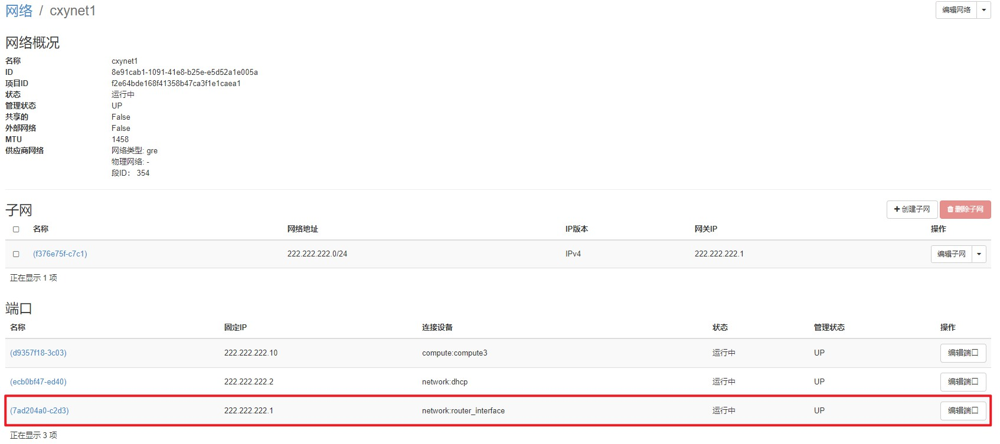
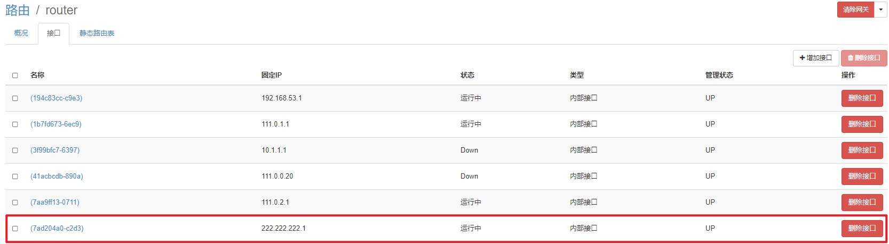
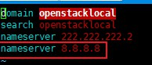

# OpenStackTips6--实例ping通外网

### 实例信息

+ 实例：cxy_test   222.222.222.10
  + image : mini-router-ospf2
  + flavor : 1_1_10
+ 实例所在网段：cxynet1   222.222.222.0/24

### ex-router外部路由添加端口给实例所在网段

+ 

+ 

### 加DNS

+ vim /etc/resolv.conf
+ 