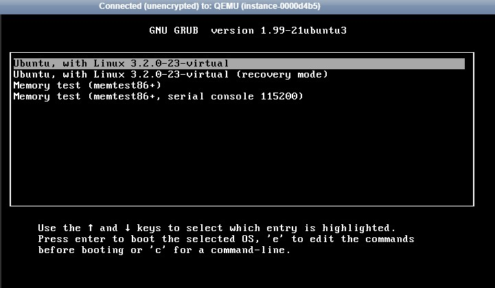
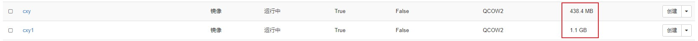

# OpenStackTips7--镜像制作

+ 示例实例：cxy_test

  222.222.222.10

  mini-router-ospf2

  1_1_10

  在该实例上安装了bottle和netperf后进行镜像测试

### Dashboard制作快照

+ 关闭实例

+ 点击创建快照cxy1

+ 在控制节点下载镜像

  ```bash
  [root@controller images]# glance image-list | grep cxy1
  | 5775a392-224b-4641-9fb7-9570a442c7b7 | cxy1                                |
  [root@controller images]# glance image-download --file /home/cxy_tdyt/images/cxy1.img 5775a392-224b-4641-9fb7-9570a442c7b7
  ```

+ 在控制节点上传镜像

  ```bash
  [root@controller images]# glance image-create --name cxy1 --file cxy1.img --disk-format qcow2 --container-format bare --visibility public
  +------------------+--------------------------------------+
  | Property         | Value                                |
  +------------------+--------------------------------------+
  | checksum         | 845df1a2e0db637052ba4e33790bb0ee     |
  | container_format | bare                                 |
  | created_at       | 2020-08-21T08:40:42Z                 |
  | disk_format      | qcow2                                |
  | id               | 033b8818-c5b7-4c3c-a93b-459b3eecf854 |
  | min_disk         | 0                                    |
  | min_ram          | 0                                    |
  | name             | cxy1                                 |
  | owner            | f2e64bde168f41358b47ca3f1e1caea1     |
  | protected        | False                                |
  | size             | 1221066752                           |
  | status           | active                               |
  | tags             | []                                   |
  | updated_at       | 2020-08-21T08:40:47Z                 |
  | virtual_size     | None                                 |
  | visibility       | public                               |
  +------------------+--------------------------------------+
  ```

+ 删除快照

  **注：此时有两个名为cxy1的image,一个类型为snapshot，一个为镜像。删掉快照而不是镜像**

  ```bash
  [root@controller images]# glance image-list | grep cxy1
  | 5775a392-224b-4641-9fb7-9570a442c7b7 | cxy1                                |
  | 033b8818-c5b7-4c3c-a93b-459b3eecf854 | cxy1                                |
  [root@controller images]# glance image-show 5775a392-224b-4641-9fb7-9570a442c7b7
  +------------------+--------------------------------------+
  | Property         | Value                                |
  +------------------+--------------------------------------+
  | base_image_ref   | 98f66863-4c37-4889-b34b-70637632e9a4 |
  | checksum         | 845df1a2e0db637052ba4e33790bb0ee     |
  | container_format | bare                                 |
  | created_at       | 2020-08-21T08:30:33Z                 |
  | disk_format      | qcow2                                |
  | id               | 5775a392-224b-4641-9fb7-9570a442c7b7 |
  | image_location   | snapshot                             |
  | image_state      | available                            |
  | image_type       | snapshot                             |
  | instance_uuid    | 494ad3c5-4ad2-48aa-8e8e-f1bef7672918 |
  | kernel_id        | None                                 |
  | min_disk         | 10                                   |
  | min_ram          | 0                                    |
  | name             | cxy1                                 |
  | owner            | f2e64bde168f41358b47ca3f1e1caea1     |
  | owner_id         | f2e64bde168f41358b47ca3f1e1caea1     |
  | protected        | False                                |
  | ramdisk_id       | None                                 |
  | size             | 1221066752                           |
  | status           | active                               |
  | tags             | []                                   |
  | updated_at       | 2020-08-21T08:31:03Z                 |
  | user_id          | 8943d3f104fe427185be6a6e6ec7540f     |
  | virtual_size     | None                                 |
  | visibility       | private                              |
  +------------------+--------------------------------------+
  [root@controller images]# glance image-show 033b8818-c5b7-4c3c-a93b-459b3eecf854
  +------------------+--------------------------------------+
  | Property         | Value                                |
  +------------------+--------------------------------------+
  | checksum         | 845df1a2e0db637052ba4e33790bb0ee     |
  | container_format | bare                                 |
  | created_at       | 2020-08-21T08:40:42Z                 |
  | disk_format      | qcow2                                |
  | id               | 033b8818-c5b7-4c3c-a93b-459b3eecf854 |
  | min_disk         | 0                                    |
  | min_ram          | 0                                    |
  | name             | cxy1                                 |
  | owner            | f2e64bde168f41358b47ca3f1e1caea1     |
  | protected        | False                                |
  | size             | 1221066752                           |
  | status           | active                               |
  | tags             | []                                   |
  | updated_at       | 2020-08-21T08:40:47Z                 |
  | virtual_size     | None                                 |
  | visibility       | public                               |
  +------------------+--------------------------------------+
  ```

  ```bash
  [root@controller images]# glance image-delete 5775a392-224b-4641-9fb7-9570a442c7b7
  ```

+ 启动实例

  

  按照默认启动就行

---

### 手动制作

+ 获取实例ID

  ```bash
  [root@compute3 ~]# nova list | grep cxy_test
  /usr/lib/python2.7/site-packages/keyring/backends/Gnome.py:6: PyGIWarning: GnomeKeyring was imported without specifying a version first. Use gi.require_version('GnomeKeyring', '1.0') before import to ensure that the right version gets loaded.
    from gi.repository import GnomeKeyring
  | 494ad3c5-4ad2-48aa-8e8e-f1bef7672918 | cxy_test            | ACTIVE | -          | Running     | cxynet1=222.222.222.10
  ```

+ 在实例所在节点进入该实例目录

  ```bash
  [root@compute3 ~]# cd /var/lib/nova/instances/494ad3c5-4ad2-48aa-8e8e-f1bef7672918/
  [root@compute3 494ad3c5-4ad2-48aa-8e8e-f1bef7672918]# ls
  console.log  disk  disk.info  libvirt.xml
  ```

  **disk文件即为实例的磁盘文件**

+ 关闭实例

+ 压缩复制磁盘文件

  ```bash
  [root@compute3 494ad3c5-4ad2-48aa-8e8e-f1bef7672918]# qemu-img convert -c -O qcow2 disk cxy.qcow2
  ```

  不希望压缩的话，去掉-c选项

+ 在控制节点上传镜像

  ```bash
  [root@controller images]# glance image-create --name cxy --file cxy.qcow2 --disk-format qcow2 --container-format bare --visibility public
  +------------------+--------------------------------------+
  | Property         | Value                                |
  +------------------+--------------------------------------+
  | checksum         | e726207e8b66d174fb8ab495d4590156     |
  | container_format | bare                                 |
  | created_at       | 2020-08-21T08:09:48Z                 |
  | disk_format      | qcow2                                |
  | id               | 37f3348a-d4f1-4a30-98fa-8a8d817e18fd |
  | min_disk         | 0                                    |
  | min_ram          | 0                                    |
  | name             | cxy                                  |
  | owner            | f2e64bde168f41358b47ca3f1e1caea1     |
  | protected        | False                                |
  | size             | 459669504                            |
  | status           | active                               |
  | tags             | []                                   |
  | updated_at       | 2020-08-21T08:09:50Z                 |
  | virtual_size     | None                                 |
  | visibility       | public                               |
  +------------------+--------------------------------------+
  ```

### 两种方式对比

用两种方式制作完成后，cxy为手动制作的镜像，cxy1为快照制作的镜像



源镜像mini-router-ospf2


由于cxy在复制磁盘文件时进行了压缩，所以磁盘大小变小。

