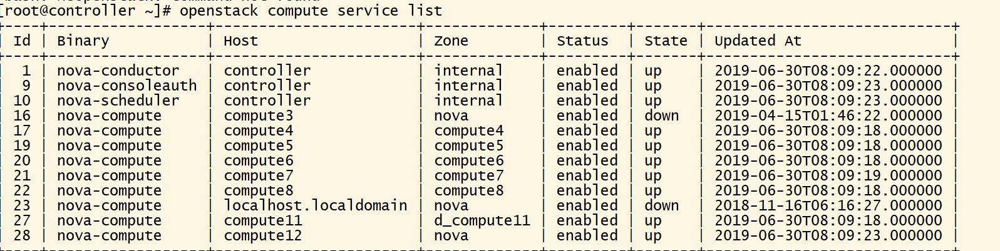
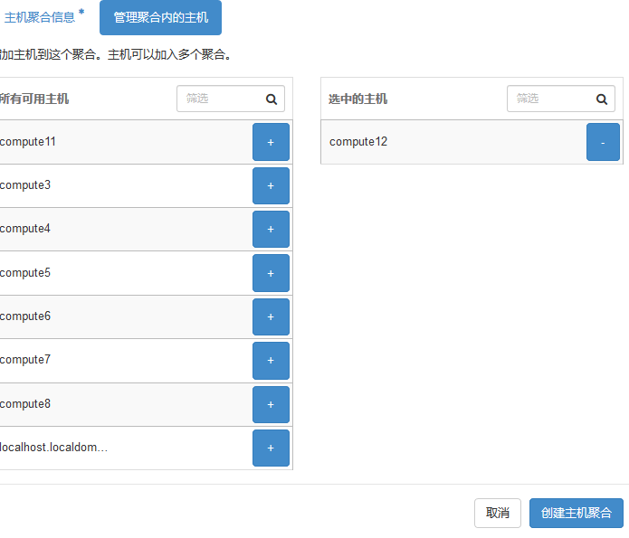
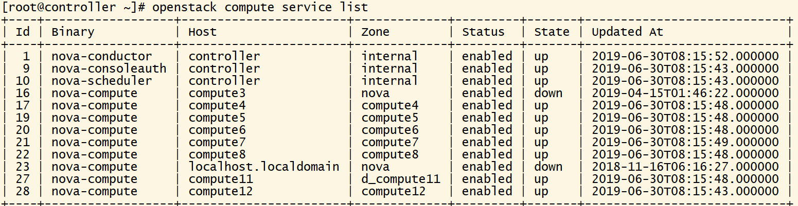

# OpenStackTips9--创建可用域

### Availability zone(可用域)

+ Availability Zones 通常是对 computes 节点上的资源在小的区域内进行逻辑上的分组和隔离。

+ 例如在同一个数据中心，我们可以将 Availability Zones 规划到不同的机房，或者在同一机房的几个相邻的机架，从而保障如果某个 Availability Zone 的节点发生故障（如供电系统或网络），而不影响其他的 Availability Zones 上节点运行的虚拟机，通过这种划分来提高 OpenStack 的可用性。

+ 目前 OpenStack 默认的安装是把所有的 computes 节点划分到 nova 的 Availability Zone 上，但我们可以通过对 nova.conf(/etc/nova/nova.conf) 文件的配置来定义不同的 Availability zones。

+ az是在region范围内的再次切分，只是工程上的独立，例如可以把一个机架上的机器划分在一个az中，划分az是为了提高容灾性和提供廉价的隔离服务。选择不同的region主要考虑哪个region靠近你的用户群体。

+ **用户可见**

+ 对Nova的服务分为两类: 

  + Controller节点的服务进程

     如nova-api, nova-scheduler, nova-conductor等

    默认的zone配置项由internal_service_availability_zone决定

  + 计算节点的进程, 如nova-computer. 

    nova-computer所属的zone配置项由default_available_zone决定

+ 控制节点默认可用域为internal, 而计算节点可用域默认为nova

---

### Host Aggregates(主机聚合)

+ Host Aggregates 是在 Availability Zones 的基础上更进一步地进行逻辑的分组和隔离。

+ host aggregate是管理员用来根据硬件资源的某一属性来对硬件进行划分的功能，**只对管理员可见**

  + 其主要功能就是实现根据某一属性来划分物理机，比如linux，windows区分；是否SSD高性能存储区分；是否高性能计算GPU区分等等。

  + 例如我们可以根据不同的 computes 节点的物理硬件配置将具有相同共性的物理资源规划在同一 Host Aggregate 之下，或者根据用户的具体需求将几个 computes 节点规划在具有相同用途的同一 Host Aggregate 之下，通过这样的划分有利于提高 OpenStack 资源的使用效率。Host Aggregates 可以通过 nova client 或 API 来创建和配置。

---

### Availability zone和Host Aggregates的关系

+ 一个nova-compute节点只能在一个az(可用域)内，但是可以存在多个aggregate(主机聚合)中
+ az是用户可见的，用户手动的来指定vm运行在哪些host上；Host aggregate是一种更智能的方式，是调度器可见的，影响调度策略的一个表达式。
+ 一个aggregation可以和一个az建立关联，也可以不和任何az建立关联
+ 多个aggregation可以和同一个az建立关联，但反之不行
+ 一个host只能加入一个az，不可同时加入多个az，但是一个host可以同时加入多个aggregation

---

### 如何将一个host加入az

+ 不能直接通过命令将一个host加入az

+ 可能是社区的开发人员意识到，让管理员通过配置的方式管理zone不太合适，不够灵活，所以在G版中将这一方式修改。就改用nova aggregate-create 命令，在创建一个aggregate的同时，指定一个AZ

+ ```bash
  [root@controller ~]# nova help aggregate-create
  usage: nova aggregate-create <name> [<availability-zone>]
  
  Create a new aggregate with the specified details.
  
  Positional arguments:
    <name>               Name of aggregate.
    <availability-zone>  The availability zone of the aggregate (optional).
  ```

+ 创建一个aggregate后，同时把它作为一个zone，此时aggregate=zone。因为大家知道，aggregate是管理员可见，普通用户不可见的对象，那么这个改变，就可以使普通用户能够通过使用zone的方式来使用aggregate

+ 创建完aggregate之后，向aggregate里加主机时，该主机就自动属于aggregate表示的zone

---

### 通过dashboard创建可用域

+ 安装好计算节点compute12，如图

  

  可见compute12 的zone 为nova ，将nova变为computer 12 方法如下

+ 进入dashboard 

  系统-主机聚合-创建主机聚合

  写入相应名称，选择主机，确认创建。

  

  

+ 完成创建可用区域，在控制节点查看，则发现变化。

  

  证明修改成功

---

### 通过命令创建可用域

+ 将compute2加入可用域compute2

  compute2默认可用域为nova

  ```bash
  [root@controller ~]# nova service-list
  +----+------------------+------------+----------+---------+-------+----------------------------+-----------------+
  | Id | Binary           | Host       | Zone     | Status  | State | Updated_at                 | Disabled Reason |
  +----+------------------+------------+----------+---------+-------+----------------------------+-----------------+
  | 1  | nova-scheduler   | controller | internal | enabled | up    | 2020-10-20T03:33:35.000000 | -               |
  | 2  | nova-conductor   | controller | internal | enabled | up    | 2020-10-20T03:33:33.000000 | -               |
  | 4  | nova-consoleauth | controller | internal | enabled | up    | 2020-10-20T03:33:26.000000 | -               |
  | 8  | nova-compute     | compute    | compute  | enabled | up    | 2020-10-20T03:33:32.000000 | -               |
  | 9  | nova-compute     | compute2   | nova     | enabled | up    | 2020-10-20T03:33:30.000000 | -               |
  +----+------------------+------------+----------+---------+-------+----------------------------+-----------------+
  ```

  ```bash
  [root@controller neutron]# nova availability-zone-list
  +-----------------------+----------------------------------------+
  | Name                  | Status                                 |
  +-----------------------+----------------------------------------+
  | internal              | available                              |
  | |- controller         |                                        |
  | | |- nova-conductor   | enabled :-) 2020-10-20T03:10:13.000000 |
  | | |- nova-scheduler   | enabled :-) 2020-10-20T03:10:15.000000 |
  | | |- nova-consoleauth | enabled :-) 2020-10-20T03:10:06.000000 |
  | nova                  | available                              |
  | |- compute            |                                        |
  | | |- nova-compute     | enabled :-) 2020-10-20T03:10:12.000000 |
  | |- compute2           |                                        |
  | | |- nova-compute     | enabled :-) 2020-10-20T03:10:09.000000 |
  +-----------------------+----------------------------------------+
  ```

+ 创建aggregate,指定zone

  ```bash
  nova aggregate-create *aggregate_name* *az_name*
  nova aggregate-list
  ```

  ```bash
  [root@controller ~]# nova aggregate-create compute2 compute2
  +----+----------+-------------------+-------+------------------------------+
  | Id | Name     | Availability Zone | Hosts | Metadata                     |
  +----+----------+-------------------+-------+------------------------------+
  | 2  | compute2 | compute2          |       | 'availability_zone=compute2' |
  +----+----------+-------------------+-------+------------------------------+
  ```

  ```bash
  [root@controller ~]# nova aggregate-list
  +----+----------+-------------------+
  | Id | Name     | Availability Zone |
  +----+----------+-------------------+
  | 1  | compute  | compute           |
  | 2  | compute2 | compute2          |
  +----+----------+-------------------+
  ```

+ 添加主机

  ```bash
  nova aggregate-add-host *aggregate_name* *host_name*
  ```

  ```bash
  [root@controller ~]# nova aggregate-add-host compute2 compute2
  Host compute2 has been successfully added for aggregate 2 
  +----+----------+-------------------+------------+------------------------------+
  | Id | Name     | Availability Zone | Hosts      | Metadata                     |
  +----+----------+-------------------+------------+------------------------------+
  | 2  | compute2 | compute2          | 'compute2' | 'availability_zone=compute2' |
  +----+----------+-------------------+------------+------------------------------+
  ```

+ 查询主机与服务所属zone

  ```bash
  nova host-list
  nova service-list
  nova availability-zone-list
```
  
  ```bash
  [root@controller ~]# nova service-list
  +----+------------------+------------+----------+---------+-------+----------------------------+-----------------+
  | Id | Binary           | Host       | Zone     | Status  | State | Updated_at                 | Disabled Reason |
  +----+------------------+------------+----------+---------+-------+----------------------------+-----------------+
  | 1  | nova-scheduler   | controller | internal | enabled | up    | 2020-10-20T03:34:55.000000 | -               |
  | 2  | nova-conductor   | controller | internal | enabled | up    | 2020-10-20T03:34:53.000000 | -               |
  | 4  | nova-consoleauth | controller | internal | enabled | up    | 2020-10-20T03:34:56.000000 | -               |
  | 8  | nova-compute     | compute    | compute  | enabled | up    | 2020-10-20T03:34:52.000000 | -               |
  | 9  | nova-compute     | compute2   | compute2 | enabled | up    | 2020-10-20T03:34:50.000000 | -               |
  +----+------------------+------------+----------+---------+-------+----------------------------+-----------------+
```
  
  ```bash
  [root@controller ~]# nova availability-zone-list
  +-----------------------+----------------------------------------+
  | Name                  | Status                                 |
  +-----------------------+----------------------------------------+
  | internal              | available                              |
  | |- controller         |                                        |
  | | |- nova-conductor   | enabled :-) 2020-10-20T06:40:00.000000 |
  | | |- nova-scheduler   | enabled :-) 2020-10-20T06:39:55.000000 |
  | | |- nova-consoleauth | enabled :-) 2020-10-20T06:39:57.000000 |
  | compute               | available                              |
  | |- compute            |                                        |
  | | |- nova-compute     | enabled :-) 2020-10-20T06:40:02.000000 |
  | compute2              | available                              |
  | |- compute2           |                                        |
  | | |- nova-compute     | enabled :-) 2020-10-20T06:39:57.000000 |
  +-----------------------+----------------------------------------+
  ```
  
  

