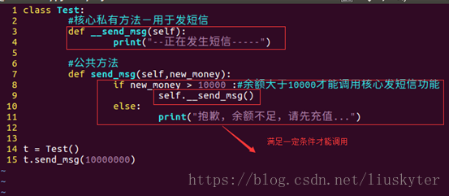

# Python13--面向对象程序设计-类和对象

### 定义和使用类

+ 定义类：

  > class 类名：
  >
  > 属性(成员变量)
  >
  > ...
  >
  > 成员函数(成员方法)

  + 类名的命名规则

    驼峰命名法

    类名中每个单词首字母大写，不使用下划线

    实例名和模块名都采用小写格式，并在单词之间加上下划线

  + 对于每个类，都应紧跟在类定义后面包含一个文档字符串，简要描述类的功能
  + 一个空行分隔方法，两个空行分隔类
  + 先写导入标准库模块的import，添加一个空行，再写导入自己的模块的import语句

  + 成员函数一般指与特定实例绑定的函数，通过对象调用成员方法时，对象本身将被作为第一个参数传递过去

  + 类的成员函数必须有一个参数self，而且位于参数列表的开头。

    self代表类的实例(对象)自身，可以使用self引用类中的属性和成员函数。

    在类的成员函数中访问实例属性时需要以self为前缀

    但在外部通过对象名调用对象成员函数时不需要传递这个参数

    如果在外部通过类名调用对象成员函数则需要显式为self参数传值

+ 定义对象

  > 对象名=类名([参数])

+ 在Python2.7中创建类

  ```python
  class ClassName(object):
      ...
  ```

  https://www.cnblogs.com/liuhaidon/p/12066383.html

---

### 构造函数\__init__(self[,参数])

```python
def __init__(self, obj1[, obj2,...]):
    self.obj1 = obj1
    ...
```

+ 该函数为一个特殊的方法，会在类实例化时自动为新生成的类实例调用__init__()方法。

+ 该方法并未显式地包含return语句，但是Python自动返回一个表示该类的实例。

+ 构造函数一般用于完成对象数据成员设置初值或进行其他必要的初始化工作。

+ 如果用户未定义构造函数，Python将提供一个默认的构造函数

+ 在这个方法的名称中，开头和末尾各有两个下划线，这是一种约定，避免python默认方法与普通方法发生名称冲突

+ 形参self必不可少，还必须位于其他形参的前面

  Ptyhon在调用这个\__init__()方法来创建Dog实例时，将自动传入实参self

  每个与类相关联的方法调用都自动传递实参self，它是一个指向实例本身的引用，让实例能够访问类中的属性和方法

---

### 析构函数\__del__(self)

+ 该函数用来释放对象占用的资源，在Python收回对象空间之前自动执行。

+ 若用户未定义析构函数，Python将提供一个默认的析构函数进行必要的清理工作。

+ 在外部调用方法

  ```python
  del 对象名 #系统会自动调用析构函数
  ```

---

### 实例属性和类属性

+ 实例属性：在构造函数中定义，定义时以self为前缀；
+ 类属性：在类中构造方法之外定义的属性。

+ 在主程序（类的外部）中，实例属性属于实例（对象）只能通过实例访问；类属性属于类可以通过类名访问，也可以通过对象名访问，为类的所有实例所共享。

+ Python可以动态地为类和对象增加成员。

  + 为类增加类属性

    > 类名.类属性名=值 

  + 为实例绑定成员函数

    > 实例名.成员函数名=types.MethodType(函数名,实例名)

    + 需要导入模块types 即 import types
    + 函数需要提前写好，函数名与成员函数名相同

+ Python可以使用一些函数来访问属性

  + getattr(obj,name):访问对象obj的属性name，并返回属性值
  + hasattr(obj,name):检查是否存在某属性，存在返回True
  + setattr(obj,name,value):设置一个属性。若不存在，会创建一个新属性并赋值为value
  + delattr(obj,name):删除属性

+ Python内置了一些类属性

  + \__dict\_\_:类的属性（返回一个字典，由类的数据属性组成）
  + \__doc\_\_:类的文档字符串
  + \__name__:类名
  + \__module\_\_:类定义所在模块（类全名为\_\_main__.className；若类位于一个导入模块mymod中，则返回mymod）
  + \__bases__:类的所有父类组成的元组

```python
import types
class Person:
    num = 0  # 类的静态属性
    def __init__(self, str, n):
        self.name = str  # 实例属性
        self.age = n
        Person.num == 1  # 修改类属性
    def SayHello(self):
        print("Hello!")
    def PrintName(self):
        print("姓名:", self.name, "  年龄:", self.age)
    def PrintNum(self):
        print(Person.num)

P1 = Person('cxy', 21)
P2 = Person('ccc', 45)
Person.num = 2
print("姓名:",P1.name,"  年龄:",P1.age)
print("姓名:",P2.name,"  年龄:",P2.age)
Person.work = 'JNU'
P1.age = 23
print("姓名:",P1.name,"  年龄:",P1.age,"  单位:",Person.work)
print("姓名:",P2.name,"  年龄:",P2.age,"  单位:",Person.work)
def setAge(self,s):
    self.age=s
P2.setAge=types.MethodType(setAge,P2)    #为P2实例绑定成员函数setAge
P2.setAge(35)
print("姓名:",P1.name,"  年龄:",P1.age,"  单位:",Person.work)
print("姓名:",P2.name,"  年龄:",P2.age,"  单位:",Person.work)

print(getattr(P1, 'num'))
print(getattr(P1, 'name'))
print(getattr(P1, 'age'))
print(hasattr(P1, 'name'))
print(hasattr(P1, 'work'))
print(hasattr(P1, 'gender'))
print(setattr(P1, 'gender', 'female'))
print(hasattr(P1, 'gender'))
print(P1.gender)
print(hasattr(P2, 'gender'))
print(delattr(P1, 'gender'))
print(hasattr(P1, 'gender'))
print()
print(P1)
print(id(P1))
print(type(P1))
print()
print(getattr(P1, '__dict__'))
print(getattr(Person, '__doc__'))
print(getattr(Person, '__name__'))
print(getattr(P1, '__module__'))
print(getattr(Person, '__bases__'))
```

```python
姓名: cxy   年龄: 21
姓名: ccc   年龄: 45
姓名: cxy   年龄: 23   单位: JNU
姓名: ccc   年龄: 45   单位: JNU
姓名: cxy   年龄: 23   单位: JNU
姓名: ccc   年龄: 35   单位: JNU
2
cxy
23
True
True
False
None
True
female
False
None
False

<__main__.Person object at 0x000001A78F469048>
1819174932552
<class '__main__.Person'>

{'name': 'cxy', 'age': 23}
None
Person
__main__
(<class 'object'>,)

Process finished with exit code 0
```

---

### 私有属性

+  私有属性

  以两个下划线“__”开头 注：Python不存在严格意义上的私有成员

  私有属性在类的外部不能直接访问，需要通过调用对象的公有成员方法来访问，或通过Python支持的特殊方法来访问

  https://blog.csdn.net/wohu1104/article/details/104460315/

  可以通过对象.\__dict__方法查看对象的属性,可以使用属性内的key进行调用.

  Python提供了访问私有属性的特殊方式，可用于程序的测试和调试，对于成员方法也具有同样的性质（不推荐）

+ 私有变量

  python默认的成员函数和成员变量都是公开的,没有像其他类似语言的public,private等关键字修饰.

  但是可以在变量前面加上两个下划线"\_",这样的话函数或变量就变成私有的.这是python的私有变量轧压(这个翻译好拗口),英文是(private name mangling.) 

  **情况就是当变量被标记为私有后,在变量的前端插入类名,再类名前添加一个下划线"\_",即形成了_ClassName__变量名.** 

+ 会用到私有属性的场景有
  + 把特定的一个属性隐藏起来,不想让类的外部进行调用.
  + 我想保护这个属性,不想让属性随意被改变.
  + 我想保护这个属性,不被子类继承.

+ 对象名.__类名+私有成员

  在Python中，以下划线开头的变量名和方法名有特殊含义，尤其是在类的定义中

+ _xxx:这样的对象为保护成员

  不能用 from module import *导入；

  只有类和子类内部成员方法能访问这些成员

+ 设置私有属性

  + 只读 @property

    内置装饰器函数,只在面向对象中使用

    类内方法伪装成属性,不用传参数,需要返回值

    目的时让代码更合理.名词时属性,动词是方法

    伪装的属性不能直接修改.（不论属性是否私有）

  + 可写 @setter

    setter实现对对象的修改

    @property配合@name.setter实现对name对象的修改.

  + 删除属性 @deleter

  + 实例

    + 只读

      ```python
      class Movie(object):
          def __init__(self, name, year):
              self.__name = name
              self.__year = year
      
          def print_detail(self):
              print("Name is {}, year is {}".format(self.__name, self.__year))
      
          @property
          def name(self):
              return self.__name
      
      movie = Movie("囧妈", 2020)
      movie.print_detail()
      print(movie.name)
      ```

      ```python
      Name is 囧妈, year is 2020
      囧妈
      ```

      使用 `@property` 装饰后 `name` 变为属性，意味着 `.name` 就会返回电影的名字，而不是通过 `.get_name()` 这种函数调用的方法。这样变为真正的

      属性后，可读性更好。

    + 可读可写

      如果使 `name` 既可读又可写，就再增加一个装饰器 `@name.setter`。

      注意这种装饰器写法：`name.setter`，`name` 已经被包装为 `property` 实例，调用实例上的 `setter` 函数再包装 `name` 后就会可写

      ```python
      class Movie(object):
          def __init__(self, name, year):
              self.__name = name
              self.__year = year
      
          def print_detail(self):
              print("Name is {}, year is {}".format(self.__name, self.__year))
      
          @property
          def name(self):
              return self.__name
      
          @name.setter
          def name(self, new_name):
              self.__name = new_name
      
      movie = Movie("囧妈", 2020)
      print(movie.name) # 囧妈
      movie.name = "流浪地球"
      print(movie.name) # 流浪地球
      print(getattr(movie, '__dict__'))
      print(movie.__dict__)
      ```

      ```python
      囧妈
      流浪地球
      {'_Movie__name': '流浪地球', '_Movie__year': 2020}
      {'_Movie__name': '流浪地球', '_Movie__year': 2020}
      ```

    + 删除属性

      ```python
      class Movie(object):
          def __init__(self, name, year):
              self.__name = name
              self.__year = year
      
          def print_detail(self):
              print("Name is {}, year is {}".format(self.__name, self.__year))
      
          @property
          def name(self):
              return self.__name
          @property
          def year(self):
              return self.__year
          @year.deleter
          def year(self):
              del self.__year
      
      movie = Movie("囧妈", 2020)
      movie.print_detail()
      print(movie.name)
      print(movie.__dict__)
      del movie.year
      #delattr(movie, 'year')
      print(movie.__dict__)
      ```

      ```python
      Name is 囧妈, year is 2020
      囧妈
      {'_Movie__name': '囧妈', '_Movie__year': 2020}
      {'_Movie__name': '囧妈'}
      ```

---

### 方法

+ 公有方法：

  通过对象名直接调用；

  若通过类名调用属于对象的公有方法，需要显示为该方法的self参数传递一个对象名，来指定访问哪个对象的数据成员

+ 私有方法：

  私有方法名以两个下画线"__"开始

  私有方法只能在属于对象的方法中通过self调用或在外部通过Python支持的特殊方式调用

  

+ 静态方法:

  通过类名和对象名调用，但不能直接访问属于对象的成员，只能访问属于类的成员

  在定义静态方法前加@staticmethod

+ 实例

  ```python
  class Movie(object):
      def __init__(self, name, year):
          self.__name = name
          self.__year = year
          self.value = 0
  
      def print_detail(self):
          print("Name is {}, year is {}".format(self.__name, self.__year))
  
      @property
      def name(self):
          return self.__name
  
      def __money(self):
          return self.value
  
  movie = Movie("囧妈", 2020)
  movie.print_detail()
  print(movie._Movie__money())
  ```

  ```
  Name is 囧妈, year is 2020
  0
  ```

  

 

 

 

   
