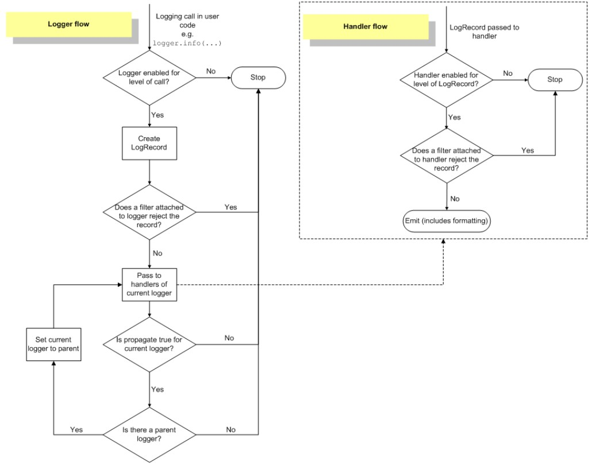

# Python模块10--logging

### 相关概念

日志是一种可以追踪某些软件运行时所发生事件的方法。软件开发人员可以向他们的代码中调用日志记录相关的方法来表明发生了某些事情。

一个事件可以用一个可包含可选变量数据的消息来描述。

此外，事件也有重要性的概念，这个重要性也可以被称为严重性级别（level）。

+ 日志的作用

  + 程序调试
  + 了解软件程序运行情况是否正常
  + 软甲你程序运行故障分析与问题定位
  + 如果应用的日志信息足够详细和丰富，还可以用来做用户行为分析，如：分析用户的操作行为、类型洗好、地域分布以及其它更多的信息，由此可以实现改进业务、提高商业利益。

+ 日志的等级

  + DEBUG
  + INFO
  + NOTICE
  + WARNING
  + ERROR
  + CRITICAL
  + ALERT
  + EMERGENCY

+ 日志字段信息与日志格式

  一条日志信息对应的是一个事件的发生，而一个事件通常需要包括以下几个内容：

  + 事件发生时间
  + 事件发生位置
  + 事件的严重程度--日志级别
  + 事件内容

  还可以包括一些其他信息，如进程ID、进程名称、线程ID、线程名称等

  日志格式就是用来定义一条日志记录中包含那些字段的，且日志格式通常都是可以自定义的

---

### logging模块简介

logging模块是Python的一个标准库模块

由标准库模块提供日志记录API的关键好处是所有Python模块都可以使用这个日志记录功能。所以，你的应用日志可以将你自己的日志信息与来自第三方模块的信息整合起来。

+ logging模块的日志级别

  logging模块默认定义了以下几个日志等级，它允许开发人员自定义其他日志级别，但是这是不被推荐的，尤其是在开发供别人使用的库时，因为这会导致日志级别的混乱。

  | 日志等级（level） | 描述                                                         |
  | ----------------- | ------------------------------------------------------------ |
  | DEBUG             | 最详细的日志信息，典型应用场景是 问题诊断                    |
  | INFO              | 信息详细程度仅次于DEBUG，通常只记录关键节点信息，用于确认一切都是按照我们预期的那样进行工作 |
  | WARNING           | 当某些不期望的事情发生时记录的信息（如，磁盘可用空间较低），但是此时应用程序还是正常运行的 |
  | ERROR             | 由于一个更严重的问题导致某些功能不能正常运行时记录的信息     |
  | CRITICAL          | 当发生严重错误，导致应用程序不能继续运行时记录的信息         |

  日志等级是从上到下依次升高的，即：DEBUG < INFO < WARNING < ERROR < CRITICAL，而日志的信息量是依次减少的；

  开发应用程序或部署开发环境时，可以使用DEBUG或INFO级别的日志获取尽可能详细的日志信息来进行开发或部署调试；

  应用上线或部署生产环境时，应该使用WARNING或ERROR或CRITICAL级别的日志来降低机器的I/O压力和提高获取错误日志信息的效率。

  日志级别的指定通常都是在应用程序的配置文件中进行指定的。

  当为某个应用程序指定一个日志级别后，应用程序会记录所有日志级别大于或等于指定日志级别的日志信息，而不是仅仅记录指定级别的日志信息

  logging模块也可以指定日志记录器的日志级别，只有级别大于或等于该指定日志级别的日志记录才会被输出，小于该等级的日志记录将会被丢弃。

+ logging模块的使用方式介绍

  + logging模块提供了两种记录日志的方式：
    + 第一种方式是使用logging提供的模块级别的函数
    + 第二种方式是使用Logging日志系统的四大组件

    其实，logging所提供的模块级别的日志记录函数也是对logging日志系统相关类的封装而已。

  + logging模块定义的模块级别的常用函数

    | 函数                                   | 说明                                 |
    | -------------------------------------- | ------------------------------------ |
    | logging.debug(msg, *args, **kwargs)    | 创建一条严重级别为DEBUG的日志记录    |
    | logging.info(msg, *args, **kwargs)     | 创建一条严重级别为INFO的日志记录     |
    | logging.warning(msg, *args, **kwargs)  | 创建一条严重级别为WARNING的日志记录  |
    | logging.error(msg, *args, **kwargs)    | 创建一条严重级别为ERROR的日志记录    |
    | logging.critical(msg, *args, **kwargs) | 创建一条严重级别为CRITICAL的日志记录 |
    | logging.log(level, *args, **kwargs)    | 创建一条严重级别为level的日志记录    |
    | logging.basicConfig(**kwargs)          | 对root logger进行一次性配置          |

    其中`logging.basicConfig(**kwargs)`函数用于指定“要记录的日志级别”、“日志格式”、“日志输出位置”、“日志文件的打开模式”等信息，其他几个都是用于记录各个级别日志的函数。

  + logging模块的四大组件

    | 组件       | 说明                                                         |
    | ---------- | ------------------------------------------------------------ |
    | loggers    | 提供应用程序代码直接使用的接口                               |
    | handlers   | 用于将日志记录发送到指定的目的位置                           |
    | filters    | 提供更细粒度的日志过滤功能，用于决定哪些日志记录将会被输出（其它的日志记录将会被忽略） |
    | formatters | 用于控制日志信息的最终输出格式                               |

    logging模块提供的模块级别的那些函数实际上也是通过这几个组件的相关实现类来记录日志的，只是在创建这些类的实例时设置了一些默认值。

---

### 使用logging提供的模块级别的函数记录日志

+ 最简单的日志输出

  ```python
  import logging
  
  logging.debug('This is a debug log.')
  logging.info('This is a info log.')
  logging.warning('This is a warning log.')
  logging.error('This is a error log.')
  logging.critical('This is a critical log.')
  logging.log(logging.DEBUG, 'This is a debug log.')
  logging.log(logging.INFO, 'This is a info log.')
  logging.log(logging.WARNING, 'This is a warning log.')
  logging.log(logging.ERROR, 'This is a error log.')
  logging.log(logging.CRITICAL, 'This is a critical log.')
  ```

  ```python
  WARNING:root:This is a warning log.
  ERROR:root:This is a error log.
  CRITICAL:root:This is a critical log.
  WARNING:root:This is a warning log.
  ERROR:root:This is a error log.
  CRITICAL:root:This is a critical log.
  ```

+ 使记录的日志中包含变量数据

  可使用一个格式字符串作为这个事件的描述消息（logging.debug、logging.info等函数的第一个参数），然后将变量数据作为第二个参数*args的值进行传递，

  ```python
  logging.warning('%s is %d years old.', 'Tom', 10)
  ```

  ```python
  WARNING:root:Tom is 10 years old.
  ```

+ logging.debug(), logging.info()等方法的定义中，除了msg和args参数外，还有一个**kwargs参数

  它们支持3个关键字参数: `exc_info, stack_info, extra`

  + exc_info： 其值为布尔值，如果该参数的值设置为True，则会将异常信息添加到日志消息中。如果没有异常信息则添加None到日志信息中。
  + stack_info：其值也为布尔值，默认值为False。如果该参数的值设置为True，栈信息将会被添加到日志信息中。
  + extra：这是一个字典（dict）参数，它可以用来自定义消息格式中所包含的字段，但是它的key不能与logging模块定义的字段冲突。

+ logging模块提供的日志记录函数所使用的日志器设置的默认日志级别是`WARNING`

  因此只有`WARNING`级别的日志记录以及大于它的`ERROR`和`CRITICAL`级别的日志记录被输出了，而小于它的`DEBUG`和`INFO`级别的日志记录被丢弃了。

+ 打印出的日志信息的格式

  上面输出结果中每行日志记录的各个字段含义分别是：

  ```python
  日志级别:日志器名称:日志内容
  ```

  logging模块提供的日志记录函数所使用的日志器设置的日志格式默认是BASIC_FORMAT，其值为：

  ```python
  "%(levelname)s:%(name)s:%(message)s"
  ```

+ 将日志记录输出到文件中

  在logging模块提供的日志记录函数所使用的日志器设置的处理器所指定的日志输出位置默认为:
  `sys.stderr`

+ logging.basicConfig()函数

  `logging.basicConfig()`函数是一个一次性的简单配置工具

  也就是说只有在第一次调用该函数时会起作用，后续再次调用该函数时完全不会产生任何操作的，多次调用的设置并不是累加操作。

  该方法用于为logging日志系统做一些基本配置，方法定义如下：

  ```python
  logging.basicConfig(**kwargs)
  ```

  该函数可接收的关键字参数如下：

  | 参数名称 | 描述                                                         |
  | -------- | ------------------------------------------------------------ |
  | filename | 指定日志输出目标文件的文件名，指定该设置项后日志信息就不会被输出到控制台了 |
  | filemode | 指定日志文件的打开模式，默认为'a'。需要注意的是，该选项要在filename指定时才有效 |
  | format   | 指定日志格式字符串，即指定日志输出时所包含的字段信息以及它们的顺序。logging模块定义的格式字段下面会列出。 |
  | datefmt  | 指定日期/时间格式。需要注意的是，该选项要在format中包含时间字段%(asctime)s时才有效 |
  | level    | 指定日志器的日志级别                                         |
  | stream   | 指定日志输出目标stream，如sys.stdout、sys.stderr以及网络stream。需要说明的是，stream和filename不能同时提供，否则会引发 `ValueError`异常 |
  | style    | Python 3.2中新添加的配置项。指定format格式字符串的风格，可取值为'%'、'{'和'$'，默认为'%' |
  | handlers | Python 3.3中新添加的配置项。该选项如果被指定，它应该是一个创建了多个Handler的可迭代对象，这些handler将会被添加到root logger。需要说明的是：filename、stream和handlers这三个配置项只能有一个存在，不能同时出现2个或3个，否则会引发ValueError异常。 |

+ logging模块定义的格式字符串字段

  | 字段/属性名称   | 使用格式            | 描述                                                         |
  | --------------- | ------------------- | ------------------------------------------------------------ |
  | asctime         | %(asctime)s         | 日志事件发生的时间--人类可读时间，如：2003-07-08 16:49:45,896 |
  | created         | %(created)f         | 日志事件发生的时间--时间戳，就是当时调用time.time()函数返回的值 |
  | relativeCreated | %(relativeCreated)d | 日志事件发生的时间相对于logging模块加载时间的相对毫秒数（目前还不知道干嘛用的） |
  | msecs           | %(msecs)d           | 日志事件发生事件的毫秒部分                                   |
  | levelname       | %(levelname)s       | 该日志记录的文字形式的日志级别（'DEBUG', 'INFO', 'WARNING', 'ERROR', 'CRITICAL'） |
  | levelno         | %(levelno)s         | 该日志记录的数字形式的日志级别（10, 20, 30, 40, 50）         |
  | name            | %(name)s            | 所使用的日志器名称，默认是'root'，因为默认使用的是 rootLogger |
  | message         | %(message)s         | 日志记录的文本内容，通过 `msg % args`计算得到的              |
  | pathname        | %(pathname)s        | 调用日志记录函数的源码文件的全路径                           |
  | filename        | %(filename)s        | pathname的文件名部分，包含文件后缀                           |
  | module          | %(module)s          | filename的名称部分，不包含后缀                               |
  | lineno          | %(lineno)d          | 调用日志记录函数的源代码所在的行号                           |
  | funcName        | %(funcName)s        | 调用日志记录函数的函数名                                     |
  | process         | %(process)d         | 进程ID                                                       |
  | processName     | %(processName)s     | 进程名称，Python 3.1新增                                     |
  | thread          | %(thread)d          | 线程ID                                                       |
  | threadName      | %(thread)s          | 线程名称                                                     |

+ 示例1

  ```python
  LOG_FORMAT = "%(asctime)s - %(levelname)s - %(message)s"
  DATE_FORMAT = "%m/%d/%Y %H:%M:%S %p"
  
  logging.basicConfig(filename='my.log', level=logging.DEBUG, format=LOG_FORMAT, datefmt=DATE_FORMAT)
  
  logging.debug("This is a debug log.")
  logging.info("This is a info log.")
  logging.warning("This is a warning log.")
  logging.error("This is a error log.")
  logging.critical("This is a critical log.")
  ```

  此时会在my.log日志文件中看到如下输出内容：

  ```python
  05/08/2017 14:29:04 PM - DEBUG - This is a debug log.
  05/08/2017 14:29:04 PM - INFO - This is a info log.
  05/08/2017 14:29:04 PM - WARNING - This is a warning log.
  05/08/2017 14:29:04 PM - ERROR - This is a error log.
  05/08/2017 14:29:04 PM - CRITICAL - This is a critical log.
  ```

+ 日志器（Logger）是有层级关系的

  上面调用的logging模块级别的函数所使用的日志器是`RootLogger`类的实例，其名称为'root'，它是处于日志器层级关系最顶层的日志器，且该实例是以单例模式存在的。

+ 示例2

  ```python
  LOG_FORMAT = "%(asctime)s - %(levelname)s - %(user)s[%(ip)s] - %(message)s"
  DATE_FORMAT = "%m/%d/%Y %H:%M:%S %p"
  
  logging.basicConfig(format=LOG_FORMAT, datefmt=DATE_FORMAT)
  logging.warning("Some one delete the log file.", exc_info=True, stack_info=True, extra={'user': 'Tom', 'ip':'47.98.53.222'})
  ```

  ```python
  05/08/2017 16:35:00 PM - WARNING - Tom[47.98.53.222] - Some one delete the log file.
  NoneType
  Stack (most recent call last):
    File "C:/Users/wader/PycharmProjects/LearnPython/day06/log.py", line 45, in <module>
      logging.warning("Some one delete the log file.", exc_info=True, stack_info=True, extra={'user': 'Tom', 'ip':'47.98.53.222'})
  ```

---

### logging模块日志流处理流程

+ logging日志模块四大组件

  | 组件名称 | 对应类名  | 功能描述                                                     |
  | -------- | --------- | ------------------------------------------------------------ |
  | 日志器   | Logger    | 提供了应用程序可一直使用的接口                               |
  | 处理器   | Handler   | 将logger创建的日志记录发送到合适的目的输出                   |
  | 过滤器   | Filter    | 提供了更细粒度的控制工具来决定输出哪条日志记录，丢弃哪条日志记录 |
  | 格式器   | Formatter | 决定日志记录的最终输出格式                                   |

  logging模块就是通过这些组件来完成日志处理的，上面所使用的logging模块级别的函数也是通过这些组件对应的类来实现的。

  + 这些组件之间的关系描述

    + 日志器（logger）需要通过处理器（handler）将日志信息输出到目标位置，如：文件、sys.stdout、网络等；
    + 不同的处理器（handler）可以将日志输出到不同的位置；
    + 日志器（logger）可以设置多个处理器（handler）将同一条日志记录输出到不同的位置；
    + 每个处理器（handler）都可以设置自己的过滤器（filter）实现日志过滤，从而只保留感兴趣的日志；
    + 每个处理器（handler）都可以设置自己的格式器（formatter）实现同一条日志以不同的格式输出到不同的地方。

    简单点说就是：日志器（logger）是入口，真正干活儿的是处理器（handler），处理器（handler）还可以通过过滤器（filter）和格式器（formatter）对要输出的日志内容做过滤和格式化等处理操作。

+ logging日志模块相关类及其常用方法介绍

  + logger类

    + logger对象的三个任务

      + 向应用程序代码暴露几个方法，使应用程序可以在运行时记录日志消息；
      + 基于日志严重等级（默认的过滤设施）或filter对象来决定要对哪些日志进行后续处理；
      + 将日志消息传送给所有感兴趣的日志handlers。

    + Logger对象最常用的两类方法

      + 配置方法

        | 方法                                          | 描述                                       |
        | --------------------------------------------- | ------------------------------------------ |
        | Logger.setLevel()                             | 设置日志器将会处理的日志消息的最低严重级别 |
        | Logger.addHandler() 和 Logger.removeHandler() | 为该logger对象添加 和 移除一个handler对象  |
        | Logger.addFilter() 和 Logger.removeFilter()   | 为该logger对象添加 和 移除一个filter对象   |

        内建等级中，级别最低的是DEBUG，级别最高的是CRITICAL。

        例如setLevel(logging.INFO)，此时函数参数为INFO，那么该logger将只会处理INFO、WARNING、ERROR和CRITICAL级别的日志，而DEBUG级别的消息将会被忽略/丢弃。

      + 消息发送方法

        | 方法                                                         | 描述                                              |
        | ------------------------------------------------------------ | ------------------------------------------------- |
        | Logger.debug(), Logger.info(), Logger.warning(), Logger.error(), Logger.critical() | 创建一个与它们的方法名对应等级的日志记录          |
        | Logger.exception()                                           | 创建一个类似于Logger.error()的日志消息            |
        | Logger.log()                                                 | 需要获取一个明确的日志level参数来创建一个日志记录 |

        - Logger.exception()与Logger.error()的区别在于：Logger.exception()将会输出堆栈追踪信息，另外通常只是在一个exception handler中调用该方法。
        - Logger.log()与Logger.debug()、Logger.info()等方法相比，虽然需要多传一个level参数，显得不是那么方便，但是当需要记录自定义level的日志时还是需要该方法来完成。

    + 生成logger对象方法

      + 方法一：通过Logger类的实例化方法创建一个Logger类的实例

      + 方法二：常用

        ```python
        logger = logging.getLogger([name])
        ```

        + 可选参数name

          表示将要返回的日志器的名称标识

          如果不提供该参数，则其值为‘root’

          若以相同的name参数值多次调用getLogger()方法，将会返回指向同一个logger对象的引用

    + logger的层级结构与有效等级

      + logger的层级结构

        logger的名称是一个以'.'分割的层级结构，每个'.'后面的logger都是'.'前面的logger的children

        例如，有一个名称为 foo 的logger，其它名称分别为 foo.bar, foo.bar.baz 和 foo.bam都是 foo 的后代

      + logger的有效等级（effective level）

        如果一个logger上没有被明确设置一个level，那么该logger就是使用它parent的level;

        如果它的parent也没有明确设置level则继续向上查找parent的parent的有效level，依次类推，直到找到个一个明确设置了level的祖先为止。

        需要说明的是，root logger总是会有一个明确的level设置（默认为 WARNING）。

        当决定是否去处理一个已发生的事件时，logger的有效等级将会被用来决定是否将该事件传递给该logger的handlers进行处理。

      + child loggers在完成对日志消息的处理后，默认会将日志消息传递给与它们的祖先loggers相关的handlers。

        因此，我们不必为一个应用程序中所使用的所有loggers定义和配置handlers，只需要为一个顶层的logger配置handlers，然后按照需要创建child loggers就可足够了。

        我们也可以通过将一个logger的propagate属性设置为False来关闭这种传递机制。

  + Handler类

    + Handler对象的作用是（基于日志消息的level）将消息分发到handler指定的位置（文件、网络、邮件等）。

    + Logger对象可以通过addHandler()方法为自己添加0个或者更多个handler对象。

      比如，一个应用程序可能想要实现以下几个日志需求：

      + 把所有日志都发送到一个日志文件中；
      + 把所有严重级别大于等于error的日志发送到stdout（标准输出）；
      + 把所有严重级别为critical的日志发送到一个email邮件地址。

      这种场景就需要3个不同的handlers，每个handler负责发送一个特定严重级别的日志到一个特定的位置。

    + 一个handler中只有非常少数的方法是需要应用开发人员去关心的。

      对于使用内建handler对象的应用开发人员来说，似乎唯一相关的handler方法就是下面这几个配置方法：

      | 方法                                          | 描述                                        |
      | --------------------------------------------- | ------------------------------------------- |
      | Handler.setLevel()                            | 设置handler将会处理的日志消息的最低严重级别 |
      | Handler.setFormatter()                        | 为handler设置一个格式器对象                 |
      | Handler.addFilter() 和 Handler.removeFilter() | 为handler添加 和 删除一个过滤器对象         |

      需要说明的是，应用程序代码不应该直接实例化和使用Handler实例。

      因为Handler是一个基类，它只定义了素有handlers都应该有的接口，同时提供了一些子类可以直接使用或覆盖的默认行为。

    + 一些常用的Handler

      | Handler                                   | 描述                                                         |
      | ----------------------------------------- | ------------------------------------------------------------ |
      | logging.StreamHandler                     | 将日志消息发送到输出到Stream，如std.out, std.err或任何file-like对象。 |
      | logging.FileHandler                       | 将日志消息发送到磁盘文件，默认情况下文件大小会无限增长       |
      | logging.handlers.RotatingFileHandler      | 将日志消息发送到磁盘文件，并支持日志文件按大小切割           |
      | logging.hanlders.TimedRotatingFileHandler | 将日志消息发送到磁盘文件，并支持日志文件按时间切割           |
      | logging.handlers.HTTPHandler              | 将日志消息以GET或POST的方式发送给一个HTTP服务器              |
      | logging.handlers.SMTPHandler              | 将日志消息发送给一个指定的email地址                          |
      | logging.NullHandler                       | 该Handler实例会忽略error messages，通常被想使用logging的library开发者使用来避免'No handlers could be found for logger XXX'信息的出现。 |
      
      + logging.FileHandler(filename[,mode=‘a’, encoding=None, delay=False])
        + filename : 文件名
        + mode : 问价你打开方式。默认是‘a’，即添加到文件末尾

  + Formater类

    Formater对象用于配置日志信息的最终顺序、结构和内容。

    与logging.Handler基类不同的是，应用代码可以直接实例化Formatter类。

    另外，如果你的应用程序需要一些特殊的处理行为，也可以实现一个Formatter的子类来完成。

    + Formatter类的构造方法定义如下

      ```python
      logging.Formatter.__init__(fmt=None, datefmt=None, style='%')
      ```

      + fmt：指定消息格式化字符串，如果不指定该参数则默认使用message的原始值
      + datefmt：指定日期格式字符串，如果不指定该参数则默认使用"%Y-%m-%d %H:%M:%S"
      + style：Python 3.2新增的参数，可取值为 '%', '{'和 '$'，如果不指定该参数则默认使用'%''

  + Filter类

    Filter可以被Handler和Logger用来做比level更细粒度的、更复杂的过滤功能。

    Filter是一个过滤器基类，它只允许某个logger层级下的日志事件通过过滤。

    + 该类定义如下：

      ```python
      class logging.Filter(name='')
          filter(record)
      ```

      比如，一个filter实例化时传递的name参数值为'A.B'，那么该filter实例将只允许名称为类似如下规则的loggers产生的日志记录通过过滤：'A.B'，'A.B,C'，'A.B.C.D'，'A.B.D'，而名称为'A.BB', 'B.A.B'的loggers产生的日志则会被过滤掉。如果name的值为空字符串，则允许所有的日志事件通过过滤。

    + filter方法用于具体控制传递的record记录是否能通过过滤，如果该方法返回值为0表示不能通过过滤，返回值为非0表示可以通过过滤。
    + 如果有需要，也可以在filter(record)方法内部改变该record，比如添加、删除或修改一些属性。
    + 我们还可以通过filter做一些统计工作，比如可以计算下被一个特殊的logger或handler所处理的record数量等。

+ logging日志流处理流程

  

  + 日志流处理流程

    + 1.（在用户代码中进行）日志记录函数调用，如：logger.info(...)，logger.debug(...)等；

    + 2.判断要记录的日志级别是否满足日志器设置的级别要求（要记录的日志级别要大于或等于日志器设置的级别才算满足要求），如果不满足则该日志记录会被丢弃并终止后续的操作，如果满足则继续下一步操作；

    + 3.根据日志记录函数调用时掺入的参数，创建一个日志记录（LogRecord类）对象；

    + 4.判断日志记录器上设置的过滤器是否拒绝这条日志记录，如果日志记录器上的某个过滤器拒绝，则该日志记录会被丢弃并终止后续的操作，如果日志记录器上设置的过滤器不拒绝这条日志记录或者日志记录器上没有设置过滤器则继续下一步操作--将日志记录分别交给该日志器上添加的各个处理器；

    + 5.判断要记录的日志级别是否满足处理器设置的级别要求（要记录的日志级别要大于或等于该处理器设置的日志级别才算满足要求），如果不满足记录将会被该处理器丢弃并终止后续的操作，如果满足则继续下一步操作；

    + 6.判断该处理器上设置的过滤器是否拒绝这条日志记录，如果该处理器上的某个过滤器拒绝，则该日志记录会被当前处理器丢弃并终止后续的操作，如果当前处理器上设置的过滤器不拒绝这条日志记录或当前处理器上没有设置过滤器测继续下一步操作；

    + 7.如果能到这一步，说明这条日志记录经过了层层关卡允许被输出了，此时当前处理器会根据自身被设置的格式器（如果没有设置则使用默认格式）将这条日志记录进行格式化，最后将格式化后的结果输出到指定位置（文件、网络、类文件的Stream等）；

    + 8.如果日志器被设置了多个处理器的话，上面的第5-8步会执行多次；

    + 9.这里才是完整流程的最后一步：判断该日志器输出的日志消息是否需要传递给上一级logger（之前提到过，日志器是有层级关系的）的处理器，如果propagate属性值为1则表示日志消息将会被输出到处理器指定的位置，同时还会被传递给parent日志器的handlers进行处理直到当前日志器的propagate属性为0停止，如果propagate值为0则表示不向parent日志器的handlers传递该消息，到此结束。

      如果propagate值为1，那么日志消息会直接传递交给上一级logger的handlers进行处理，此时上一级logger的日志等级并不会对该日志消息进行等级过滤。

  + 一条日志信息要想被最终输出需要依次经过以下几次过滤：

    + 日志器等级过滤；
    + 日志器的过滤器过滤；
    + 日志器的处理器等级过滤；
    + 日志器的处理器的过滤器过滤；

---

### 使用logging四大组件记录日志

+ 示例需求

  + 要求将所有级别的所有日志都写入磁盘文件中
  + all.log文件中记录所有的日志信息，日志格式为：日期和时间 - 日志级别 - 日志信息
  + error.log文件中单独记录error及以上级别的日志信息，日志格式为：日期和时间 - 日志级别 - 文件名[:行号] - 日志信息
  + 要求all.log在每天凌晨进行日志切割

+ 分析

  + 要记录所有级别的日志，因此日志器的有效level需要设置为最低级别--DEBUG;
  + 日志需要被发送到两个不同的目的地，因此需要为日志器设置两个handler；另外，两个目的地都是磁盘文件，因此这两个handler都是与FileHandler相关的；
  + all.log要求按照时间进行日志切割，因此他需要用logging.handlers.TimedRotatingFileHandler; 而error.log没有要求日志切割，因此可以使用FileHandler;
  + 两个日志文件的格式不同，因此需要对这两个handler分别设置格式器；

+ 代码实现

  ```python
  import logging
  import logging.handlers
  import datetime
  
  logger = logging.getLogger('mylogger')
  logger.setLevel(logging.DEBUG)
  
  rf_handler = logging.handlers.TimedRotatingFileHandler('all.log', when='midnight', interval=1, backupCount=7, atTime=datetime.time(0, 0, 0, 0))
  rf_handler.setFormatter(logging.Formatter("%(asctime)s - %(levelname)s - %(message)s"))
  
  f_handler = logging.FileHandler('error.log')
  f_handler.setLevel(logging.ERROR)
  f_handler.setFormatter(logging.Formatter("%(asctime)s - %(levelname)s - %(filename)s[:%(lineno)d] - %(message)s"))
  
  logger.addHandler(rf_handler)
  logger.addHandler(f_handler)
  
  logger.debug('debug message')
  logger.info('info message')
  logger.warning('warning message')
  logger.error('error message')
  logger.critical('critical message')
  ```

  all.log文件输出

  ```python
  2017-05-13 16:12:40,612 - DEBUG - debug message
  2017-05-13 16:12:40,612 - INFO - info message
  2017-05-13 16:12:40,612 - WARNING - warning message
  2017-05-13 16:12:40,612 - ERROR - error message
  2017-05-13 16:12:40,613 - CRITICAL - critical message
  ```

  error.log文件输出

  ```python
  2017-05-13 16:12:40,612 - ERROR - log.py[:81] - error message
  2017-05-13 16:12:40,613 - CRITICAL - log.py[:82] - critical message
  ```

---

### 配置logging的几种方式

+ 用Python代码显式的创建loggers, handlers和formatters并分别调用它们的配置函数；
+ 创建一个日志配置文件，然后使用`fileConfig()`函数来读取该文件的内容；
+ 创建一个包含配置信息的dict，然后把它传递个`dictConfig()`函数；

https://www.cnblogs.com/yyds/p/6885182.html

---

### 向日志输出中添加上下文信息

除了传递给日志记录函数的参数外，有时候我们还想在日志输出中包含一些额外的上下文信息。

比如，在一个网络应用中，可能希望在日志中记录客户端的特定信息，如：远程客户端的IP地址和用户名。这里我们来介绍以下几种实现方式：

+ 通过向日志记录函数传递一个`extra`参数引入上下文信息
+ 使用LoggerAdapters引入上下文信息
+ 使用Filters引入上下文信息

https://www.cnblogs.com/yyds/p/6897964.html

## debug解决：中文日志乱码

### 参考网址

https://blog.csdn.net/u010895119/article/details/79565427?utm_term=python%E6%97%A5%E5%BF%97%E6%96%87%E4%BB%B6%E4%B8%AD%E6%96%87%E4%B9%B1%E7%A0%81&utm_medium=distribute.pc_aggpage_search_result.none-task-blog-2~all~sobaiduweb~default-0-79565427&spm=3001.4430

### 解决方案

```python
fh = logging.FileHandler(logfile, mode='a', encoding='utf-8')
```


