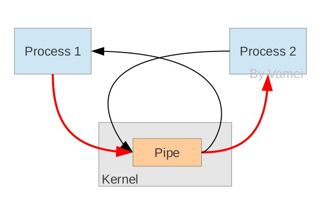

# Python笔记19--管道

### 简介

管道是Linux进程间通信方式的一种，管道有两端，读端和写端。

创建管道，然后从父进程fork出子进程，父进程和子进程拥有共同的读写文件描述符，可以实现子进程写文件，父进程读文件的操作。



### 参考

https://www.cnblogs.com/wangm-0824/p/10267977.html

### 使用

+ 创建管道的类

  ```python
  pipe([duplex])
  ```

  在进程之间创建一条管道，并返回元组（conn1,conn2）,其中conn1，conn2表示管道两端的连接对象，强调一点：必须在产生Process对象之前产生管道

  + duplex

    默认管道是全双工的，如果将duplex射成False，conn1只能用于接收，conn2只能用于发送。

+ 主要方法

  + ```python
    conn1.recv()
    ```

    接收conn2.send(obj)发送的对象。如果没有消息可接收，recv方法会一直阻塞。

    如果连接的另外一端已经关闭，那么recv方法会抛出EOFError。

  + ```python
    conn1.send(obj)
    ```

    通过连接发送对象。obj是与序列化兼容的任意对象

  + ```python
    conn1.close()
    ```

    关闭连接。如果conn1被垃圾回收，将自动调用此方法

  + ```python
    conn1.fileno()
    ```

    返回连接使用的整数文件描述符

  + ```python
    con1.poll([timeout])
    ```

    如果连接上的数据可用，返回True。

    timeout指定等待的最长时限。如果省略此参数，方法将立即返回结果。如果将timeout设成None，操作将无限期地等待数据到达。

  + ```python
    conn1.recv_bytes([maxlength])
    ```

    接收c.send_bytes()方法发送的一条完整的字节消息。

    maxlength指定要接收的最大字节数。

    如果进入的消息，超过了这个最大值，将引发IOError异常，并且在连接上无法进行进一步读取。

    如果连接的另外一端已经关闭，再也不存在任何数据，将引发EOFError异常。

  + ```python
    conn.send_bytes(buffer [, offset [, size]])
    ```

    通过连接发送字节数据缓冲区，buffer是支持缓冲区接口的任意对象，offset是缓冲区中的字节偏移量，而size是要发送字节数。结果数据以单条消息的形式发出，然后调用c.recv_bytes()函数进行接收

  + ```python
    conn1.recv_bytes_into(buffer [, offset])
    ```

    接收一条完整的字节消息，并把它保存在buffer对象中，该对象支持可写入的缓冲区接口（即bytearray对象或类似的对象）。

    offset指定缓冲区中放置消息处的字节位移。返回值是收到的字节数。如果消息长度大于可用的缓冲区空间，将引发BufferTooShort异常。

+ 实例

  ```python
  from multiprocessing import Process, Pipe
  
  def f(conn):
      conn.send("Hello 妹妹") #子进程发送了消息
      conn.close()
  
  if __name__ == '__main__':
      parent_conn, child_conn = Pipe() #建立管道，拿到管道的两端，双工通信方式，两端都可以收发消息
      p = Process(target=f, args=(child_conn,)) #将管道的一段给子进程
      p.start() #开启子进程
      print(parent_conn.recv()) #主进程接受了消息
      p.join()
  ```


