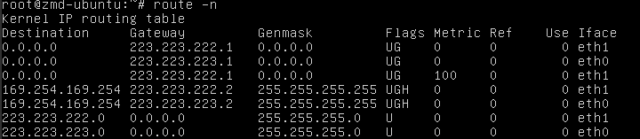

# TDYTH代码总结12--链路切换

### 网络示例

+ 虚拟机配置
  + image：mini_router_ospf2
  + flavor：1_1_10

---

### 创建实例网络

+ 在test_cxy3上进行ping测试

  + ping test_cxy2

    

  + ping test_cxy1

    

+ 路由表

  + test_cxy1

    

  + test_cxy2

    

  + test_cxy3

    

+ **==结论==**

  正常部署出来，路由协议正常

---

### 进行第一次切换

+ 过程

  将test_cxy2在net_cxy_test2网络中的端口断开，然后再连上

+ 切换结果

  原test_cxy2在net_cxy_test2网络中的port被删除

  new port_id = 'b98294db-4520-4463-b696-691a597bbf3f'

  对应新的IP = '223.223.222.26'

  

+ 在test_cxy3上进行ping测试

  + ping test_cxy2

    

  + ping test_cxy1

    

+ 路由表

  + test_cxy1

    

  + test_cxy2

    

  + test_cxy3

    

---

### ==删除所有涉及到的端口的端口安全==     ==事实上只用删除新端口的端口安全即可==

+ 在test_cxy3上进行ping测试

  + ping test_cxy2

    

  + ping test_cxy1

    

+ 路由表

  + test_cxy1

    

  + test_cxy2

    

  + test_cxy3

    

+ **==结论==**

  首次切换以后，新端口需要删除端口安全，虚拟机的路由表才会正常更新。

  可能端口安全过滤掉某些ospf报文

---

### 再次切换

+ 过程

  将test_cxy2在net_cxy_test2网络中的端口断开，然后再连上

+ 切换结果

  test_cxy2在net_cxy_test2网络中的新port仍然存在，继续被使用

  

+ 在test_cxy3上进行ping测试

  + ping test_cxy2

    

  + ping test_cxy1

    

+ 路由表

  + test_cxy1

    

  + test_cxy2

    

  + test_cxy3

    

+ **==结论==**

  再次切换后，对应test_cxy2在网络net_cxy_test2中的端口仍然不变，因此路由正常

### ==**总结**==

+ ==首次切换后，若创建了新端口，需要给新的端口删除端口安全==

+ ==**后面再次测试发现，只需要删除新的端口的端口安全即可，不用删除所有涉及的端口的端口安全**==

+ ==test_cxy2的路由表始终不变==

