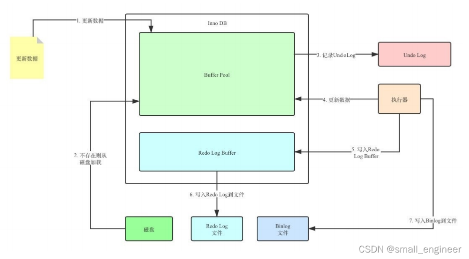
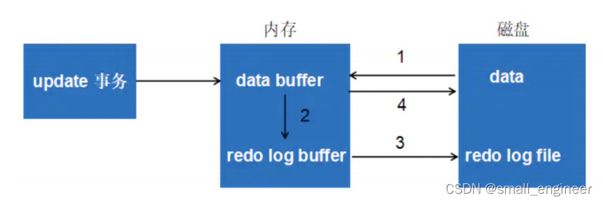

# 关系数据库笔记2--redo日志与undo日志

## undo日志

undo日志（回滚日志，UNDO Log），记录事务修改前的状态

undo log是逻辑日志，对事务回滚时，只是将数据库逻辑地恢复到原来的样子。

### undo log是事务原子性、一致性的保证

* 事务需要保证 原子性 ，也就是事务中的操作要么全部完成，要么什么也不做。
* 但有时候事务执行到一半会出现一些情况，比如：
  * 情况一：事务执行过程中可能遇到各种错误，比如 服务器本身的错误 ， 操作系统错误 ，甚至是突然 断电 导致的错误
  * 情况二：程序员可以在事务执行过程中手动输入 ROLLBACK 语句结束当前事务的执行。
* 以上情况出现，我们需要把数据改回原先的样子，这个过程称之为 回滚 ，这样就可以造成一个假象：这个事务看起来什么都没做，所以符合 原子性 要求。

### Undo日志的作用

#### 回滚数据

* 用户对undo日志可能有误解:undo用于将数据库物理地恢复到执行语句或事务之前的样子。但事实并非如此。
* undo是逻辑日志，因此只是将数据库逻辑地恢复到原来的样子。所有修改都被逻辑地取消了，但是数据结构和页本身在回滚之后可能大不相同。
* 这是因为在多用户并发系统中，可能会有数十、数百甚至数千个并发事务。
* 数据库的主要任务就是协调对数据记录的并发访问。比如，一个事务在修改当前一个页中某几条记录，同时还有别的事务在对同一个页中另几条记录进行修改。

因此，不能将一个页回滚到事务开始的样子，因为这样会影响其他事务正在进行的工作。

#### MVCC

* 即在InnoDB存储引擎中MVCC的实现是通过undo来完成。
* 当用户读取一行记录时，若该记录已经被其他事务占用，当前事务可以通过undo读取之前的行版本信息，以此实现非锁定读取。

### Undo的存储结构

#### 回滚段与undo页

* InnoDB对undo log的管理采用段的方式，也就是 回滚段（rollback segment） 。

* 每个回滚段记录了1024 个 undo log segment ，而在每个undo log segment段中进行 undo页 的申请。

#### 回滚段与事务

* 每个事务只会使用一个回滚段，一个回滚段在同一时刻可能会服务于多个事务。
* 当一个事务开始的时候，会制定一个回滚段，在事务进行的过程中，当数据被修改时，原始的数据会被复制到回滚段。
* 在回滚段中，事务会不断填充盘区，直到事务结束或所有的空间被用完。如果当前的盘区不够用，事务会在段中请求扩展下一个盘区，如果所有已分配的盘区都被用完，事务会覆盖最初的盘区或者在回滚段允许的情况下扩展新的盘区来使用。
* 回滚段存在于undo表空间中，在数据库中可以存在多个undo表空间，但同一时刻只能使用一个undo表空间。
* 当事务提交时，InnoDB存储引擎会做以下两件事情：将undo log放入列表中，以供之后的purge操作；判断undo log所在的页是否可以重用，若可以分配给下个事务使用

### 回滚段中的数据分类

* 未提交的回滚数据(uncommitted undo information)
* 已经提交但未过期的回滚数据(committed undo information)
* 事务已经提交并过期的数据(expired undo information)

### Undo的工作过程

图有问题，应该先写入redo log到磁盘，再更新内存数据。

* 先写入redo log buffer，当redo log buffer数据量超过一定大小，或距离上次刷入磁盘超过一定时间，就将redo log buffer中的事务操作一次性刷入磁盘的redo log文件。
* 然后一次性将多个事务的修改操作应用到内存中并逐个返回刻画段操作结果。
* 最后将事务操作写入到binlog文件

### Undo log的删除

#### 针对于insert undo log

因为insert操作的记录，只对事务本身可见，对其他事务不可见。

故该undo log可以在事务提交后直接删除，不需要进行purge操作

#### 针对于update undo log

该undo log可能需要提供MVCC机制，因此不能在事务提交时就进行删除。

提交时放入undo log链表，等待purge线程进行最后的删除

## redo日志

redo日志（重做日志，REDO Log）记录事务修改后的状态

redo log是物理日志，记录的是数据页的物理变化

### redo日志是事务持久性的保证

### redo的组成

* 重做日志缓存保存在内存中，是易失的，连续的缓存空间，由若干个block组成
* 重做日志文件保存在硬盘中，是持久的，由若干个日志文件组成

### redo流程

* 第1步：先将原始数据从磁盘中读入内存中来，修改数据的内存拷贝
* 第2步：生成一条重做日志并写入redo log buffer，记录的是数据被修改后的值
* 第3步：当事务commit时，将redo log buffer中的内容刷新到 redo log file，对 redo log file采用追加 写的方式
* 第4步：定期将内存中修改的数据刷新到磁盘中
* Write-Ahead Log(预先日志持久化)：在持久化一个数据页之前，先将内存中相应的日志页持久化。

## undo log不是redo log的逆过程

undo和redo都可以视为一种恢复操作，但是

* undo日志，是存储引擎层（innodb）生成的日志，记录的是“逻辑操作”日志，比如对某一行进行了INSERT语句操作，那个undo log就记录一条与之相反的DELETE操作（或者是，在进行INSERT操作之前的原数据）。主要用于事务的回滚和一致性非锁定读。

* redo日志：是存储引擎层（innodb）生成的日志，记录的是“物理级别”上的页修改操作，比如页号xxx，偏移量yyy写入了‘zzz’数据， 主要为了保证数据的可靠性，事务的持久性

