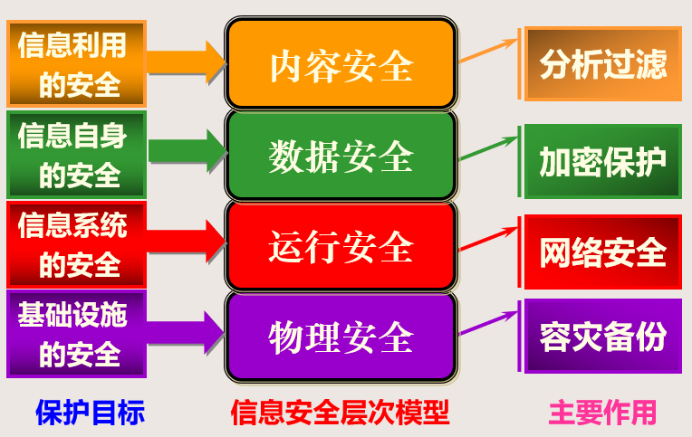

# 第一章--信息安全概述

1. 信息安全理解

   + 信息安全从技术角度来看是对信息与信息系统的固有属性的攻击与保护的过程。

   + 它围绕着信息系统、信息自身及信息利用的==机密性、真实性、可控性、可用性==这四个核心安全属性，具体反映在==物理安全、运行安全、数据安全、内容安全、信息内容对抗==等五个层面上。

2. 四个核心安全属性

  + 机密性（Confidentiality） ：反映了信息与信息系统的不可被非授权者所利用
  + 真实性（Authentication） ：反映了信息与信息系统的行为不被伪造、篡改、冒充
  + 可控性（controllability）：反映了信息的流动与信息系统可被控制者所监控
  + 可用性（Availability） ：反映了信息与信息系统可被授权者所正常使用

3. 五个层面

  + 物理安全（系统安全）

    指对网络与信息系统物理装备的保护。主要涉及**网络与信息系统的机密性、可用性、完整性**等属性。

    + 涉及的主要技术
      + 加扰处理、电磁屏蔽：防范电磁泄露
      + 容错、容灾、冗余备份、生存性技术：防范随机性故障
      + 信息验证：防范信号插入

    + 信息安全的技术层次视点
      + 环境安全
      + 设施安全
      + 动力安全
      + 容灾

  + 运行安全（系统安全）

    指对网络与信息系统的运行过程和运行状态的保护。主要涉及**网络与信息系统的真实性、可控性、可用性**等

    + 涉及的主要技术
      + 风险评估体系、安全测评体系：支持系统评估
      + 漏洞扫描、安全协议：支持对安全策略的评估与保障
      + 防火墙、物理隔离系统、访问控制技术、防恶意代码技术：支持访问控制
      + 入侵检测及预警系统、安全审计技术：支持入侵检测
      + 反制系统、容侵技术、审计与追踪技术、取证技术、动态隔离技术：支持应急响应
      + 网络攻击技术，Phishing、Botnet、DDoS、木马等技术
    + 信息安全的技术层次视点
      + 系统评估-测试评估能力
      + 访问控制-安全防护能力
      + 入侵检测-安全预警能力
      + 应急响应-应急响应能力

  + 数据安全（信息安全）

    指对信息在数据收集、处理、存储、检索、传输、交换、显示、扩散等过程中的保护，使得在数据处理层面保障信息依据授权使用，不被非法冒充、窃取、篡改、抵赖。主要涉及**信息的机密性、真实性、完整性、不可否认性**等

    + 涉及的主要技术
      + 对称与非对称密码技术及其硬化技术、VPN等技术：防范信息泄密
    + 认证、鉴别、PKI等技术：防范信息伪造
      + 完整性验证技术：防范信息篡改
      + 数字签名技术：防范信息抵赖
      + 秘密共享技术：防范信息破坏
    + 信息安全的技术层次视点
      + 防泄漏
      + 防冒充
      + 防篡改
      + 防抵赖
    
  + 内容安全（信息安全）

    指对信息在网络内流动中的选择性阻断，以保证信息流动的可控能力。主要涉及**信息的机密性、真实性、可控性、可用性**等

    + 涉及的主要技术
      + 文本识别、图像识别、流媒体识别、群发邮件识别等：用于对信息的理解与分析
      + 面向内容的过滤技术（CVP）、面向URL的过滤技术（UFP）、面向DNS的过滤技术等：用于对信息的过滤

    + 信息安全的技术层次视点
      + 有害信息的过滤

  + 信息利用的安全（信息对抗的安全）

    指对信息有效内容真实性的隐藏、保护与分析。主要涉及**信息有效内容的机密性、完整性**等

    + 信息安全的技术层次视点
      + 信息的隐藏与发现
      + 信息的干扰与提取
    + 涉及的主要技术
      + 数据挖掘技术：发现信息
      + 隐写技术、水印技术：保护信息
      + 即时通、MSN等协议的分析技术：对特定协议的理解
      + VoIP识别技术：对数字化语音信息的理解
      + 音频识别与按内容匹配：锁定音频目标进行

4. 对信息安全的理解

   

   

   

   