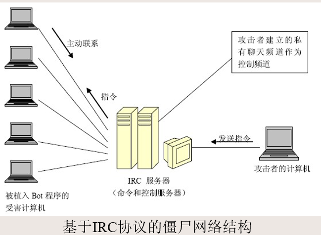

# 第三章--网络与系统攻击与防御技术

1. 针对WIN7的渗透测试演示（黑客攻击技术）

   + Metasploit - 对目标主机进行渗透测试

     Metasploit是一款开源的安全漏洞检测工具，可以帮助安全和IT专业人士识别安全性问题，验证漏洞的缓解措施，并管理专家驱动的安全性进行评估，提供真正的安全风险情报。

   ---

2. 漏洞利用技术

   + 漏洞的定义
     + 漏洞(Vulnerability)也称为**脆弱性**， 是指计算机系统在**硬件、软件及协议**的具体实现或系统安全策略上存在的缺陷和不足。它一旦被发现，就可以被攻击者用以在未授权的情况下访问或破坏系统。不同的软硬件设备，不同的系统或者同种系统在不同的设置环境下，都会存在各自的安全隐患。
     + **系统的漏洞**主要是由于在程序设计初期，没有注意安全问题或者是程序员的不正确处理而造成的．另外，用户对于软件的不正确配置或者不恰当的使用也会引发漏洞
     + **协议上的漏洞**则是由于设计人员在协议设计时没有考虑安全因素或者考虑不全而引发的。
     + **0Day漏洞**：是指那些没有公开过，因而也没有补丁的漏洞，也就是通常所说的“未公开漏洞”。
     + **CVE（Common Vulnerabilities & Exposures）**：公共漏洞和暴露。CVE就好像是一个字典表，为广泛认同的信息安全漏洞或者已经暴露出来的弱点给出一个公共的名称。

   + 漏洞库

     + 中国国家漏洞库

          http://www.cnvd.org.cn

     + 美国国家漏洞库

       http://cve.mitre.org/

   + ==漏洞利用效果==

     + 远程提权
     + 本地提权(CVE-2014-0196)
     + 信息泄露(CVE-2014-0160)：心脏出血
     + 拒绝服务攻击(DoS)
     + 任意代码执行
     + SQL注入
     + 跨站攻击（XSS）

   + CVE-2014-0160

     + 又称为**“heartbleed bug”**，中文名称叫做**“心脏出血”**、**“击穿心脏”**等。可攻击全球三分之二的网站

     + OpenSSL存在的漏洞，这一漏洞**让任何人都能读取系统的运行内存**。
     + OpenSSL是一种开放源码的SSL实现，用来实现网络通信的高强度加密，现在被广泛地用于各种网络应用程序中。
     + 原理
       + 首先读取了数据包的长度payload；
       + 根据数据包长度（1 + 2 + payload + padding）分配内存bp；
       + 从接收缓存pl中拷贝payload大小的数据到bp中；
       + 由于程序没有验证length字段值是否为数据包实际的大小，如果发送端伪造了一个畸形的length字段，使得length大于实际的数据包大小。那么在接收端拷贝payload时会越界访问相邻区域内存，从而导致内存泄漏。

   ---

3. 网络扫描技术

   + 网络扫描基本概念

     网络扫描是根据对方服务所采用的协议，在一定时间内，通过自身系统对对方协议进行特定读取、猜想验证、恶意破坏，并将对方直接或间接返回数据作为某指标的判断依据的一种行为：

     **扫描的目的**是对预先的猜想进行验证或采集一些关心的数据

     网络扫描通常被黑客用于选择攻击目标和实施攻击，并且由于扫描自身的特点，通常被认为是**网络攻击的第一步**

     几乎都是客户端一方的程序，针对的**对象绝大多数是服务器方**

     通常都是**主动行为**，只能主动适应服务器的各项要求且在不被服务器发现的情况下**秘密扫描**

     网络扫描通常具有**时限性**。该时限虽然没有一个明确的界限，但一般来说都是接近扫描的最快速度。如果一个用户每隔几个小时访问一次公司网页，则不能算是扫描。

     扫描几乎都是**利用工具进行**的，操作系统提供的程序并不都具有扫描的各项要求。

   + 服务和端口的概念

     一台主机可以安装多个服务，这些服务可以是相同的服务，也可以是不同的服务。

     为了区分这些服务，引入“端口”这个概念，即每一个服务对应于一个或多个端口。

     端口具有独占性，一旦有服务占用了某个端口，则通常情况下，另外的服务不能再占用这个端口

     按照Berkeley套接字约定：65536个端口。
     
     | 范围        | 名称     | 作用             |
     | ----------- | -------- | ---------------- |
     | 0-1023      | 熟知端口 | 用于一些共用服务 |
     | 1024-49151  | 登记端口 | 一些非公用服务   |
     | 49152-65535 | 临时端口 | 用户程序临时使用 |

   + 网络扫描原理

     + 根据扫描的概念可以发现，当一个主机向一个远端服务器的某个端口提出建立连接的请求时，如果对方有此项服务就会应答；如果对方未安装此项服务，即使向相应的端口发出请求，对方仍无应答。
     + 利用这个原理，如果对所有熟知端口或自己选定的某个范围内的熟知端口分别建立连接，并记录下远端服务器所给予的应答，通过查看记录就可以知道目标服务器上都安装了哪些服务，这个过程就叫做**端口扫描**，所使用的程序叫做**扫描程序**。

   + ==网络扫描工具==

     + Nmap
       + Nmap是一款开源免费的网络发现（Network Discovery）和安全审计（Security Auditing）工具。软件名字Nmap是Network Mapper的简称。Nmap最初是由Fyodor在1997年开始创建的。随后在开源社区众多的志愿者参与下，该工具逐渐成为最为流行安全必备工具之一。
       + Nmap可以检测目标机是否在线、端口开放情况、侦测运行的服务类型及版本信息、侦测操作系统与设备类型等信息

     + Zmap

       + Zmap是美国密歇根大学研究者开发出一款工具。在第22届USENIX安全研讨会，以超过nmap 1300倍的扫描速度声名鹊起。
       + 与nmap相比， zmap专注于主机扫描，端口扫描
       + 相比大名鼎鼎的nmap**全网扫描速度**是他最大的亮点。在千兆网卡状态下，45分钟内扫描全网络IPv4地址。

       ```bash
       sudo zmap -B 10M -p 80 -n 100 -o result.txt
       ```

       + -B 是指的是带宽 -p 端口 -n 扫描多少个目标 -o 输出结果
       + 整句表示利用10M带宽随机扫描100个IP地址的80端口，并将结果输出到results.txt中，结果表明在该100地址中有一个主机开启了80端口，IP地址为66.79.177.203。
     
   + ==漏洞扫描工具==

     + 漏洞扫描

       漏洞扫描又称为**安全扫描**或**脆弱性评估**，其基本原理是**利用特征匹配的原理**来识别各种已知的漏洞。

       通过扫描技术，安全管理员可以方便地发现网络和主机开放的端口、提供的服务、系统的参数等信息，并识别出系统中可能会被黑客利用的漏洞，在这些漏洞被攻击者利用之前对其进行修复，从而加强信息系统的安全性。

     + Nessus

       Nessus的特征匹配：将获得的扫描信息与Nessus的漏洞信息库中的信息对比，从而识别已知的漏洞。

       Nessus号称是世界上最流行的漏洞扫描程序，全世界有超过75000个组织在使用它。该工具提供完整的电脑漏洞扫描服务，并随时更新其漏洞数据库。

       Nessus不同于传统的漏洞扫描软件，**Nessus可同时在本机或远端上遥控**，进行系统的漏洞分析扫描。Nessus也是渗透测试重要工具之一

   ---

4. 网络监听技术

   + 基本概念

     网络监听是将网卡置于一种**混杂模式**(promiscuous)的工作模式，在这种模式下，主机可以接收到本网段同一条物理通道上传输的所有信息，而不管这些信息的发送方和接受方是谁。

     此时，如果两台主机进行通信的信息没有加密，只要使用某些网络监听工具(例如**NetXray、Sniffer**等工具)就可以轻而易举地截取包括口令和账号在内的信息资料。 

   + ==Sniffer==应用举例：**wireshark**进行网络监听
     
     + 通过网络监听抓取用户名和密码
     + 对所捕获到的分组进行过滤（ip地址过滤）
     + 逐个分析报文内容，并结合网络应用特点，可解析出用户名和密码

   ---

5. 网络欺骗技术

   + Web欺骗

     + Web是建立在**应用层**上的服务，直接面向Internet用户

     + Web欺骗的根源

       由于Internet的开放性，任何人都可以建立自己的Web站点

       Web站点名字(DNS域名)可以自由注册，按先后顺序

       并不是每个用户都清楚Web的运行规则

     + Web欺骗的动机

       商业利益、商业竞争

       政治目的

     + ==Web欺骗的形式==

       + 使用相似域名

         注册一个与目标公司或者组织相似的域名，然后建立一个欺骗网站，骗取该公司用户的信任，以得到这些用户的信息。

         如果客户提供了敏感信息，那么这种欺骗可能会带来更大的危害

         + 用户在假冒的网站上订购了一些商品，然后出示支付信息。
         + 假冒的网站把这些信息记录下来并分配一个cookie，然后提示：现在网站出现故障，请重试一次。
         + 当用户重试的时候，假冒网站发现这个用户带有cookie，就把它的请求转到真正的网站上。

       + Cross-Site Scripting(跨站脚本攻击)

         + 绝大多数交互网站或者服务提供网站可能存在这种漏洞

         + 攻击产生的根源

           Cross-Site Scripting是一种经常出现在Web应用中的计算机安全漏洞，它允许恶意Web用户将代码植入到提供给其它用户使用的页面中。

         + 攻击方式

           把一段脚本注入到服务器上，用户访问方法服务器的某个URL，这个URL就会把远端的脚本注入进来，这个脚本有可能自动进行很多操作。比如帮你发微博，帮你发站内消息等。

           注入有很多方法，比如：提交表单，更改URL参数，上传图片，设置签名，等等。

   + DNS欺骗

     DNS欺骗就是攻击者**冒充域名服务器**的一种欺骗行为。

     + 原理

       如果可以冒充域名服务器，然后把查询的IP地址设为攻击者的IP地址，这样的话，用户上网就只能看到攻击者的主页，而不是用户想要取得的网站的主页了，这就是DNS欺骗的基本原理。

       DNS欺骗其实并不是真的“黑掉”了对方的网站，而是冒名顶替、招摇撞骗罢了。

     + ==DNS欺骗主要欺骗形式==
       
       + hosts文件篡改：Hosts文件是一个用于存储计算机网络中节点信息的文件，它可以将主机名映射到相应的IP地址，实现DNS的功能，它可以由计算机的用户进行控制。可以利用Hosts把该网站的域名映射到错误的IP或本地计算机的IP。
       + DNS劫持：又称域名劫持，是指在劫持的网络范围内拦截域名解析的请求，分析请求的域名，把审查范围以外的请求放行，否则返回假的IP地址或者什么都不做使请求失去响应，其效果就是对特定的网络不能反应或访问的是假网址。

   + 一些渗透测试工具

     + Metasploit

     + Nessus

     + Kali Linux

     + BurpSuite

     + OWASP ZAP

       Web应用程序渗透测试工具，提供了自动和手动的Web应用程序扫描功能，以便服务于毫无经验和经验丰富的专业渗透测试人员。

     + SQLmap

       可自动查找SQL注入攻击漏洞

   + ==网络钓鱼（Phishing）==

     网络钓鱼所使用的策略大都是**通过大量散发诱骗邮件，冒充成一个被受害者所信任的组织机构，去引诱尽可能多的终端用户。**

     钓鱼者会发出一个让用户采取紧急行动的请求，而具有讽刺意义的是通常其理由是保护用户的机密性数据免受恶意活动的侵害。

     这封欺骗性的电子邮件将会包含一个容易混淆的链接，指向一个假冒目标机构公开网站的远程网页。

     钓鱼者希望受害者能够被欺骗，从而向这个假的、但看起来是目标机构的“官方网站”的网页接口输入他们的机密信息。

     被钓鱼者青睐的目标机构包括很多著名的银行、信用卡公司和知名互联网商务网站。

   ---

6. DoS与DDoS攻击技术

   + DoS攻击技术

     + 简介

       DoS攻击，其全称为Denial of Service，又被称为拒绝服务攻击。直观地说，就是**攻击者过多地占用系统资源直到系统繁忙、超载而无法处理正常的工作，甚至导致被攻击的主机系统崩溃**。攻击者的目的很明确，即**通过攻击使系统无法继续为合法的用户提供服务**。

     +  DoS攻击类型

       + 消耗有限的物理资源

         + 网络资源
         + 带宽资源
         + 其他资源衰竭，如磁盘空间、进程数

       + 修改配置信息造成DoS

         比如修改路由器信息，造成不能访问网络

         修改NT注册表，也可以关掉某些功能

       + 物理部件的移除或破坏

   + DDoS攻击技术

     + 简介

       分布式拒绝服务攻击(Distributed Denial of Service, DDoS)是一种比较新的黑客攻击方法，最早出现于1999年夏天。

       分布式拒绝服务攻击使用与普通的拒绝服务攻击同样的方法，但是**发起攻击的源是多个**，通常来说，至少要有数百台甚至上千台主机才能达到满意的效果。

       它利用了TCP/IP协议本身的漏洞和缺陷。

       攻击者利用成百上千个被“控制”节点向受害节点发动大规模的协同攻击。

       通过消耗带宽、CPU和内存等资源，达到被攻击者的性能下降甚至瘫痪和死机，从而造成其他合法用户无法正常访问。

       和DoS比较起来，其破坏性和危害程度更大，涉及范围更广，也更难发现攻击者

     + 原理
       + 探测扫描大量主机来寻找可以入侵的目标主机
       + 入侵有安全漏洞的主机并且获取控制权
       + 在每台入侵主机中安装攻击程序
       + 利用已经入侵主机继续进行扫描和入侵

   + LDDoS攻击技术

     + 简介

       低速率分布式拒绝服务(LDDos，low—rate distributed denial of service)攻击是一种新型的DDos攻击方式。

     + 原理

       与传统DDoS攻击不同的是，**LDDoS是一种周期性的小流量攻击。它通过控制多台傀儡机分别发送很小的脉冲流量，当所有脉冲同时到达受害目标时便汇聚成巨大的冲击流量，使得受害目标在较长时间内对用户的合理服务请求失去响应处理能力。**

       LDDoS与传统DDoS攻击相比，是一个小流量逐渐汇聚的攻击过程。因此，**LDDoS攻击更加隐蔽**，在网络链路中很难被传统的DDoS攻击检测方法发现。

     + 实现方法
       + 利用TCP协议中超时重传(RT0，retransmission time out)机制的弱点
       + 利用边界网关协议BGP中的KEEPALIVE机制，可以使得整个Internet处于瘫痪状态。

   ---

7. 木马与僵尸网络

   + 木马定义

     木马是一个**包含在一个合法程序中的非法的程序**。

     该非法程序被用户在不知情的情况下执行。

     在现在网络世界里，它是比较流行的病毒文件，通过用自身伪装吸引用户下载，向施种木马者提供后门，**使施种者可以任意毁坏、窃取被种者的文件，甚至远程操控被种者的电脑。**

     **木马是窃取用户机密信息的重要手段之一**．与病毒、蠕虫等其他恶意软件不同，木马通常不会对用户系统造成明显的破坏．它们往往潜伏在用户的电脑里，窃取、偷看各种文件，监视用户的一举一动，收集各种系统、用户信息，而用户对此却一无所知。

   + 僵尸网络

     + 定义

       僵尸网络(botnet)是攻击者出于恶意目的,传播僵尸程序控制大量主机,并通过一对多的命令与控制信道所组成的网络.僵尸网络是从传统恶意代码形态包括计算机病毒、网络蠕虫、特洛伊木马和后门工具的基础上进化,并通过相互融合发展而成的目前最为复杂的攻击方式之一。

       由于为攻击者提供了隐匿、灵活且高效的**一对多控制机制**,僵尸网络得到了攻击者的青睐和进一步的发展,从而已成为因特网最为严重的安全威胁之一.

       **利用僵尸网络,攻击者可以轻易地控制成千上万台主机对因特网任意站点发起分布式拒绝服务攻击**,发送大量垃圾邮件,**从受控主机上窃取敏感信息**或进行**点击欺诈**以牟取经济利益。

     + ==僵尸网络结构==

       + Bot: Robo(机器人)的简写，是秘密运行在被控计算机中，可以接受预定义的命令和执行预定义的功能，具有一定人工智能的程序，也被称为**僵尸程序**。Bot本质上是一个**网络客户端**，他会主动连接到服务器读取控制命令，按照指令执行相应的代码。

       + Zombie：被注入Bot程序的计算机，被称为**僵尸计算机**。
       + Command&Conntrol Server：**命令&控制服务器**，简写为C&CS,该服务器与Bot连接，控制者通过该服务器发送命令，控制Bot。
       + BotNet：僵尸网络。**由Bot、C&CS和控制者组成的可通信、可控制的网络。**之所以用“僵尸网络”这个名字，是为了更形象的让人认识到这类危害的特点：众多的计算机在不知不觉中如同中国古老传说中的僵尸群一样被人驱赶和指挥者，成为被人利用的一股力量

       

       

     + 僵尸网络的构建和扩张
       + 攻击者制作了僵尸程序、建立好IRC服务器中的环境后，需要将僵尸程序植入到尽量多的互联网主机上，才能构成一个威力强大的僵尸网络，僵尸程序需要借助其他手段自动或手动进入用户计算机来蔓延自己：
         + 利用**网络蠕虫**：因为蠕虫具有自主传播蠕虫用户计算机的最普遍的手段。僵尸程序可以跟随蠕虫程序一起进入用户的计算机，也可以在跟随蠕虫进入用户计算机后从指定地址下载完整的僵尸程序。
         + 利用**网站中嵌入恶意代码**：恶意代码会利用浏览器的漏洞，在用户访问这些页面的时候在其计算机中植入僵尸程序。为了吸引用户能访问这些网站，攻击者可以通过网页仿冒、或发送垃圾邮件骗取用户上当。
       + 攻击者会处心积虑的利用各种方式隐蔽的扩大僵尸计算机的数量，若扩张速度太快则容易引起网管或安全人员的注意，通常攻击者会花费一两年时间慢慢积累所控制计算机的数量。

   ---

8. 网络蠕虫

   + 定义

     网络蠕虫(Worm)是一种智能化、自动化，综合网络攻击、密码学和计算机病毒技术,**不需要计算机使用者干预即可运行的攻击程序或代码**。它会扫描和攻击网络上存在系统漏洞的节点主机,通过局域网或者国际互联网从一个节点传播到另外一个节点。

     **与计算机病毒的区别**：计算机病毒是一段代码,能把自身加到其他程序包括操作系统上;它不能独立运行,需要由它的宿主程序运行来激活它。

     网络蠕虫的**特点**:智能化、自动化和高技术化。

   ---

9. APT攻击

   + 定义

     高级长期威胁（英语：advanced persistent threat，缩写：APT），又称高级持续性威胁、先进持续性威胁等，是指隐匿而持久的电脑入侵过程，通常由某些人员精心策划，针对特定的目标。

     其通常是出于商业或政治动机，针对特定组织或国家，并要求在长时间内保持高隐蔽性。

     高级长期威胁包含三个要素：高级、长期、威胁。

     + 高级强调的是使用复杂精密的恶意软件及技术以利用系统中的漏洞。
     + 长期暗指某个外部力量会持续监控特定目标，并从其获取数据。
     + 威胁则指人为参与策划的攻击。

   ---

10. 防火墙技术

    + 定义

      在互联网上，防火墙是一种非常有效的网络安全系统，通过它可以隔离**风险区域（Internet或有一定风险的网络）**与**安全区域（局域网）**的连接，同时不会妨碍安全区域对风险区域的访问。

      所谓防火墙指的是一个**由软件和硬件设备组合**而成、在**内部网和外部网之间**、**专用网与公共网**之间的界面上构造的保护屏障，该计算机流入流出的所有网络通信均要经过此防火墙。

      是一种获取安全性方法的形象说法，它是一种计算机硬件和软件的结合，使**Internet**与**Intranet**之间建立起一个安全网关（Security Gateway），从而保护内部网免受非法用户的侵入。\

    + 功能

      + 可以限制未授权的用户进入内部网络，过滤掉不安全的服务和非法用户
      + 防止入侵者接近网络防御设施
      + 限制内部用户访问特殊站点

    + 局限

      + 防火墙不能防范网络内部的攻击：防火墙无法禁止变节者或内部间谍将敏感数据拷贝到软盘上
      + 防火墙也不能防范那些伪装成超级用户或诈称新雇员的黑客们劝说没有防范心理的用户公开其口令，并授予其临时的网络访问权限
      + 防火墙不能防止传送己感染病毒的软件或文件，不能期望防火墙去对每一个文件进行扫描，查出潜在的病毒

    + 工作原理

      防火墙就象一种过滤塞，可以让你喜欢的东西通过这个塞子，别的东西都统统过滤掉。在网络的世界里，要由防火墙过滤的就是承载通信数据的数据包。

      防火墙的**两个基本操作：拒绝或接受**

      防火墙的**工作方式**：分析出入防火墙的数据包，决定拒绝还是接受。

      + **IP地址过滤**

        检查IP包头，根据其IP源地址和目标地址作出放行/丢弃决定。

      + **服务器TCP/IP端口过滤**

        仅仅依靠地址进行数据过滤在实际运用中是不可行的，还有个原因就是目标主机上往往运行着多种通信服务。

    + ==防火墙分类==

      + 分组过滤（Packet Filtering）

        作用在协议组的**网络层和传输层**，根据分组包头源地址、目的地址和端口号、协议类型等标志确定是否允许数据包通过，只有满足过滤逻辑的数据包才被转发到相应的目的地的出口端，其余的数据包则从数据流中丢弃。

        通常情况下，如果规则中没有明确允许指定数据包的出入，那么数据包将被丢弃。

        一个可靠的分组过滤防火墙依赖于规则集

      + 应用代理（Application Proxy）

        也叫应用网关（Application Gateway），它作用在**应用层**，其特点是**完全“阻隔”网络通信流**，通过对每种应用服务编制专门的代理程序，实现监视和控制应用层通信流的作用。实际中的应用网关通常由专用工作站实现。

        应用代理是运行在防火墙上的一种**服务器程序**，防火墙主机可以是一个具有两个网络接口的双重宿主主机。**代理服务器**被放置在内部服务器和外部服务器之间，用于转接内外主机之间的通信，它可以根据安全策略来决定是否为用户进行代理服务。代理服务器运行在应用层，因此又被称为**“应用网关”**。

      + 状态检测（Status Detection）

        直接对分组里的数据进行处理，并且结合前后分组的数据进行综合判断，然后决定是否允许该数据包通过。

    ---

11. 入侵检测技术

    + 定义

      入侵检测（Intrusion Detection  **IDS**）是**对入侵行为的发觉**。它通过从计算机网络或计算机系统的关键点收集信息并进行分析，从中发现网络或系统中是否有违反安全策略的行为和被攻击的迹象，并作出及时的判断、记录和报警。

    + ==入侵检测技术基本组成==

      + 信息收集

        收集内容包括：系统或网络的日志文件、网络流量、系统目录和文件的异常变化、程序执行中的异常行为

        需要在计算机网络系统中的若干不同关键点（不同网段和不同主机）收集信息。尽可能扩大检测范围；从一个源来的信息有可能看不出疑点

      + 信息分析

        + 模式匹配

          就是将收集到的信息与已知的网络入侵和系统误用模式数据库进行比较，从而发现违背安全策略的行为

        + 统计分析

          首先给系统对象（如用户、文件、目录和设备等）创建一个统计描述，统计正常使用时的一些测量属性（如访问次数、操作失败次数和延时等）

          测量属性的平均值和偏差将被用来与网络、系统的行为进行比较，任何观察值在正常值范围之外时，就认为有入侵发生

        + 完整性分析：往往用于事后分析

          主要关注某个文件或对象是否被更改

          在发现被更改的、被安装木马的应用程序方面特别有效

      + 结果处理

        + 误报（false positive）：系统错误地将异常活动定义为入侵
        + 漏报（false negative）：系统未能检测出真正的入侵行为

    + 入侵检测与防火墙实验

      + 入侵检测与入侵防御 -- **snort**与单台防火墙联动实验
      + **Snort**
        + 强大的轻量级**网络入侵检测系统**，它能够检测到各种不同的攻击方式，对攻击进行实时报警。
        + 它能够检测多种方式的攻击和探测
        + 支持用户自定义规则的加载
        + **不能阻断攻击，只能发出报警**
      + **Iptables**
        + **Linux防火墙（包过滤型）**
        + 针对IP数据包，检查IP地址和端口：当数据包与规则匹配时,iptables就根据规则所定义的方法来处理这些数据包,如放行(accept),拒绝(reject)和丢弃(drop)等

      

      

    

    

    

    

    


