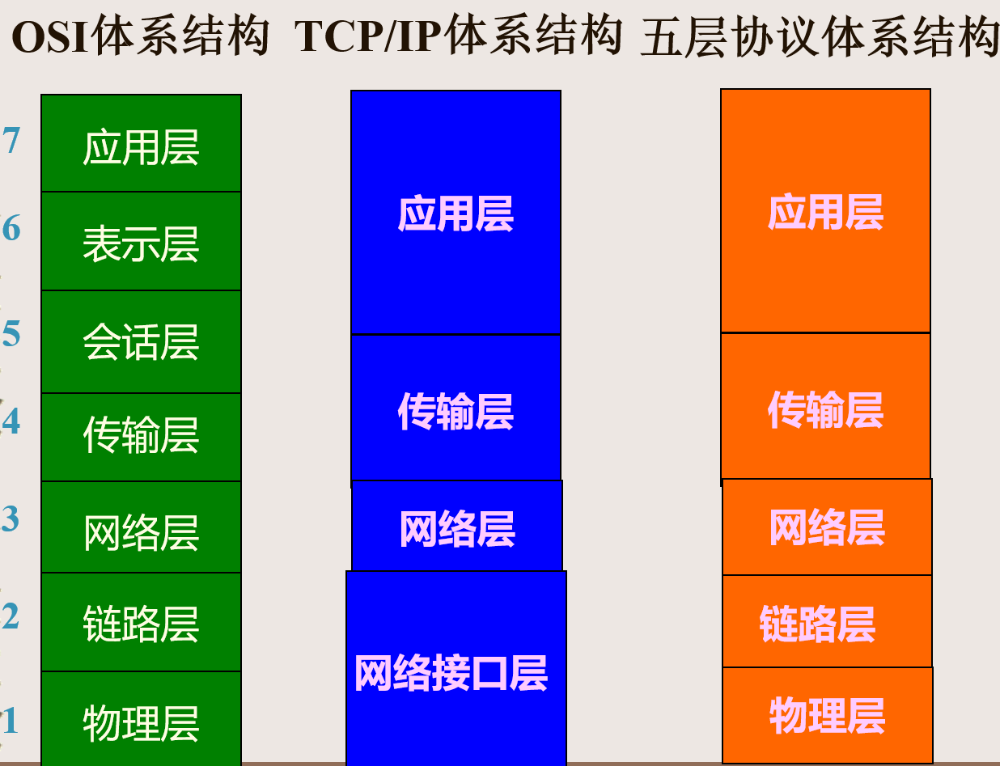

# 第二章--计算机网络概述

1. 计算机网络的定义

   + 计算机网络中信息传输模式：==分组交换==
     + 在发送端，先把较长的报文划分成较短的、固定长度的数据段，称之为分组
     + 每一个分组的首部都含有地址等控制信息。路由器根据收到的分组的首部中的地址信息，查找转发表后把分组转发到下一个路由器，通过多跳，最后交付给目的主机

2. 计算机网络体系结构

   计算机网络的体系结构是计算机网络的各层及其协议的集合

   + OSI国际标准（未被市场认可）
   + 非国际标准TCP/IP
   + 五层协议体系结构

   

   + 网络协议（简称协议）：是为进行网络中的数据交换而建立的规则、标准或约定

3. TCP/IP协议族

   + TCP/IP是一组协议的代名词，它还包括许多协议，组成了TCP/IP协议簇
   + TCP/IP协议簇分为四层，IP位于协议簇的第二层，TCP位于协议簇的第三层。

   

   + 网络接口层

     通常包括操作系统中的设备驱动程序和计算机中对应的网络接口卡。它们一起处理与电缆（或其他任何传输媒介）的物理接口细节。

     以太网协议、PPP协议、IEEE802系列协议

   + 网络层

     处理分组在网络中的活动，例如分组的选路。

     + ARP：地址解析协议
     + RARP：反向地址解析协议
     + IP：Internet协议
     + ICMP：Internet控制报文协议
     + RIP协议、OSPF协议、BGP协议

   + 传输层

     为两台主机上的应用程序提供端到端的通信

     + TCP：传输控制协议
     + UDP：用户数据报协议

   + 应用层

     负责处理特定的应用程序细节，向应用程序提供服务。

     + SMTP：简单邮件传输协议
     + Rloginrsh：远程登录
     + FTP：文件传输协议
     + Telnet：远程登录
     + DNS：域名服务
     + SNMP：简单网络管理协议
     + TFTP：简单文件传输协议
     + DHCP协议、NFS协议、HTTP协议、SSL协议、POP3协议、IMAP协议

   + 网络端口：用于表示和区别网络中主机的不同应用程序

     + 网络端口=应用程序=主机门户

     + ==典型端口==

       HTTP 80

       FTP 20/21

       Telnet 23

       SMTP 25

       DNS 53

     

   

