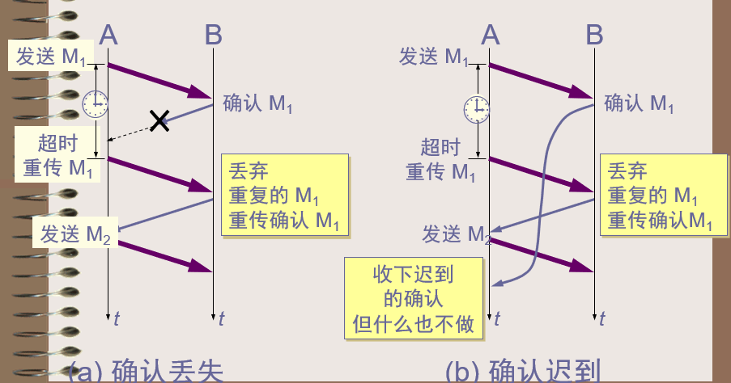
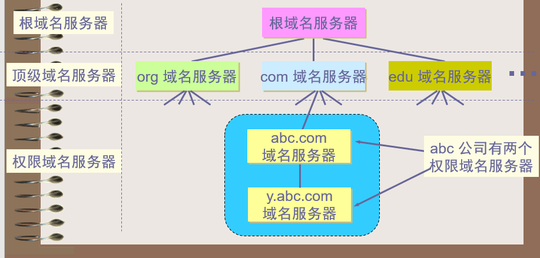

# 第五章--计算机网络技术前沿选讲

1. 计算机网络体系结构

   + 网络协议

     网络协议(network protocol)，简称为**协议**，是为进行网络中的数据交换而建立的规则、标准或约定。

   + 计算机网络的体系结构

     计算机网络的体系结构(architecture)是计算机网络的各层及其协议的集合。

     体系结构就是这个计算机网络及其部件所应完成的功能的精确定义。

     实现(implementation)是遵循这种体系结构的前提下用何种硬件或软件完成这些功能的问题。

     体系结构是抽象的，而实现则是具体的，是真正在运行的计算机硬件和软件。  

   + 三种体系结构

     

   + TCP/IP体系结构
     + **网络接口层**：任何可用于IP数据报交换的分组传输的链路层协议均包含在其中。
     + **网络层**：处理来自传输层的分组发送请求，处理毕发往网络接口；处理输入的数据报，进行路由选择。
     + **传输层**：提供端到端的可靠通信。
     + **应用层**：向用户提供一组由TCP/IP所制定的协议标准的常用的应用程序。

   ---

2. 网络层

   + IP地址及其表示方法

     我们把整个因特网看成为一个单一的、抽象的网络。IP 地址就是给每个连接在因特网上的主机（或路由器）分配一个在全世界范围是唯一的 32 位的标识符。

     IP 地址现在由因特网名字与号码指派公司ICANN (Internet Corporation for Assigned Names and Numbers)进行分配

     + IP地址的编址方法

       + **分类的IP 地址**：这是最基本的编址方法，在 1981 年就通过了相应的标准协议。

         + 每一类地址都由两个固定长度的字段组成，其中一个字段是网络号 net-id，它标志主机（或路由器）所连接到的网络，而另一个字段则是主机号 host-id，它标志该主机（或路由器）。

         + 两级的 IP 地址可以记为：IP 地址 ::= { <网络号>, <主机号>}    

         + 点分十进制记法：128.11.3.31

         + 五类IP地址

           

           

           + ==一些有特殊用途的IP地址==
             + 网络地址（Netid=特定网络号，Hostid=0）
             + 直接广播地址（Netid=特定网络号，Hostid=全1）
             + 有限广播地址（ Netid=全1，Hostid=全1 ）
             + 本网特定主机地址（ Netid=全0，Hostid=特定主机号 ）
             + 回送地址（Netid=127, Hostid=任意值）
             + 本网络本主机（Netid=全0,Hostid=全0）

         + IP数据报格式

           + 一个 IP 数据报由首部和数据两部分组成。
           + 首部的前一部分是固定长度，共 **20 字节**，是所有 IP 数据报必须具有的。
           + 在首部的固定部分的后面是一些可选字段，其长度是可变的。

           

           + IP数据报首部的固定分中的各字段

             + 版本：占 4 位，指 IP 协议的版本。

               目前的 IP 协议版本号为 4 (即 IPv4)

             + 首部长度：占 4 位

               可表示的最大数值，是 15 个单位(**一个单位为 4 字节**)

               因此**IP 的首部长度的最大值是 60 字节**。

             + 区分服务：占 8 位

               用来获得更好的服务

               在旧标准中叫做服务类型，但实际上一直未被使用过。

               1998 年这个字段改名为区分服务。

               只有在使用区分服务（DiffServ）时，这个字段才起作用。

               在一般的情况下都不使用这个字段 

             + 总长度：占 16 位

               指首部和数据之和的长度，

               **单位为字节**，因此数据报的最大长度为 65535 字节。

               总长度必须不超过最大传送单元 MTU。 

             + 标识(identification)  ：占 16 位

               它是一个计数器，用来产生数据报的标识

             + 标志(flag) ： 占 3 位，目前只有前两位有意义。

               标志字段的**最低位**是 **MF** (More Fragment)。

               + MF = 1 表示后面“还有分片”。MF = 0 表示最后一个分片。

               标志字段中间的一位是 **DF** (Don't Fragment) 。

               + 只有当 DF = 0 时才允许分片。

             + 片偏移：占13 位

               指出某片在原分组中的相对位置。

               片偏移**以 8 个字节为偏移单位**。
               + 重组

                 当分了片的IP数据报被传输到最终目标主机时，目标主机要对收到的各分片重新进行组装，以恢复成源主机发送时的IP数据报。

               + **==IP怎样重组乱序的分片==**

                 + 发送方将一个惟一的标识放进每个输出数据报的**标识域**中。当路由器对一个数据报分片时，就会将这一标识数复制到每一分片中，接收方就可利用收到的分片的**标识和IP源地址**来确定该段属于那个数据报。

                 + 根据偏移量确定分片在原数据报中的位置。
                 + 根据MF字段确定分片是否为最后一个分片。

             + 生存时间：占8位，记为TTL（Time To Live）

               数据报在网络中可通过的路由器数的最大值。

             + 协议：占8 位

               字段指出此数据报携带的数据使用何种协议

               以便目的主机的 IP 层将数据部分上交给哪个处理过程

               

             + 首部校验和：占16位

               字段**只检验数据报的首部**，不检验数据部分。

               这里不采用 CRC 检验码而采用简单的计算方法。

             + 源地址和目的地址：各占4位

       + ==子网的划分==

         + 这是对最基本的编址方法的改进，其标准[RFC 950]在 1985 年通过。
         + 在 ARPANET 的早期，IP 地址的设计确实不够合理。
           + IP 地址空间的利用率有时很低。 
           + 给每一个物理网络分配一个网络号会使路由表变得太大因而使网络性能变坏。
           + 两级的 IP 地址不够灵活。
         + 三级的IP地址
           + 从 1985 年起在 IP 地址中又增加了一个“子网号字段”，使两级的 IP 地址变成为**三级的 IP 地址。**
           + 划分子网已成为因特网的正式标准协议。 
         + 划分子网的基本思路
           + 划分子网纯属一个单位内部的事情。单位对外仍然表现为没有划分子网的网络。
           + 从主机号借用若干个位作为子网号 subnet-id，而主机号 host-id 也就相应减少了若干个位。IP地址原来的网络号不改变
           + IP地址 ::= {<网络号>, <子网号>, <主机号>}
         + 子网掩码
           + **从一个 IP 数据报的首部并无法判断源主机或目的主机所连接的网络是否进行了子网划分。**
           + 使用子网掩码(subnet mask)可以找出 IP 地址中的子网部分。
           + (IP 地址) AND (子网掩码) =网络地址
           + 默认子网掩码
             + A类地址：255.0.0.0
             + B类地址：255.255.0.0
             + C类地址：255.255.255.0
           + 使用子网掩码的分组转发过程
             + 在不划分子网的两级 IP 地址下，从 IP 地址得出网络地址是个很简单的事。
             + 但在划分子网的情况下，从 IP 地址却不能唯一地得出网络地址来，这是因为网络地址取决于那个网络所采用的子网掩码，但数据报的首部并没有提供子网掩码的信息。
             + 因此分组转发的算法也必须做相应的改动。
             + 使用子网划分后，**路由表包括：目的网络地址、子网掩码和下一跳地址**。 
             + **==路由转发分组的算法==**
               + 从收到的分组的首部提取目的 IP 地址 *D*。
               + 首先判断**是否连在本网络**上，如果是就直接交付，否则交给路由器并逐项查找路由表
               + 对路由器**直接相连的网络**逐个进行检查：用各网络的子网掩码和 *D* 逐位相“与”，看是否和相应的网络地址匹配。若匹配，则将分组直接交付。否则就是间接交付，执行(3)。
               + 若路由表中有目的地址为 *D* 的**特定主机路由**，则将分组传送给指明的下一跳路由器；否则，执行(4)。
               + 对路由表中的每一行的子网掩码和 *D* 逐位相“与”，若其结果与该行的目的网络地址匹配，则将分组传送 给该行指明的下一跳路由器；否则，执行(5)。
               + 若路由表中有一个**默认路由**，则将分组传送给路由表中所指明的默认路由器；否则，执行(6)。
               + **报告转发分组出错。**

       + ==构造超网==

         + 这是比较新的**无分类编址方法**。1993 年提出后很快就得到推广应用。
         
         + 划分子网在一定程度上缓解了因特网在发展中遇到的困难。然而在 1992 年因特网仍然面临三个必须尽早解决的问题，这就是：
           + B 类地址在 1992 年已分配了近一半，眼看就要在 1994 年 3 月全部分配完毕！
           + 因特网主干网上的路由表中的项目数急剧增长（从几千个增长到几万个）。
           + 整个 IPv4 的地址空间最终将全部耗尽
     
         + IP编址问题的演进
       
           + 1987 年，RFC 1009 就指明了在一个划分子网的网络中可同时使用几个不同的子网掩码。使用**变长子网掩码 VLSM **(Variable Length Subnet Mask)可进一步提高 IP 地址资源的利用率。
           + 在 VLSM 的基础上又进一步研究出**无分类编址方法**，它的正式名字是**无分类域间路由选择 CIDR **(Classless Inter-Domain Routing)。 
         
         + CIDR主要特点
         
           + CIDR 消除了传统的 A 类、B 类和 C 类地址以及划分子网的概念，因而可以更加有效地分配 IPv4 的地址空间。
           + CIDR使用各种长度的“网络前缀”(network-prefix)来代替分类地址中的网络号和子网号。
           + IP 地址从三级编址（使用子网掩码）又回到了两级编址。 
         
         + CIDR无分类的两级地址
         
           + 记法
         
             IP地址 ::= {<网络前缀>, <主机号>}
         
           + CIDR 还使用**“斜线记法”**(slash notation)，它又称为CIDR记法，即在 IP 地址面加上一个斜线“/”，然后写上网络前缀所占的位数（这个数值对应于三级编址中子网掩码中 1 的个数）。
         
           + CIDR 把网络前缀都相同的连续的 IP 地址组成“CIDR 地址块”
         
           + CIDR地址块
         
             128.14.32.0/20 表示的地址块共有 2^12 个地址（因为斜线后面的 20 是网络前缀的位数，所以这个地址的主机号是 12 位）。
         
             这个地址块的起始地址是 128.14.32.0。
         
             在不需要指出地址块的起始地址时，也可将这样的地址块简称为“/20 地址块”。
         
             128.14.32.0/20 地址块的最小地址：128.14.32.0
         
             128.14.32.0/20 地址块的最大地址：128.14.47.255
         
             全 0 和全 1 的主机号地址一般不使用。
         
         + 路由聚合（route aggregation）
         
           + 一个 CIDR 地址块可以表示很多地址，这种**地址的聚合常称为路由聚合**，它使得路由表中的一个项目可以表示很多个（例如上千个）原来传统分类地址的路由。
           + **路由聚合也称为构成超网(supernetting)。**
           + **CIDR 虽然不使用子网了，但仍然使用“掩码”这一名词（但不叫子网掩码）**。
           + 对于 /20 地址块，它的掩码是 20 个连续的 1。 斜线记法中的数字就是掩码中1的个数。
         
         + 构成超网
         
           前缀长度不超过 23 位的 CIDR 地址块都包含了多个 C 类地址。
         
           这些 C 类地址合起来就构成了超网。
         
           CIDR 地址块中的地址数一定是 2 的整数次幂。
         
           网络前缀越短，其地址块所包含的地址数就越多。而在三级结构的IP地址中，划分子网是使网络前缀变长。 
         
         + **最长前缀匹配**
           
           + 使用 CIDR 时，**路由表中的每个项目由“网络前缀”和“下一跳地址”**组成。在查找路由表时可能会得到不止一个匹配结果。
           + 应当从匹配结果中选择具有最长网络前缀的路由：最长前缀匹配(longest-prefix matching)。
           + 网络前缀越长，其地址块就越小，因而路由就越具体(more specific) 。
           + 最长前缀匹配又称为最长匹配或最佳匹配。
     
   + 网际控制报文协议ICMP

     + 介绍
       + 为了提高 IP 数据报交付成功的机会，在网际层使用了网际控制报文协议 ICMP (Internet Control Message Protocol)。
       + ICMP 允许主机或路由器报告差错情况和提供有关异常情况的报告。
       + **ICMP 不是高层协议，而是 IP 层的协议。**
       + ICMP 报文作为 IP 层数据报的数据，加上数据报的首部，组成 IP 数据报发送出去。
       + ICMP与IP这两个协议是相互依赖的：IP在发送一个差错报文时要用到ICMP，而ICMP利用IP来传递报文。
     + ==ICMP报文的种类==
       + **ICMP差错报告报文（5种）**
         + 终点不可达
         + 源点抑制（Source quench）
         + 时间超时
         + 参数问题
         + 改变路由（重定向）（Redirect）
       + **ICMP询问报文（2种）**
         + 回送请求和回答报文
         + 时间戳请求和回答报文

   + 因特网的路由选择协议

     + 介绍

       + 不存在一种绝对的最佳路由算法。
       + 所谓“最佳”只能是相对于某一种特定要求下得出的较为合理的选择而已。
       + 实际的路由选择算法，应尽可能接近于理想的算法。 
       + 路由选择是个非常复杂的问题
         + 它是网络中的所有结点共同协调工作的结果。
         + 路由选择的环境往往是不断变化的，而这种变化有时无法事先知道。 

     + 从路由算法的自适应性考虑

       + **静态路由选择策略**

         即非自适应路由选择，其特点是简单和开销较小，但不能及时适应网络状态的变化。

       + **动态路由选择策略**

         即自适应路由选择，其特点是能较好地适应网络状态的变化，但实现起来较为复杂，开销也比较大。

       + **因特网采用的路由协议主要是自适应（即动态的）、分布式路由选择协议。 **

     + 因特网采用**分层次**的路由选择协议

       + 因特网的规模非常大。如果让所有的路由器知道所有的网络应怎样到达，则这种路由表将非常大，处理起来也太花时间。而所有这些路由器之间交换路由信息所需的带宽就会使因特网的通信链路饱和。

       + 许多单位不愿意外界了解自己单位网络的布局细节和本部门所采用的路由选择协议（这属于本部门内部的事情），但同时还希望连接到因特网上。

       + 自治系统AS（Autonomous System）

         + 定义

           自治系统 AS 的定义：在单一的技术管理下的一组路由器，而这些路由器使用一种 AS 内部的路由选择协议和共同的度量以确定分组在该 AS 内的路由，同时还使用一种 AS 之间的路由选择协议用以确定分组在 AS之间的路由。

           现在对自治系统 AS 的定义是强调下面的事实：尽管一个 AS 使用了多种内部路由选择协议和度量，但重要的是**一个 AS 对其他 AS 表现出的是一个单一的和一致的路由选择策略**。

       + 两大类路由选择策略

         + ==内部网关协议IGP (Interior Gateway Protocol)==

           即**在一个自治系统内部使用的路由选择协议**。目前这类路由选择协议使用得最多，如 **RIP 和 OSPF **协议。

           在自治系统内部的路由选择叫做**域内路由选择**(intradomain routing) 

           + 基于**距离-向量**路由算法的路由信息协议**RIP**
             + RIP 协议中的“距离”也称为“跳数” ，每经过一个路由器，跳数就加 1。 RIP 认为一个好的路由就是它通过的路由器的数目少，即“距离短”。
             + 每个路由器都定时向邻接节点广播其自身的路由信息，同时也接收邻接路由器广播来的路由信息；
             + 接收邻接路由器的路由信息后，依据该路由信息更新本地路由信息；更新方法是对于没有的表项则创建一个并在其距离向量之上加一，已存在的表项则需比较一下两者那个更大，较小的一个将会留下；
             + 整个计算采用的是分布式算法，多个路由器独立计算，直到收敛为止。
           + 基于**链路-状态**路由算法的开放式**最短路径优先**协议**OSPF**
             + “最短路径优先”是因为使用了 Dijkstra 提出的最短路径算法SPF
             + 每个路由器主动测试与其相连的链路状态，并将这些信息发送给其他相邻的路由器
             + 由于各路由器之间频繁地交换链路状态信息，因此所有的路由器最终都能建立一个**链路状态数据库**，它是一个**全网的拓扑结构图**
             + 根据链路状态数据库，利用**最短路径算法**，每个路由器可以求得以自己为根的一棵最短路径树，利用该树生成路由表。

         + ==外部网关协议EGP (External Gateway Protocol)== 

           若源站和目的站处在不同的自治系统中，当数据报传到一个**自治系统的边界**时，就需要使用一种协议将路由选择信息传递到另一个自治系统中。这样的协议就是外部网关协议 EGP。在外部网关协议中目前使用最多的是 **BGP-4**。

           自治系统之间的路由选择也叫做**域间路由选择**(interdomain routing)

           + 外部网关协议 BGP
             + 介绍
               + 可以将 BGP-4 简写为 BGP
               + 因特网的规模太大，使得自治系统之间路由选择非常困难。**对于自治系统之间的路由选择，要寻找最佳路由是很不现实的。**
                 + 当一条路径通过几个不同 AS 时，要想对这样的路径计算出有意义的代价是不太可能的。
                 + 比较合理的做法是在 AS 之间**交换“可达性”信息**。  
               + 自治系统之间的路由选择必须考虑有关策略。
               + 因此，边界网关协议 BGP 只能是力求**寻找一条能够到达目的网络且比较好的路由**（不能兜圈子），而并非要寻找一条最佳路由。 
             + BGP发言人
               + 每一个自治系统的管理员要选择**至少一个路由器**作为该自治系统的“ BGP 发言人” 。
               + 一般说来，两个 BGP 发言人都是通过一个共享网络连接在一起的，而 **BGP 发言人往往就是 BGP 边界路由器**，但也可以不是 BGP 边界路由器。
             + BGP工作原理
               + 一个 BGP 发言人与其他自治系统中的 BGP 发言人要交换路由信息，就要**先建立 TCP 连接**，然后在此连接上**交换 BGP 报文**以建立 **BGP 会话**(session)，利用 BGP 会话交换路由信息。
               + **BGP 所交换的网络可达性的信息就是要到达某个网络所要经过的一系列 AS。**
               + 当 BGP 发言人互相交换了网络可达性的信息后，各 BGP 发言人就根据所采用的策略从收到的路由信息中找出到达各 AS 的较好路由。 

   ---

3. 传输层

   + 进程之间的通信

     + 从通信和信息处理的角度看，运输层向它上面的应用层提供通信服务，它属于**面向通信部分的最高层**，同时也是**用户功能中的最低层**。

     + 当**网络的边缘部分**中的两个主机使用网络的核心部分的功能进行端到端的通信时，只有位于网络边缘部分的主机的协议栈才有运输层，而**网络核心部分**中的路由器在转发分组时都只用到下三层的功能。
     + 两个主机进行通信实际上就是两个主机中的应用进程互相通信
     + 应用进程之间的通信又称为**端到端的通信**
     + 运输层的一个很重要的功能就是**复用和分用**。**应用层不同进程的报文通过不同的端口向下交到运输层，再往下就共用网络层提供的服务。**
     + “运输层提供应用进程间的逻辑通信”。“逻辑通信”的意思是：运输层之间的通信好像是沿水平方向传送数据。但事实上这两个运输层之间并没有一条水平方向的物理连接。

   + 运输层的主要功能

     + 运输层为应用进程之间提供端到端的逻辑通信（但网络层是为主机之间提供逻辑通信）。
     + 运输层还要对收到的报文进行差错检测。
     + 运输层需要有两种不同的运输协议，即面向连接的 TCP 和无连接的 UDP。  

   + TCP与UDP协议

     + 运输层向高层用户屏蔽了下面网络核心的细节（如网络拓扑、所采用的路由选择协议等），它使应用进程看见的就是好像在两个运输层实体之间有一条端到端的逻辑通信信道。
     + 当运输层采用面向连接的**TCP 协议**时，尽管下面的网络是不可靠的（只提供尽最大努力服务），但这种逻辑通信信道就相当于一条**全双工的可靠信道**。
     + 当运输层采用**无连接的 UDP 协议**时，这种逻辑通信信道是一条**不可靠信道**
     + UDP 在传送数据之前不需要先建立连接。对方的运输层在收到 UDP 报文后，不需要给出任何确认。虽然 UDP 不提供可靠交付，但在某些情况下 UDP 是一种最有效的工作方式。
     + TCP 则提供面向连接的服务。**TCP 不提供广播或多播服务**。由于 TCP 要提供可靠的、面向连接的运输服务，因此不可避免地增加了许多的开销。这不仅使协议数据单元的首部增大很多，还要占用许多的处理机资源。 

   + 传输层的端口

     + 运行在计算机中的进程是用**进程标识符**来标志的

     + 运行在应用层的各种应用进程却不应当让计算机操作系统指派它的进程标识符。这是因为在因特网上使用的计算机的操作系统种类很多，而不同的操作系统又使用不同格式的进程标识符。

     + 为了使运行不同操作系统的计算机的应用进程能够互相通信，就必须用统一的方法对 TCP/IP 体系的应用进程进行标志。

     + 解决这个问题的方法就是在运输层使用**协议端口号**(protocol port number)，或通常简称为**端口(port)**。

     + 虽然通信的终点是应用进程，但我们可以把端口想象是通信的终点，因为我们只要把要传送的报文交到目的主机的某一个合适的目的端口，剩下的工作（即最后交付目的进程）就由 TCP 来完成。

     + TCP的端口

       端口用一个 **16 位端口号**进行标志。

       **端口号只具有本地意义**，即端口号只是为了标志本计算机应用层中的各进程。**在因特网中不同计算机的相同端口号是没有联系的。**

     + 三类端口
       + **熟知端口**，数值一般为**0~1023**。指派给了TCP/IP最重要的一些应用程序，让所有的用户都知道。
       + **登记端口号**，数值为**1024~49151**，为没有熟知端口号的应用程序使用的。**使用这个范围的端口号必须在 IANA 登记，以防止重复**。
       + **客户端口号或短暂端口号**，数值为**49152~65535**，留给客户进程选择暂时使用。当服务器进程收到客户进程的报文时，就知道了客户进程所使用的动态端口号。通信结束后，这个端口号可供其他客户进程以后使用。 

   + TCP协议

     + 特点

       + TCP 是**面向连接**的运输层协议。

       + 每一条 TCP 连接只能有两个端点(endpoint)，每一条 TCP 连接只能是**点对点**的（一对一）。 
       + TCP 提供**可靠交付**的服务：无差错、不丢失、不重复、按序到达。
       + TCP 提供**全双工通信**。TCP连接的两端都设有发送缓存和接收缓存，用来临时存放双向通信的数据。
       + **面向字节流**：虽然应用程序和TCP的交互是一次一个数据块（大小不等），但TCP把应用程序交下来的数据看成仅仅是一连串的无结构的字节流。

     + TCP面向流的概念

       

   + ==停止等待协议==

     + 超时重传

       

       + **在发送完一个分组后，必须暂时保留已发送的分组的副本。**
       + 分组和确认分组都必须进行编号。
       + 超时计时器的重传时间应当比数据在分组传输的平均往返时间更长一些。

     + 确认丢失和确认迟到

       

     + 可靠通信的实现

       + 使用上述的确认和重传机制，我们就可以**在不可靠的传输网络上实现可靠的通信。**
       + 这种可靠传输协议常称为**自动重传请求ARQ** (Automatic Repeat reQuest)。
       + ARQ 表明**重传的请求是自动进行的**。接收方不需要请求发送方重传某个出错的分组 。

     + 信道利用率

       + 停止等待协议的优点是简单，但缺点是信道利用率太低。

         

     + 流水线传输

       + 发送方可连续发送多个分组，不必每发完一个分组就停顿下来等待对方的确认。

       + 由于信道上一直有数据不间断地传送，这种传输方式可获得很高的信道利用率。

         

     + 连续ARQ协议

       

   + ==TCP协议格式==

     

     + **源端口和目的端口字段**：各占 2 字节

       端口是运输层与应用层的服务接口。运输层的复用和分用功能都要通过端口才能实现。 

     + **序号字段**：占 4 字节

       TCP 连接中传送的数据流中的每一个字节都编上一个序号。序号字段的值则指的是本报文段所发送的数据的第一个字节的序号。

     + **确认号字段**：占 4 字节

       是期望收到对方的下一个报文段的数据的第一个字节的序号。

     + **数据偏移（即首部长度）**：占 4 位

       它指出 TCP 报文段的数据起始处距离 TCP 报文段的起始处有多远。

       “数据偏移”的**单位是 32 位字（以 4 字节为计算单位）**。 

     + **保留字段**：占 6 位

       保留为今后使用，但目前应置为 0。 

     + **紧急 URG**

       当 URG = 1 时，表明紧急指针字段有效。它告诉系统此报文段中有紧急数据，应尽快传送(相当于高优先级的数据)。 

     + **确认 ACK** 

       只有当 ACK = 1 时确认号字段才有效。当 ACK = 0 时，确认号无效。

     + **推送 PSH (PuSH) **

       接收 TCP 收到 PSH = 1 的报文段，就尽快地交付接收应用进程，而不再等到整个缓存都填满了后再向上交付。 

     + **复位 RST (ReSeT)** 

       当 RST = 1 时，表明 TCP 连接中出现严重差错（如由于主机崩溃或其他原因），必须释放连接，然后再重新建立运输连接。

     + **同步 SYN** 

       同步 SYN = 1 表示这是一个连接请求或连接接受报文。

     + **终止 FIN (FINis)**

       用来释放一个连接。FIN = 1 表明此报文段的发送端的数据已发送完毕，并要求释放运输连接。

     + **窗口字段**

       占 2 字节，用来让对方设置发送窗口的依据，单位为字节。

     + **检验和**：占 2 字节

       检验和字段**检验的范围包括首部和数据这两部分**。在计算检验和时，要在 TCP 报文段的前面加上 12 字节的伪首部。

     + **紧急指针字段**：占 16 位

       指出在本报文段中紧急数据共有多少个字节（紧急数据放在本报文段数据的最前面）。 

     + **选项字段** ：长度可变

       TCP 最初只规定了一种选项，即**最大报文段长度 MSS**。MSS 告诉对方 TCP：“我的缓存所能接收的报文段的数据字段的最大长度是 MSS 个字节。”

     + **填充字段**

       这是为了使整个首部长度是 4 字节的整数倍。

   + TCP 的运输连接管理

     + 运输连接就有三个阶段，即：**连接建立、数据传送和连接释放**。运输连接的管理就是使运输连接的建立和释放都能正常地进行。

     + 连接建立过程中要解决以下三个问题：

       要使每一方能够确知对方的存在。

       要允许双方协商一些参数（如最大报文段长度，最大窗口大小，服务质量等）。

       能够对运输实体资源（如缓存大小，连接表中的项目等）进行分配。 

     + 客户服务器方式
       + TCP 连接的建立都是采用**客户服务器方式**。
       + 主动发起连接建立的应用进程叫做客户(client)。
       + 被动等待连接建立的应用进程叫做服务器(server)。 
     + 三次握手建立TCP连接

4. 应用层

   + ==域名系统DNS==

     + 许多应用层软件经常直接使用域名系统 DNS (Domain Name System)，但计算机的用户只是间接而不是直接使用域名系统。 

     + 因特网采用**层次结构**的**命名树**作为主机的名字，并使用**分布式**的域名系统 DNS。

     + 名字到 IP 地址的解析是由*若干个*域名服务器程序完成的。**域名服务器程序**在专设的结点上运行，运行该程序的机器称为**域名服务器**

     + 域名结构

       + 任何一个因特网采用了层次树状结构的命名方法。

       + 连接在因特网上的主机或路由器，都有一个**唯一**的层次结构的名字，即**域名**。

       + 域名的结构由**标号**序列组成，各标号之间用点隔开：

         … **.** 三级域名 **.** 二级域名 **.** 顶级域名

       + 各标号分别代表不同级别的域名。

     + 域名空间

       

     + 树状结构的DNS域名服务器

       

     + 域名解析

       

   + ==万维网WWW==

     + 万维网 WWW (World Wide Web)并非某种特殊的计算机网络。

     + 万维网是一个大规模的、联机式的**信息储藏所**，英文简称为Web。

     + 万维网用链接的方法能非常方便地从因特网上的一个站点访问另一个站点，从而主动地按需获取丰富的信息。

     + 这种访问方式称为**“链接”**。

     + 万维网提供分布式服务

       

     + 万维网的工作方式

       + 万维网以**客户服务器**方式工作。

       + **浏览器**就是在用户计算机上的**万维网客户程序**。万维网文档所驻留的计算机则运行服务器程序，因此这个计算机也称为万维网服务器。

       + 客户程序向**服务器程序**发出请求，服务器程序向客户程序送回客户所要的万维网文档。

       + 在一个客户程序主窗口上显示出的万维网文档称为**页面**(page)。

     + 万维网的工作过程

       

   + ==电子邮件==

     + 电子邮件(e-mail)是因特网上使用得最多的和最受用户欢迎的一种应用。

     + 电子邮件把邮件发送到收件人使用的邮件服务器，并放在其中的收件人邮箱中，收件人可随时上网到自己使用的邮件服务器进行读取。

     + 电子邮件不仅使用方便，而且还具有传递迅速和费用低廉的优点。

     + 现在电子邮件不仅可传送文字信息，而且还可附上声音和图像。

     + 电子邮件的一些标准

       + 发送邮件的协议：**SMTP（ Simple Mail Transfer Protocol ）**

       + 读取邮件的协议：**POP3（Post Office Protocol）**和 **IMAP（ Internet Message Access Protocol ）**

       + **MIME媒体类型(Multipurpose Internet Mail Extensions)**是一种标准,用来表示文档、文件或字节流的性质和格式。

       + MIME在其邮件首部中说明了邮件的数据类型(如文本、声音、图像、视像等)，使用 MIME 可在邮件中同时传送多种类型的数据。

     + 电子邮件最主要的组成构件

       

5. 网络仿真与效果评估技术

   + 研究背景

     + 网络空间对抗形势日趋严峻, 网络攻防已成为各国网络攻防对抗的主要内容。

     + **网络仿真与效果评估（即网络靶场）**是针对网络攻防演练和网络新技术评测的重要基础设施。

     + 网络靶场，也称之为国家网络靶场(National Cyber Range，NCR)：是指通过虚拟环境与真实设备相结合，**模拟仿真**出真实网络空间攻防作战环境，能够支撑网络作战能力研究和网络武器装备验证试验平台。

     + ==网络靶场主要作用==
       + 网络攻防武器评测验证
       + 人员培训、竞赛、演练
       + 科学试验和新技术验证

     + 天地一体化信息网络概念

       + “天”是指由卫星等空间飞行器作为主要节点组成的天基网络，而“地”主要指由地面站网络、卫星应用专网和互联网等共同组成的地表网络。

       + 通过天基网络与地面网络的融合建设，实现地球近地空间中陆、海、空、天各类用户与应用系统之间信息的高效传输与共享应用。

     + 天地一体化信息网络的主要用途：战略安全通信、航天信息支援、航空信息服务、海洋信息服务、防灾减灾服务、反恐维稳支持……

   + 天地一体化信息网络技术

     + 天地一体化信息网络组成

       

     + 天地一体化信息网络主要关键技术

       + ==安全防护技术==
+ 面临的安全挑战
         
  + 卫星节点暴露且信道开放
         
  + 异构网络互连且网络拓扑高度动态变化
         
  + 高时延、大方差、间歇链路
         
  + 星上节点能力受限
         
+ 物理安全：抗毁技术、抗干扰技术、人工噪声、多波束通信
         
+ 运行安全：可信安全认证与接入控制、多级网络域间安全隔离、多源数据融合处理与安全态势智能感知、安全切换、安全路由、入侵检测
         
+ 数据安全：安全传输、密钥管理
     
+ 网络功能虚拟化技术
   
  + 网络功能虚拟化基本概念
   
    + 网络功能虚拟化：**NFV**， Network Functions Virtualization
       + 摒弃了传统的基于专用硬件静态、僵化的网络功能部署方式。
       + 利用虚拟化技术，将网络功能（防火墙、网络地址转换和深度检测）从专用硬件中剥离，并以软件的形式部署在通用的x86 服务器中，实现了专用硬件的软硬件解耦和。
       + 这些基于软件的虚拟网络功能根据用户需求按照一定的逻辑顺序组合成服务功能链，进而为用户提供相应的网络服务。
   
  +  ==网络功能虚拟化的特点==
   + 与提前部署、硬件独享、业务固定的传统网络相比，网络功能虚拟化不再依赖于专用硬件。网络服务可以灵活部署，资源充分共享，不仅降低了运营商的成本，而且提高了网络的扩展性能：
    
   + 解耦软件和硬件
    
   + 灵活的网络功能部署
    
   + 动态扩展
    
   + ==网络功能虚拟化相关技术==
  + 标准化服务器
     
    + COTS服务器，commercial off-the-shelf，意为商品化的产品和技术。 
       + COTS服务器由标准IT组件构成，服务器内组件可替换。
      + 服务器内部组件可替换的性质，非常有助于其形成一个有充分竞争的硬件供应市场，使COTS服务器非常适合大规模部署，这些特性为NFV 的商用推广奠定了坚实的基础。
         + DPDK技术
       
     + 虚拟化技术
     
    + 虚拟化技术（Xen、KVM、Docker）：是把计算、网络、内存、存储等实体资源抽象出来的一种资源管理技术，打破了实体之间的不可切割障碍，用户可以不受资源实现、地理位置、物理包装以及底层物理设备的限制。
       + Hypervisor：也叫虚拟机监视器，是运行在物理服务器和操作系统之间的中间软件层，允许多个操作系统和应用共享硬件。
      + NFV利用虚拟化技术，实现软硬件解耦，从而做到把用软件实现的网络功能运行在标准化的物理服务器上。
       
     + 云计算技术
     
    + 云计算（cloud computing）是分布式计算的一种，指的是通过网络“云”将巨大的数据计算处理程序分解成无数个小程序，然后，通过多部服务器组成的系统进行处理和分析这些小程序得到结果并返回给用户。
     
    + 云平台（OpenStack），是指基于硬件资源和软件资源的服务，提供计算、网络和存储能力。
     
    + NFV基于虚拟化技术的云计算，具有快速部署资源、获取服务的能力，可实现动态、按需提供资源、按用量计费、通过互联网提供海量信息、用户方便交互。
     
  + 软件定义网络技术
     
    + 软件定义网络（Software Defined Network，SDN）通过将网络设备的控制面与数据面分离开来，实现网络流量的灵活控制。
     
    + 提供可编程网络应用，实现更加灵活的流量控制能力。
     
    + SDN基本特点是：分离控制和转发的功能、控制集中化（或集中化的控制平面）、使用广泛定义的（软件）接口使得网络可以执行程序化行为。
     
    + NFV在实现网络应用或网络功能可编程方面，SDN与十分类似，SDN提供的灵活的转发能力为NFV服务功能链的实现提供了一种可行的方法。

 

