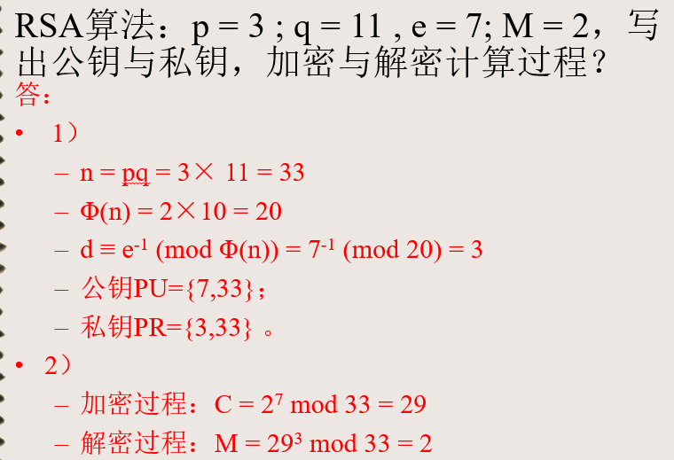
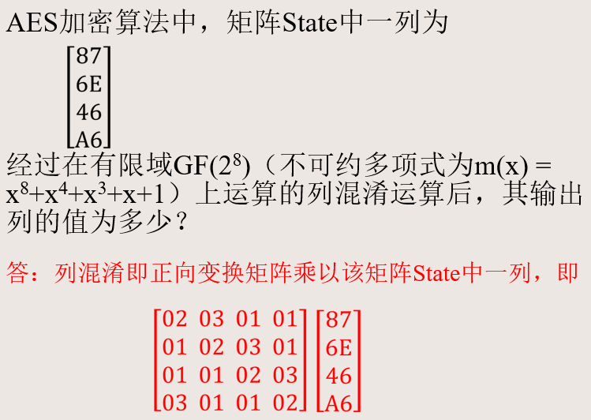
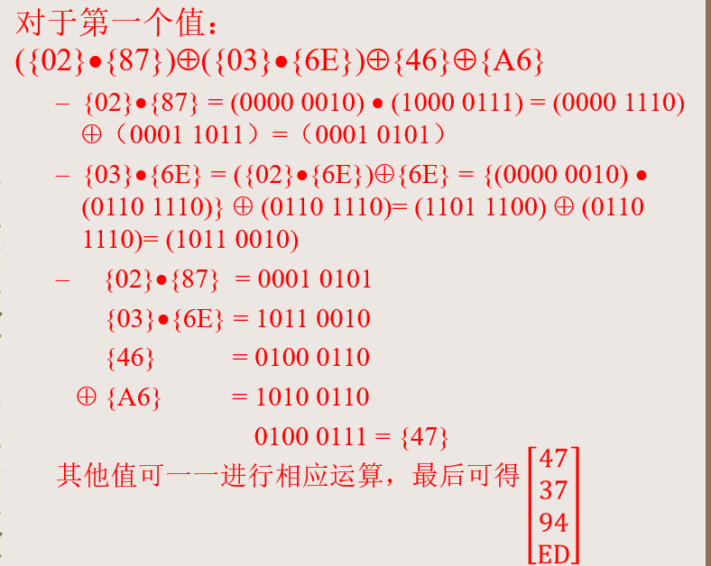
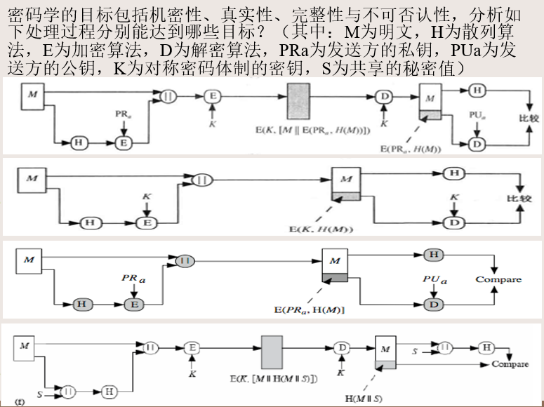
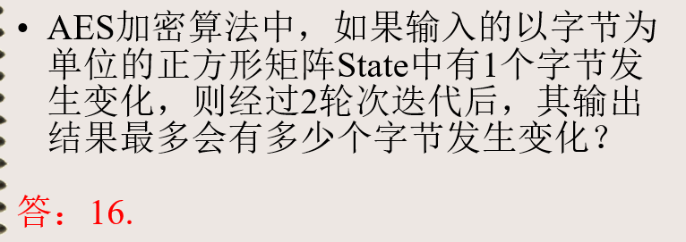
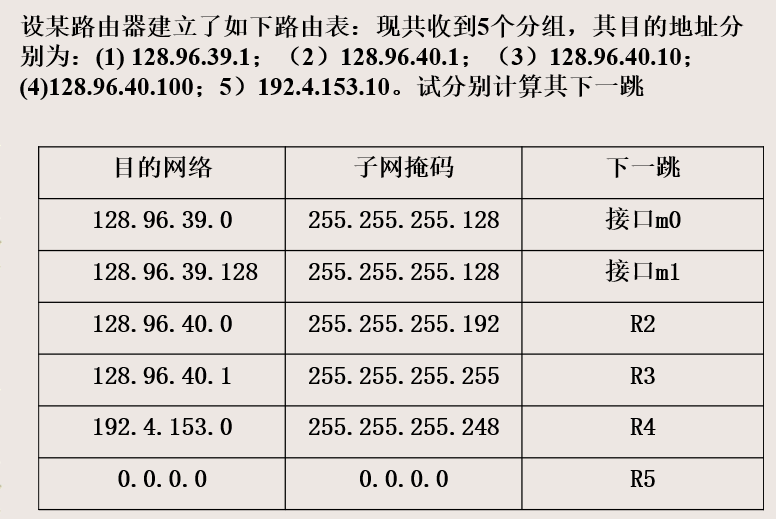
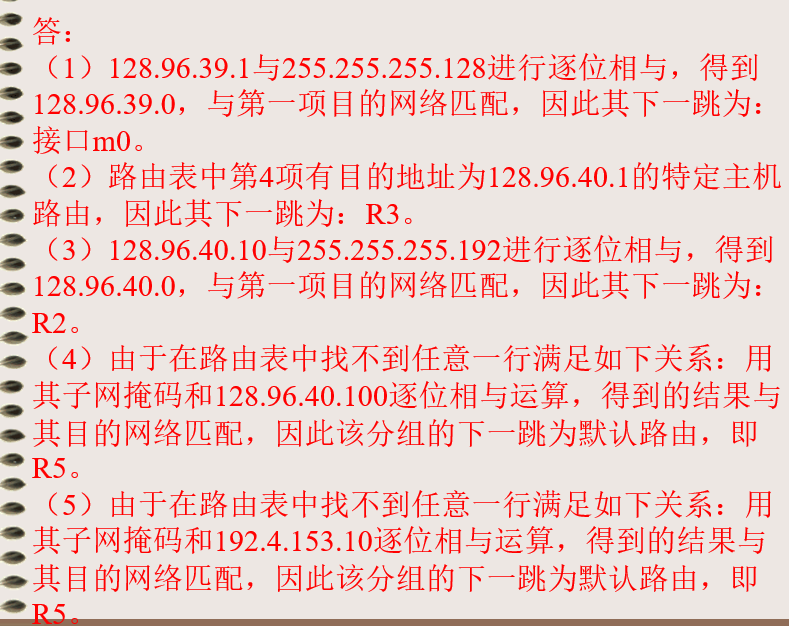
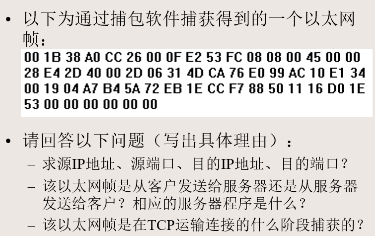
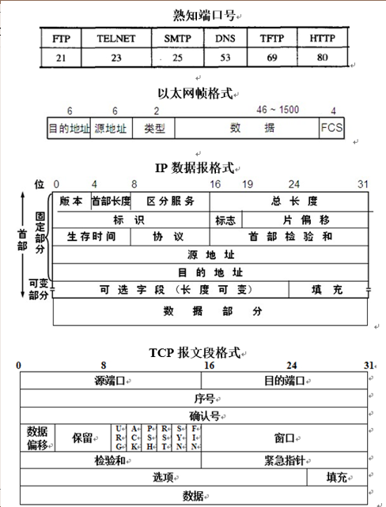

# 第六章--网络安全技术前沿选讲

1. 模糊测试技术

   + 模糊测试技术的概念
     + Fuzzing或模糊测试是一种**自动化的软件测试技**术，通常**用于识别程序中的潜在漏洞**。
     + 对程序进行模糊测试是通过向其提供随机输入语句并记录导致程序中的崩溃或非崩溃的内存损坏的测试用例来完成的。
     + 辅助以人工分析, 基于导致异常的输入数据进一步定位软件中漏洞的位置。
     + 在某种意义上，模糊测试就是通过蛮力搜索漏洞。

   + 模糊测试的测试用例生成

     + 模糊测试的测试用例生成方式有两种：基于生成和基于变异的。
     + 基于变异的模糊测试：是通过变异已知的测试用例来创建新的测试用例，通过随机修改样本的方式生成测试用例。
     + 基于生成的模糊测试：或者是基于语法的模糊测试，需要对语法有较好的理解并建立起模型，通过指定的输入模型来构造规范的输入，使得这类生成模型生成的输入很容易通过代码的完整性检测和语法检测，从而快速的绕过程序的语法检测。

   + 一些经典的工具

     + AFL：American fuzzy lop，号称是当前最高级的Fuzzing 测试工具之一，由谷歌的Michal Zalewski 所开发。通过记录输入样本的代码覆盖率，不断对输入进行变异，从而达到更高的代码覆盖率。
+ Syzkaller：Google团队开发的一款针对Linux内核进行模糊测试的开源工具，基于覆盖率引导的Linux内核Fuzzer。

---

+ 
+ 
+ 
+ 
+ 
+ 
+ 
+ 
+ 
+ 
+ 

