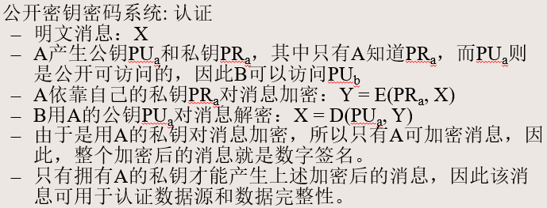

# 第四章--应用密码学与前沿选讲

1. 密码学的基本概念

   + 密码学的目标

     + **机密性**：对信息实现隐藏
     + **真实性**：用户的身份是真实的
     + **完整性**：信息未经授权不能进行修改
     + **不可否认性**：不能否认或抵赖曾经完成的操作或承诺

   + 密码体制模型

     

     + **明文（M）：**原始可理解的消息或数据。
     + **加密算法（E）：**对明文进行各种代换和变化，从明文到密文的变换
     + **加密秘钥（Ke）：**加密密钥是加密算法的输入，独立于明文和算法。算法根据所用的特定密钥而产生不同的输出，算法所用的代换和变换也依靠密钥。
     + **密文(C)：**加密后的消息，加密算法的输出，看起来是完全随机而杂乱的消息。
     + **信道：**密文传输的通道。
     + **解密算法(D)：**是加密算法的逆运算。输入密文和解密密钥，输出原始明文。
     + **解密密钥(Kd)：**用于解密密文，还原出明文，是解密算法的输入，与加密密钥有某种相关性。
     + **安全通道：**用于传递、分发密钥。
     + **加密：C = E(Ke, M )**
     + **解密：M= D(Kd, C) = D(Kd, E(Ke, M ))** 

   + ==密码体制分类==

     + 对称密码体制

       对称密码体制又称**单钥(one-key) 或私钥（private key）或传统(classical)密码体制**。在对称密码体制中，**加密密钥和解密密钥是一样的或者彼此之间是容易相互确定的**。

       按照加密方式，可分为**流密码(stream cipher)**和**分组密码(block cipher)**

       + 流密码

         在流密码中将明文消息按字符逐位地进行加密。 

       + 分组密码

         在分组密码中将明文消息分组（每组含有多个字符），逐组地进行加密。 

     + 非对称密码体制

       非对称密码体制又称**双钥(two-key) 或公钥(public key)密码体制**。在公钥密码体制中，**加密密钥和解密密钥不同**，**加密密钥可以公开而解密密钥需要保密**，**从加密密钥推导出解密密钥，在计算上是不可能的**。

   ---

2. 对称密码体制

   + 基本概念

     

     + Plaintext(Messge):明文
     + Encryption algorithm:加密算法
     + Secret Key:秘钥
     + Ciphertext:密文
     + Decryption algorithm:解密算法

   + 流密码（Stream Cipher）

     + 加密以明文比特或字节为单位，以伪随机序列与明文序列模2加后，作为密文序列每次处理数据流中的一个比特或字节

     + **密文不仅与最初给定的算法和密钥有关，同时也与明文位置有关(是所处位置的函数) **

     + 例如：**RC4、一次一密系统、AutoKey、 Vigenere等**

   + 分组密码（Block Cipher）

     + 通常以大于等于64位的数据块为处理单位，加密得**相同长度**密文
     + **经过加密所得到的密文仅与给定的密码算法和密钥有关**，与被处理的明文数据在整个明文中的位置无关。
     + 例如：**DES、AES等**

   + ==高级加密标准（AES）==

     + 起源

       DES不够安全

       3DES（或称T-DES）安全，但速度慢

       2000年10月，Rijndael（Rijn [rain] dael [del] (莱恩戴尔)）算法被选中，作为AES算法

       2001年11月，NIST发布最终标准FIPS PUB 197

     + ==AES参数==

       + 密钥长度：128位、192位、256位（本章密钥长度为128）

       + 分组长度：128

         

       + 特性

         对所有已知的攻击免疫

         在各种平台上，执行速度快且代码紧凑

         设计简单

     + ==AES结构（不是Feistel结构)==

       + 过程

         + 输入分组以正方形矩阵S描述
         + 密钥扩展为矩阵
         + 进行9/11/13轮迭代
           + 字节代换：S盒
           + 行移位：置换
           + 列混淆：GF(2^8)
           + 轮密钥加：XOR
         + 最后最后一个不完整轮
         + 矩阵state转换为输出分组

         

       + 以上各个步骤可逆

       + **在算法的开始和结束都有轮密钥加阶段**

         若以其它不需要密钥的运算用于开始和结束，则不需要密钥也可求其逆，不能增加安全性

       + 在每轮迭代中

         轮密钥加实质上是一种Vernam密码，本身不难破译

         **字节代换、行移位、列混淆三个阶段一起提供了混淆、扩散和非线性功能**。**这些阶段没有涉及密钥，其本身并不提供安全性**

         各阶段均可逆

         解密算法与加密算法并不一样，各阶段为逆操作（轮密钥加阶段算法相同）

     + **输入分组描述**

       + 输入分组用以字节为单位的正方形矩阵State描述（状态）
       + 矩阵中字节排列顺序是**从上到下从左到右的**
       + 然后对State进行迭代运算
       + 最后将State转换为输出分组

     + **秘钥扩展**

       128位密钥用字节为单位的矩阵描述
     
       密钥被扩展成一个以字为单位密钥序列数组，每一个字由4个字节组成，128位的密钥被扩展为**44字**的序列。
     
       扩展密钥的前4个字节（一个字）放在矩阵的第一列
     
       输入值是4字（16字节），输出值是一个44字（176字节）的一维线性数组（初始轮密钥以及其他10轮，每一轮提供4字的轮密钥）
     
       
     
     + **字节代换**
     
       是一个简单的查表操作
     
       变换方式： S盒是一个16×16字节的矩阵，包含8bits值的256种可能的变换
     
       字节的高4位作为行值，低4位作为列值，取S盒中对应行列的元素输出
     
       例：(95)16被映射为S盒中第9行第5列的值
     
       + 正向：S盒
       + 逆向：逆S盒
     
     + **行移位**
     
       + 正向行移位变换
     
         State的第一行不变，第二行循环**左移**一个字节，第三行循环左移两个字节，第四行循环左移三个字节
     
       + 逆向行移位变换
     
         左移改为右移
     
       + 评价
     
         将某个字节从一列移到另一列中，确保某列中的4字节扩展到了4个不同的列
     
     + **列混淆**
     
       + 正向列混淆
     
         + 对每列独立进行操作
     
         + 每列中的每个字节是被映射为一个新值，此值由该列中的4个字节通过函数变换得到
     
           
     
         + 正向列混淆变换可以基于State的矩阵乘法表示
     
           
     
         + 乘积矩阵中每个元素均是一行和一列中所对应元素的乘积之和；乘法和加法都是定义在GF(2^8)上的。
     
           + AES中的运算是按字节或4个字节的字定义的，并把一个字节看成是系数在有限域GF(2)上的次数小于8的多项式（即把一个字节看成是有限域GF(2^8)中的一个元素) 。
     
           + 有限域GF(2^8)
     
             可以把b7b6b5b4b3b2b1b0构成的一个字节看成是系数在(0, 1)中取值的多项式：
     
             ​        b7 x7 + b6 x6 + b5 x5 + b4 x4 + b3 x3 + b2 x2 + b1 x + b0
     
             ​    如{57}（01010111）可写成：  x6 + x4 + x2 + x + 1
     
           + 多项式加法
     
             在多项式表示中，两个元素的和是一个多项式，其系数是两个元素的对应系数的模2加(即**异或**（**相异为1**）)。
     
           + 多项式乘法
     
             有限域GF(28)中两个元素的乘法为模2元域GF(2)上的一个8次不可约多项式的多项式乘法。
     
             对于AES这一8次不可约多项式为： m(x) = x8+x4+x3+x+1
     
           + X乘法
     
             
     
       + 逆向列混淆变换
     
         
     
     + **轮密钥加变换**
     
       正向轮密钥加与逆向轮密钥加过程相同 
     
       128位的State按位与128位的密钥XOR
     
       可以看成是基于State列的操作，即把State的一列中的4个字节与轮密钥的1个字进行**异或**，能将其视为字节级别的操作
     
     + 解密算法的等价版本
     
       + **对密钥扩展进行改进**，使解密算法与加密算法有同样的结构
       + **交换逆向行移位和逆向字节代换 **
       + **交换轮密钥加和逆向列混淆**
     
       
     
       + 不需要对第一次和最后一次轮密钥加变换的输入进行逆向列混淆操作，因为这两轮密钥加变换不与逆向列混淆交换。
       +  等价的解密算法：与加密算法有相同的结构，变换顺序相同（但用逆向变换取代正向变换）

   ---

3. 非对称密码体制

   + 公钥密码体制的基本原理

     + 背景

       公钥密码学的概念是为了解决传统密码学中两个最困难的问题而提出的：

       + 密钥分配问题：使用对称密码体制的通信双方需要协商一个密钥
         + 通过某个安全的通道传输
         + 利用密钥分配中心
         + 不安全
       + 数字签名：防抵赖性，像手写签名一样，电子消息和文件需要签名，以确保数字签名是出自某特定的人。

       针对这两个问题，1976年，当时在美国斯坦福大学的迪菲（Diffie）和赫尔曼(Hellman)提出了公钥密码新思想。

     + ==公钥密码体制特点==

       从密码算法和加密密钥来确定解密密钥在计算上是不可行的

       两个密钥的任何一个都可用来加密，另一个用来解密

     + 公钥密码体制组成

       + 明文：算法的输入，可读信息或数据

       + 加密算法：对明文进行各种转换
       + 公钥和私钥：算法的输入，一个用于加密，一个用于解密；加密算法的执行变换依赖于公钥或者私钥
       + 密文：算法的输出，依赖于明文和密钥
       + 解密算法：根据密文和密钥还原明文

     + 公钥算法的主要步骤

       + 每一用户产生一对密钥，用来加密和解密消息
       + 将其中一个**密钥（公钥）存于公开的寄存器或其他可访问的文件中**；另一密钥（私钥）秘密保存；每一个用户可以拥有若干其他用户的公钥

     + ==对称和公开密钥加密的区别==

       + 对称密码
         + 加/解密密钥相同，密钥为双方共享
         + 密钥必须保密 
         + 已知**算法和密文**不易推导出密钥 
       + 公钥密码
         + 加/解密密钥不同，双方各持一个 
         + 其中一个密钥必须保密——私钥 
         + 已知**算法和公钥**，不易推导出私钥 

     + ==公开密钥密码系统==

       + 保密

         

       + 认证

         

       + 保密和认证

         

     + 公钥密码体制的应用

       + 加密/解密：发送方用接收方的公钥对消息加密
       + 数字签名：发送方用其私钥对消息签名，可以对整体消息签名或对消息的摘要签名。
       + 密钥交换：通信双方交换会话密钥，使用通信一方或双方的私钥。

   + RSA算法

     + 算法描述

       

       

       

   ---

4. 散列函数与散列算法

   + 消息认证简介

     + 消息认证的目的

       保护消息的完整性

       确认原始发报人身份

       数字签名是一种认证技术，抗发报方否认攻击

     + 消息认证机制基本功能包括两个层面：
       + 发送方：依靠某种产生**认证符的函数**，认证符是一个用来认证消息的值
       + 接收方：依靠该函数验证消息的真实性

   + ==消息认证方法==

     + 三种函数类型可以提供认证
       + 消息加密：**整个消息的密文**作为认证符
       + 消息认证码（message authentication code，MAC)：**消息和密钥的函数**，产生定长的值，作为认证符 
       + 散列（Hash）函数：将任意长的**消息**映射为定长的散列值的函数，以该散列值作为认证符

   + 散列函数

     + 单向散列（hash）函数是消息认证码的一种变型。

     + **与消息认证码相同**：散列函数对任意长度消息M，产生定长的**散列码h = H(M)** ，亦称作**消息摘要（Message Digest）**、**散列值**

     + **与消息认证码不同**：散列码并不使用密钥，仅是输入消息的函数

     + 散列码是报文所有比特的函数值，具有**错检测能力**，报文任意一比特的改变都将引起散列码的改变

     + Hash函数的基本使用方式

       

       

       + （a）
         + 对整个消息加密，具有**保密性**
         + 散列算法保证信息**完整性**
         + 由于A和B共享密钥，具有**真实性**，提供认证
         + 没有数字签名，不具有不可否认性
       + （b）
         + 没有对消息加密，不具有保密性
         + 散列算法保证信息**完整性**
         + 由于A和B共享密钥，具有**真实性**，提供认证
         + 没有数字签名，不具有不可否认性
       + （c）
         + 没有对消息加密，不具有保密性
         + 散列算法保证信息**完整性**
         + 公钥和密钥对保证信息**真实性**
         + 使用公钥密码中的发送方的私钥对散列加密，具有**不可否认性**
       + （d）
         + 使用对称密钥对整个消息加密，具有**保密性**
         + 散列算法保证信息**完整性**
         + 对称秘钥保证信息**真实性**
         + 使用公钥密码中的发送方的私钥对散列加密，具有**不可否认性**
       + （e）
         + 使用散列函数但不使用加密函数进行消息验证 
           + 通信双方共享公共的秘密值S，A将M和S连接后再计算散列值，并将其附于M后 
           + 由于B也知道S，所以B可以计算散列值，并验证其正确性
           + 由于攻击者不知道秘密值，因此不能伪造、修改消息
         + 没有对消息加密，不具有保密性
         + 散列算法保证信息**完整性**
         + 秘密值S保证信息**真实性**
         + 没有数字签名，不具有不可否认性
       + （f）
         + 使用对称密钥对整个消息加密，具有**保密性**
         + 散列算法保证信息**完整性**
         + 秘密值S和K保证信息**真实性**
         + 没有数字签名，不具有不可否认性

     + Hash函数的基本使用方式

       + 对避免加密的方法重视的原因 
         + 加密过程很慢，硬件开销，传输量问题，专利问题，出口限制等等

   ---

5. 密码技术应用

   + 数字签名

     + 消息认证可以保护信息交换不受第三方攻击，但是不能处理通信双方自身发生的攻击。

       + 接收方伪造
       + 发送方否认

     + 数字签名的要求

       + 收方能确认或证实发方的签字，但不能伪造；
       + 发方发出签名后的消息，就不能否认所签消息；
       + 收方对已收到的消息不能否认；
       + 第三者可以确认收发双方之间的消息传送，但不能伪造这一过程 

     + ==直接数字签名==（c,d）

       + 优点

         仅涉及通信双方

         有效性依赖发方密钥的安全性

       + 缺点

         + 验证模式依赖于发送方的保密密钥；

           发送方要抵赖发送某一消息时，可能会声称其私有密钥丢失或被窃，从而他人伪造了他的签名。

           通常需要采用与私有密钥安全性相关的行政管理控制手段来制止或至少是削弱这种情况，但威胁在某种程度上依然存在。

           改进的方式例如可以要求被签名的信息包含一个**时间戳**（日期与时间），并要求将已暴露的密钥报告给一个授权中心。

         + 如X的私有密钥确实在时间T被窃取，敌方可以伪造X的签名并附上早于或等于时间T的时间戳。

     + ==仲裁数字签名==

       + 使用**第三方认证**

       + 引入**仲裁者**

         通常的做法是所有从发送方X到接收方Y的签名消息首先送到仲裁者A，A将消息及其签名进行一系列测试，以检查其来源和内容，然后将消息加上日期并与已被仲裁者验证通过的指示一起发给Y。

       + 仲裁者在这一类签名模式中扮演敏感和关键的角色。

         所有的参与者必须极大地相信这一仲裁机制工作正常。（trusted system）

       + 单密钥加密方式，仲裁者可以看见消息 
       + 双密钥加密方式，仲裁者不可以看见消息
       + 存在一个共性问题：
         + A和发送方联手可以否认签名的信息；
         + A和接收方联手可以伪造发送方的签名；

     + ==数字签名标准DSS==

       

       + RSA方法
         + **Hash函数输入是要签名的消息**，输出是**定长的Hash码**
         + 发送方用其私钥加密Hash码形成签名，并发送消息及签名
         + 接收方用发送方的公钥对签名解密，并比较计算出的Hash码与解密出的结果是否相同。
       + DSS方法
         + **Hash码与随机数k作为签名函数的输入**
         + 签名函数依赖发送方的私钥和一组参数（全局公钥PUG）
         + 签名由两部分组成：标记为s和r。
         + 接收方对接收到的消息产生Hash码，Hash码和签名一起作为验证函数的输入。
         + 验证函数依赖于全局公钥和发送方公钥
         + 若验证函数的**输出等于签名中的r**成分，则签名有效。

   + ==公钥基础设施PKI==

     + 定义

       公钥基础设施PKI是一个基于公开密钥理论与技术实施和提供安全服务的具有普适性的安全基础设施的总称，一般可认为PKI是生成、管理、存储、分发和撤销基于公开密码的公钥证书所需要的硬件、软件、人员、策略和规程的总和。

     + 功能

       技术上解决网上**身份认证、信息保密性及完整性、不可抵赖性**等安全问题

     + 核心

       **CA机构（证书授权中心）**

     + 应用环境

       非可信网络环境

     + 技术基础

       公钥密码系统+X.509证书

   + ==安全电子交易SET==

     安全电子交易协议 (Secure Electronic Transaction,简称SET协议)是基于**信用卡在线支付的电子商务安全协议**，它是由VISA和MasterCard两大信用卡公司于1997年5月联合推出的规范。

     SET协议结合了**对称加密算法**的快速、低成本和**公钥密码算法**的可靠性，有效的保证了在开放网络上传输的个人信息、交易信息的安全，而且它还解决了SSL协议所不能解决的交易双方的身份鉴别问题。

     SET本身不是支付系统，它只是一组安全协议和规范，使用户可以用安全的方式在开放的网络上使用现有信用卡支付的基础设施。

   + ==PGP技术==

     电子邮件是现代信息社会里最常用的一种网络通信应用，PGP（Pretty Good Privacy）作为广泛使用的保障电子邮件安全的技术之一，可为**电子邮件系统和文件存储应用**过程提供机密性和鉴别服务。

     PGP最初是由美国的菲利普·齐默尔曼（Philip Zimmermann）针对电子邮件在Internet上通信的安全问题，在1991年提出并设计的一种混合密码系统，广泛用于加密重要电子邮件和文件，或者为重要电子邮件和文件进行数字签名。

     PGP既是一个电子邮件加密的标准，同时也有相应的电子邮件加密软件，并能够很好地嵌入电子邮件客户端软件，PGP的发展非常迅速，已得到广泛的应用。

   + ==Kerberos身份鉴别系统==

     Kerberos身份鉴别系统最初是美国麻省理工学院（MIT）为雅典娜工程（Project Athena）项目而开发的，其模型基于Needham－Schroeder的可信第三方协议，是目前应用广泛，也相对较为成熟的一种身份鉴别机制。

     Kerberos第5版弥补了第4版中存在的安全漏洞，不仅完善了Kerberos第4版所采用的基于DES的加密算法，而且还允许用户根据实际需要选择其他加密算法，其安全性得到进一步提高，并在1994年成为Internet的提议标准（RFC1510）

     Kerberos 采用**对称密钥加密技术**来提供可信任的第三方鉴别服务。这种鉴别存在一个密钥分发问题，即通信双方如何知道他们的共享密钥。Kerberos 采用如下机制来解决这个问题：它建立一个公正的**第三方密钥分发中心**（KDC，Key Distribution Center），KDC负责给通信双方生成共享密钥，并通过票据（Ticket）给通信双方分发共享密钥。

   

   
